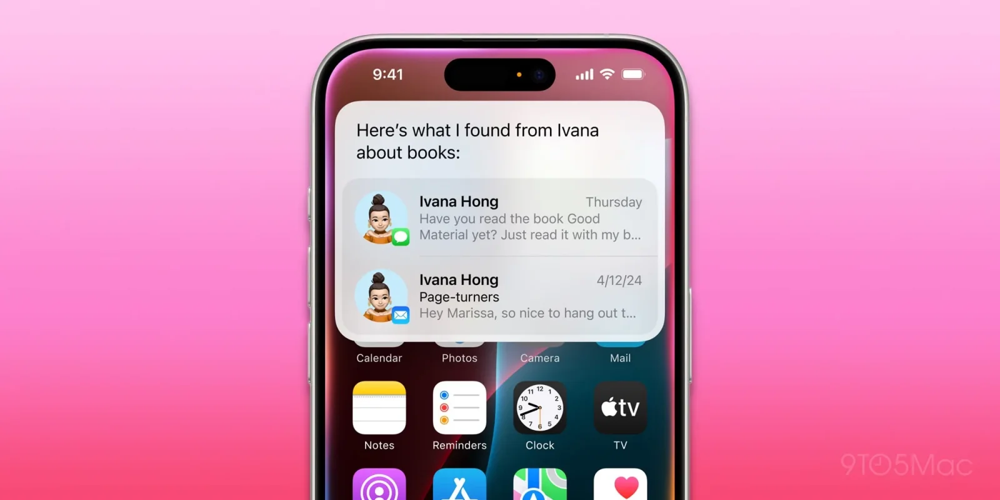

## **דחייה נוספת: ה־HomePad של אפל ייחשף רק באביב 2026**

אם אתם עוקבים אחרי התחום החכם של אפל, ייתכן ששמעתם על המוצר החדש שהיא מתכננת להשיק: **HomePad**, שהוא שילוב בין **iPad** ל־**HomePod**. המוצר אמור לשמש כמרכז שליטה חכם לבית, עם מסך וממשק קול מבוסס **Siri**.

אבל לפי דיווח עדכני של **[Mark Gurman](https://9to5mac.com/2024/11/12/apple-smart-home-ai-release-date/) מ־[Bloomberg](https://redirect.viglink.com/?format=go&jsonp=vglnk_175226005764410&key=c1c7d488bb2df8a8b659d5d41634d304&libId=mcz5y2bx010023dg000ULhj4s5mn1&loc=https%3A%2F%2F9to5mac.com%2F2025%2F07%2F11%2Fnew-homepad-product-gets-fresh-launch-timing-update%2F&ccpaConsent=1---&v=1&out=https%3A%2F%2Fwww.bloomberg.com%2Fnews%2Farticles%2F2025-07-10%2Fapple-plans-new-macbook-pro-iphone-17e-and-ipads-by-early-2026%3FaccessToken%3DeyJhbGciOiJIUzI1NiIsInR5cCI6IkpXVCJ9.eyJzb3VyY2UiOiJTdWJzY3JpYmVyR2lmdGVkQXJ0aWNsZSIsImlhdCI6MTc1MjE3NDY1MCwiZXhwIjoxNzUyNzc5NDUwLCJhcnRpY2xlSWQiOiJTWjFXMEtEV1gyUFMwMCIsImJjb25uZWN0SWQiOiJDNEVEQ0FFMUZBMDU0MEJFQTI0QTlGMjExQzFFOTA4MCJ9.9jW-hyD66uCOnRKDSF5_2a3MHb-Cmywb3HHirn2W4b0&ref=https%3A%2F%2F9to5mac.com%2F&title=New%20%E2%80%98HomePad%E2%80%99%20product%20gets%20fresh%20launch%20timing%20update%20-%209to5Mac&txt=via%20%3Cem%3EBloomberg%3C%2Fem%3E)**, אפל דוחה את ההשקה ל־**אביב 2026**, בעקבות עיכובים בפיתוח הגרסה המשופרת של Siri.

## **🎙️ תלוי ב־Siri: למה המוצר מתעכב?**

ה־HomePad תלוי באופן משמעותי בתכונות החדשות של Siri, שמבוססות על בינה מלאכותית. אפל תכננה להשיק את המכשיר במרץ 2025, אך כשהתברר שהשדרוגים ל־Siri לא יהיו מוכנים בזמן — ההשקה נדחתה.

גורמן טוען שאפל לא מוכנה לשחרר את ה־HomePad בלי היכולות החדשות של העוזרת הקולית, גם אם אפשר היה לעדכן אותן בעתיד בתוכנה. אפל מעדיפה להמתין עד שכל החבילה תהיה מוכנה מראש.

## **📆 מתי זה יקרה בפועל?**

לפי גורמן, אפל שואפת להשיק את **iOS 26.4** באביב 2026 – גרסה שתכיל את כל שדרוגי ה־AI של Siri. זה ככל הנראה יהיה גם הזמן שבו נראה את ה־HomePad החדש לראשונה על המדפים.

בעבר נרמז שהמכשיר עשוי להגיע בסוף 2025, אך כעת הכול נדחה.

## **🤔 האם הייתם קונים HomePad בלי Siri החדשה?**

האם הייתם שוקלים לרכוש את ה־HomePad גם בלי שדרוגי ה־AI של סירי?  
האם מדובר במרכז שליטה לבית – או בעוד גאדג’ט יקר שלא מביא בשורה?  
כתבו לנו בתגובות 👇
