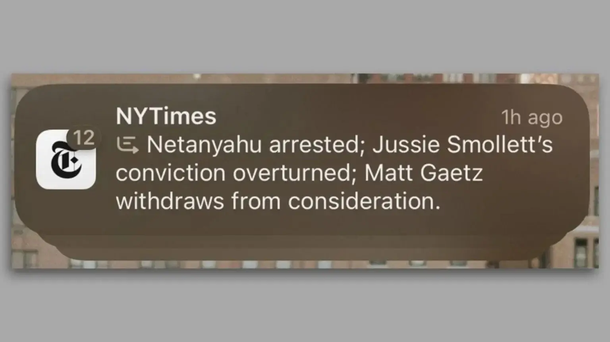

לאחר השקה מבטיחה של iOS 18.2, Apple מתמודדת עם ביקורת קשה בעקבות בעיה חמורה באחת מתכונות הבינה המלאכותית החדשות שלה. החברה קיוותה להיכנס לעולם ה-AI בקלות ובצורה "נקייה" יותר מהמתחרות, אך נראה שגם ענקית הטכנולוגיה מקופרטינו לא חסינה מטעויות.

## תכונת ה-AI שמסבכת את Apple

אחת מתכונות הדגל של **Apple Intelligence**, המציעה סיכום אינטליגנטי של התראות חדשותיות, גרמה לשערורייה לא קטנה. לפי דיווחים, המערכת יצרה כותרות מזויפות ומטעות, שעוררו ביקורת חריפה מצד גופי תקשורת גדולים כמו ה-BBC וה-New York Times.

## כותרות שקריות: מקרה ה-BBC

המקרה הבולט ביותר התרחש כאשר ה-BBC פנה ל-Apple בעקבות כותרת שקרית שסוכמה על ידי ה-AI. הכותרת טענה, לכאורה, שאדם שנעצר בארצות הברית באשמת רצח התאבד.  
המזעזע הוא שה-BBC מעולם לא פרסם כתבה כזו!

## טעויות נוספות: ה-New York Times

גם ה-New York Times סבל מבעיה דומה. באחת ההתראות שסוכמו על ידי Apple Intelligence, נטען כי ראש ממשלת ישראל נעצר. אך בפועל, הכתבה המקורית דיברה רק על צו מעצר נגדו.

## מה עומד מאחורי השגיאות האלו?

מומחים בתחום ה-AI סבורים שמדובר בבעיה שנובעת מלחץ עצום שמופעל על חברות הטכנולוגיה הגדולות (GAFAM) להשיק מוצרים מבוססי AI במהירות. התוצאה: מוצרים שמושקים לפני שהם בשלים לחלוטין.

- **השלכות חמורות:** הפצת דיסאינפורמציה בכותרות חדשותיות עלולה לערער את אמון הציבור בכלים אינטליגנטיים.
- **מבוכה ל-Apple:** עבור חברה שמיתגה את עצמה ככזו שמכניסה לשוק מוצרים "נקיים ומאובטחים", מדובר בפגיעה תדמיתית קשה.

## איך Apple מתמודדת?

נכון לעכשיו, Apple לא הגיבה רשמית למקרים המדוברים, אך נראה כי החברה תצטרך לפעול במהירות:

- **תיקון באגים:** לעדכן את מערכת Apple Intelligence כך שתמנע מסיכום מידע שגוי.
- **שיפור אמון:** להראות שקיפות בנוגע לאופן שבו תוקנו הבעיות.
- **מניעת הישנות:** לשקול השהיית ההפצה של תכונות AI נוספות עד שהן יעברו בדיקות קפדניות יותר.

## שאלות לעתיד

המקרה הזה מעלה שאלות רחבות יותר על תפקידן של מערכות AI ביצירת תוכן חדשותי. האם ניתן לסמוך עליהן? האם אנחנו מתקרבים לעידן שבו פייק ניוז מופץ על ידי אלגוריתמים?  
Apple, שבחרה להיכנס לתחום בזהירות ובאחריות רבה, תצטרך להוכיח שהיא יכולה להוביל את השוק – לא רק בטכנולוגיה מתקדמת, אלא גם בשמירה על אמינות המידע.

- כותרות שקריות: Apple Intelligence יצרה כותרות חדשותיות מזויפות, כולל טענה שקרית על התאבדות עציר בארצות הברית, שלא פורסמה על ידי ה-BBC.
- מבוכה ל-Apple: ה-AI של החברה סיכמה כתבות באופן שגוי, כולל טענה על מעצר ראש ממשלת ישראל, כשבפועל דובר רק על צו מעצר.
- אתגר לאמון: הטעויות האלו מעלות חששות לגבי אמינות מערכות AI בתקשורת והלחץ להשיק טכנולוגיות לא בשלות. Apple תצטרך לתקן במהירות ולשקם את אמון המשתמשים.
