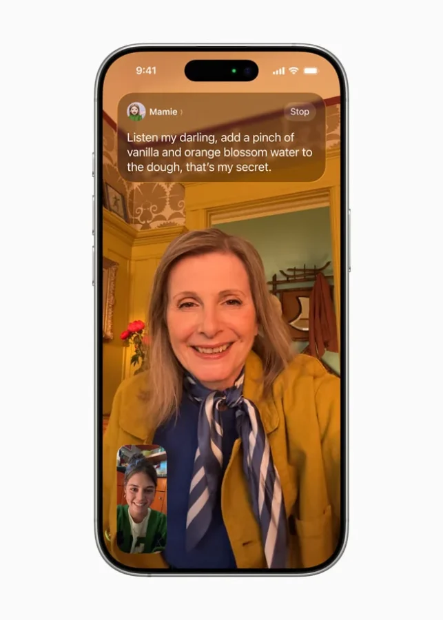
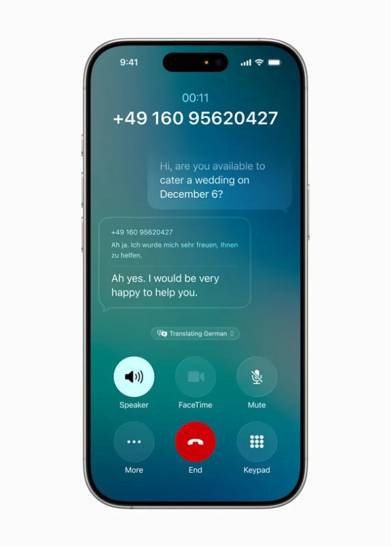
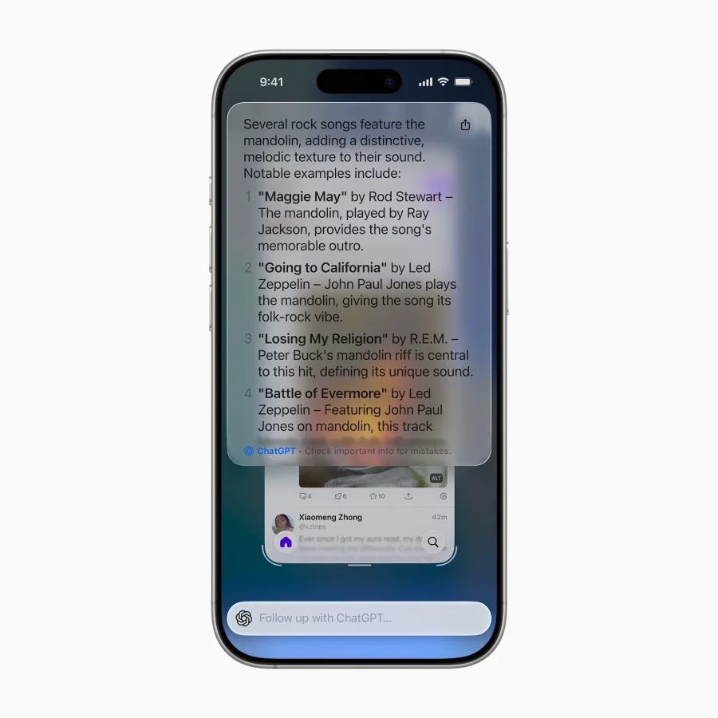
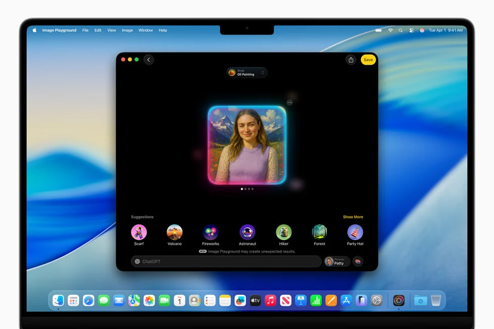

## **2024 הייתה שנה של אכזבות**

כשהושקה Apple Intelligence בשנה שעברה, אפל הבטיחה מהפכה. סירי משודרגת, פרודוקטיביות משופרת, תכונות AI פורצות דרך.

המציאות? הרבה דיבורים, מעט תוצאות.

סירי נשארה עוזרת קולית מתסכלת, תכונות מתעכבות, ואפילו מהנדסים באפל הודו בפומבי: "אנחנו בפיגור מול OpenAI וגוגל".

## **WWDC 2025: ניסיון לגאול את המצב**

באירוע השנה, אפל הציגה עדכון כולל ל־iOS 26, iPadOS 26, macOS Tahoe ועוד. Apple Intelligence קיבלה זריקת מרץ – אבל האם זה מהלך מהפכני או תיקון נזקים?

## **תרגום חי: סוף־סוף משהו עובד**

החידוש הבולט: **תרגום חי בזמן אמת** בשיחות טלפון, פייסטיים והודעות.

- תרגום דו-כיווני בקול במהלך שיחה
    
- תרגום אוטומטי בטקסטים תוך כדי כתיבה
    
- תרגום בלייב עם כתוביות בווידאו
    

⚙️ כל זה פועל **מקומית על המכשיר** – בלי שרתים חיצוניים. פרטיות מקסימלית, בלי תלות באינטרנט.

 

## **ראייה חכמה שמבינה הכל – לא רק במצלמה**

Apple Intelligence לא רק סורקת תמונות. היא מבינה את התוכן על המסך שלך בכל אפליקציה:

- ראית פוסטר להופעה? תזכורת עם כל הפרטים מוכנה
    
- מצאת מנורה באינסטגרם? קישורים ישירות ל־Etsy
    

אפשר גם לשלוף **ניתוחים מתקדמים בעזרת ChatGPT** – בחירה אופציונלית, לא חובה.

## **Workout Buddy: ה-AI נכנס לכושר**

אפליקציית הבריאות של אפל הופכת לאיש כושר אישי:

- התראות קוליות בזמן אמת
    
- ניתוח קצב ריצה, מרחקים, הישגים
    
- תזכורות והתלהבות בסגנון Fitness+
    

## **מפתחים מקבלים גישה למנוע ה-AI**

לראשונה, מפתחים יכולים להשתמש ב־Apple Intelligence באפליקציות שלהם:

- ממשק Swift פשוט – 3 שורות קוד
    
- כל חישוב מתבצע על המכשיר
    
- בלי תשלום ל־API כמו אצל גוגל או OpenAI
    

פיצ’ר זה יכול לשנות את חוקי המשחק עבור סטארטאפים קטנים.

## **שיפורים נוספים ששווה לציין**

- **Genmoji** – יצירת אימוג’ים אישיים מטקסט
    
- **Image Playground** – תמונות בסגנונות מותאמים אישית
    
- **רוטינות ב־Shortcuts** בעזרת הבינה של אפל
    
- **Wallet, Reminders, Messages** מקבלים אוטומציות חדשות
    

## **וסירי? שוב נעלמת**

בשום שלב אפל לא הציגה גרסה חדשה של Siri. ההבטחות משנה שעברה על הבנה הקשרית ופקודות מורכבות – לא מומשו.

אפילו האינטגרציה עם ChatGPT מצטיירת כטלאי, לא פתרון.

## **המסקנה: שדרוג חשוב, אבל לא מהפכה**

Apple Intelligence 2025 מראה **כיוון ברור**: בינה מלאכותית פרטית, אינטגרטיבית, נגישה לכל אחד.  
אבל זה עדיין **לא מוצר בשל כמו Gemini או ChatGPT**.
