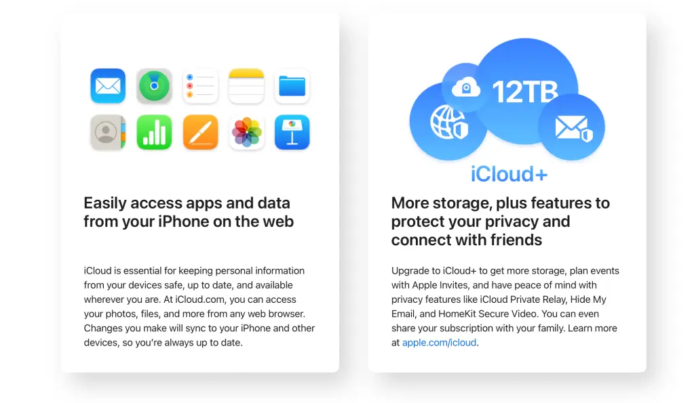
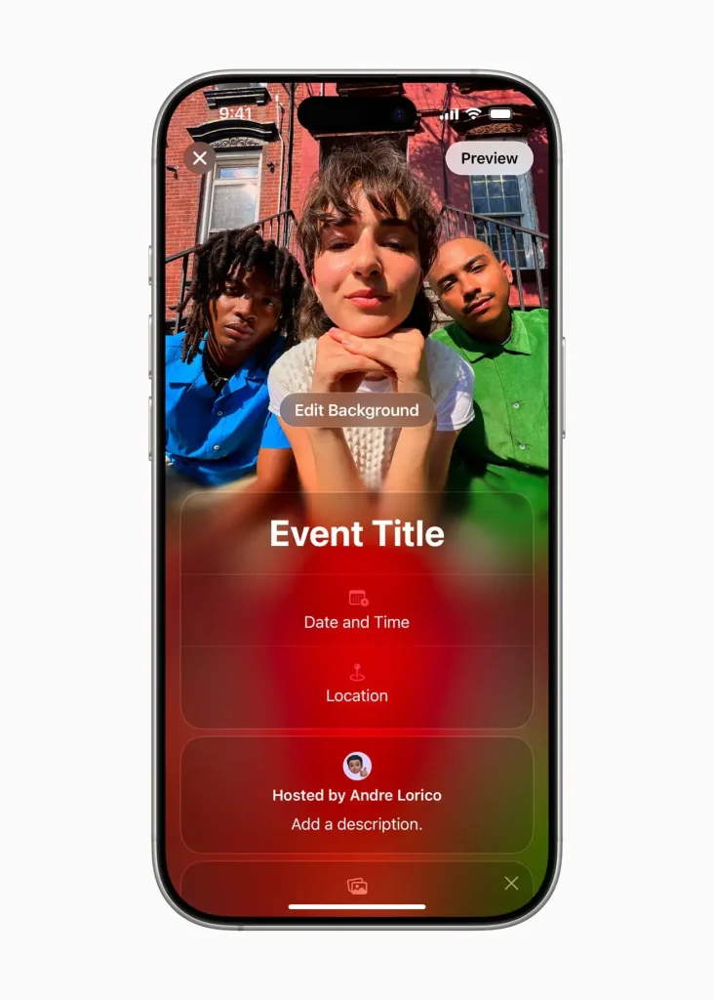
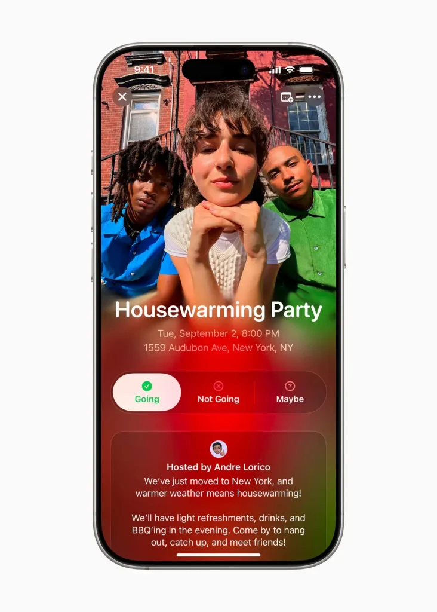
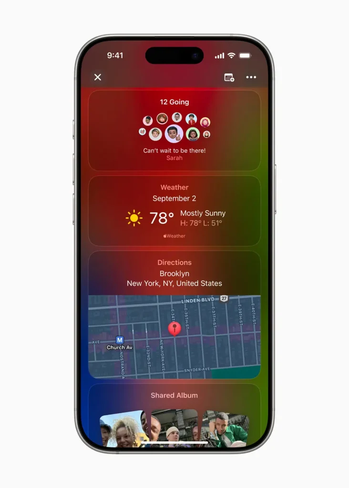

Apple השיקה רשמית את **Apple Invites**, אפליקציה חדשה למנויי iCloud+, שמאפשרת יצירת וניהול הזמנות לאירועים בצורה **מרוכזת וחכמה**. השירות זמין **מה-4 בפברואר 2025**, והוא משתלב עם האקוסיסטם של Apple, תוך שהוא מביא **חידושים משמעותיים לניהול אירועים דיגיטליים**.

## **מה מציעה האפליקציה?**

- **עיצוב הזמנות בהתאמה אישית** – בחירת רקעים **מתוך הגלריה האישית או מאוסף מובנה**, שילוב מפות Apple Maps, תחזית מזג אוויר ורשימות השמעה מ-Apple Music.
- **מעקב RSVP חכם** – צפייה **בזמן אמת באישורי הגעה**, תמיכה של עד **100 משתתפים לאירוע אחד**.
- **אלבומים משותפים לאירועים** – יצירת **מקום שיתופי לתמונות וסרטונים** מהאירוע.
- **Apple Intelligence** – יצירת תמונות באמצעות **בינה מלאכותית (Image Playground)** וכתיבה אוטומטית של טקסטים להזמנות ולתיאום המשתתפים.

## איך זה עובד?

- **זמין באייפון עם iOS 18+** דרך App Store וגם דרך **iCloud.com/invites**.
- **תמיכה במכשירים חיצוניים** – אין צורך בחשבון Apple או במכשיר iOS כדי **לקבל או להשיב להזמנה**.
- **API GroupKit** – ניהול קבוצות אורחים עם פוטנציאל **לפתיחה למפתחים חיצוניים** בעתיד.

<figure>

<figcaption>

Apple-Invites-create-an-event\_inline.jpg.large\_2x (1)

</figcaption>

</figure>

<figure>

<figcaption>

Apple-Invites-event-view\_inline.jpg.large\_2x (1)

</figcaption>

</figure>

<figure>

<figcaption>

Apple-Invites-event-view-scrolled\_inline.jpg.large\_2x (1)

</figcaption>

</figure>

## **מהן אפשרויות השימוש?**

- **חלק ממנוי iCloud+** – דורש מנוי החל מחבילת **50GB (₪4 לחודש)**.
- **כלול בחבילת Apple One** – ללא תוספת עלות עבור **מנויים קיימים**.
- **אפשרויות מתקדמות** – שילוב עם **Private Relay**, כתובות דוא"ל מותאמות אישית ושיתוף משפחתי **לעד 5 משתמשים**.

## **מה צפוי בעתיד?**

השירות מגיע **לאחר חודשים של הדלפות**, תחת שם הקוד "Confetti", וכעת מוצג כפתרון הרשמי של Apple לניהול אירועים. לפי דיווחים, **גרסה מותאמת ל-iPad** וכלים מתקדמים **לניהול משתתפים ומניעת ספאם** צפויים להופיע **בקרוב בעדכוני iOS עתידיים**.

- Apple השיקה את Apple Invites, אפליקציה חדשה למנויי iCloud+ שמאפשרת יצירת וניהול הזמנות לאירועים בצורה חכמה ומרכזית.
- השירות כולל עיצוב הזמנות בהתאמה אישית, מעקב אחרי אישורי הגעה בזמן אמת, ואלבומים משותפים לאירועים.
- האפליקציה זמינה דרך iPhone (iOS 18+) ו-iCloud.com, ותומכת גם במוזמנים שאין להם חשבון Apple או מכשיר iOS.
