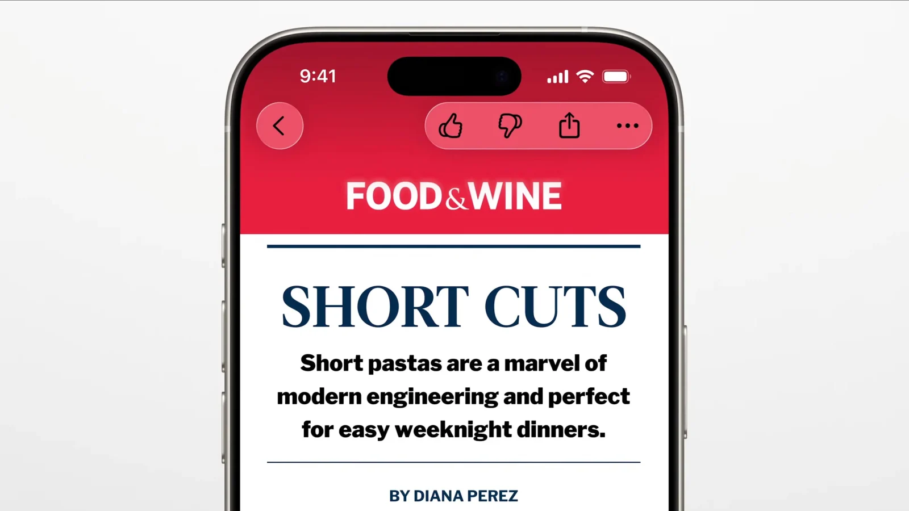
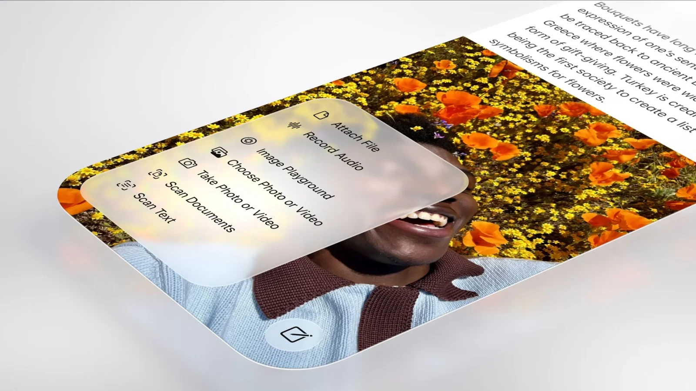
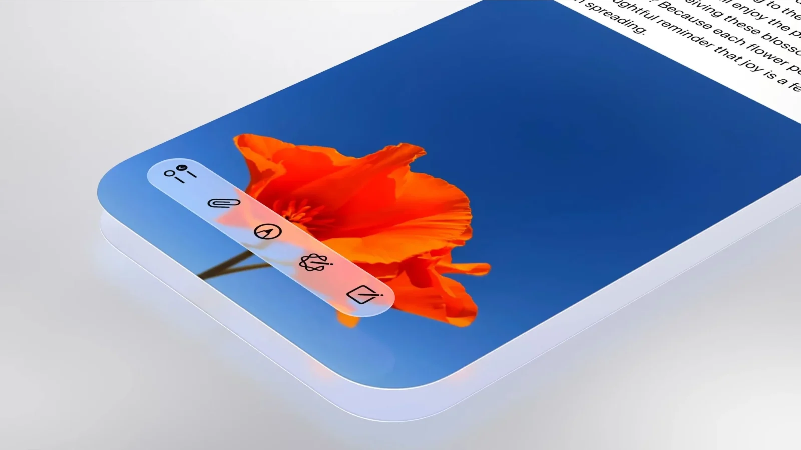
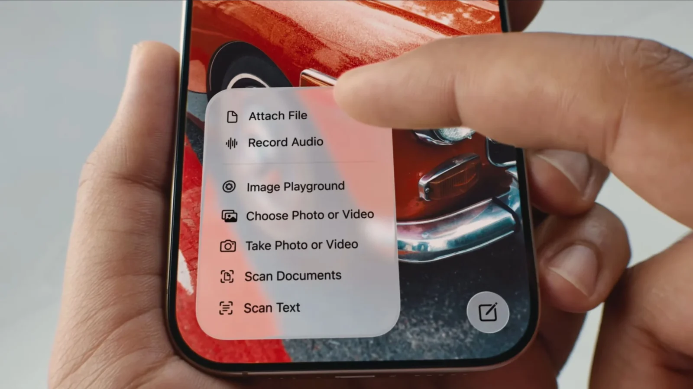
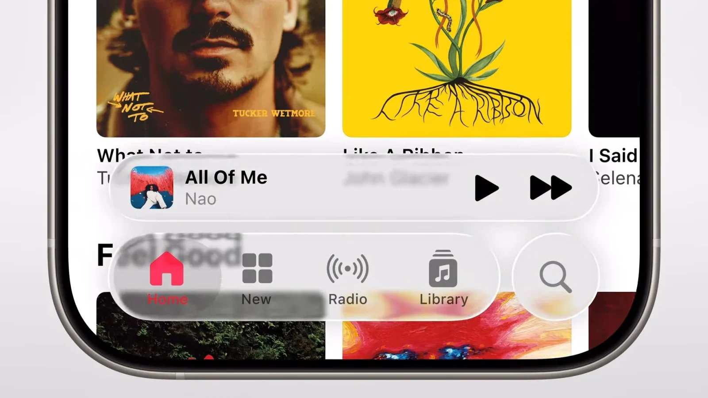
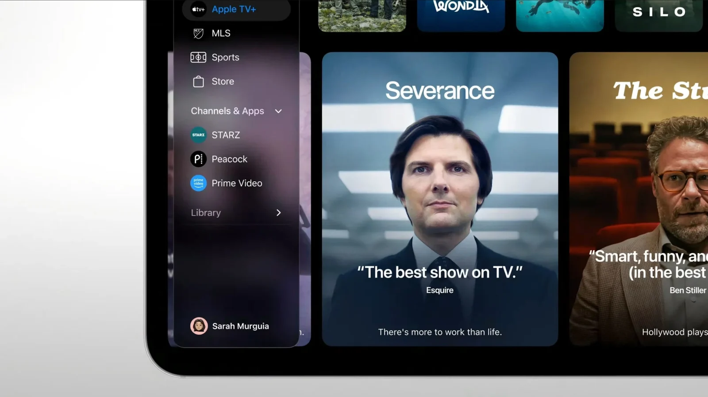
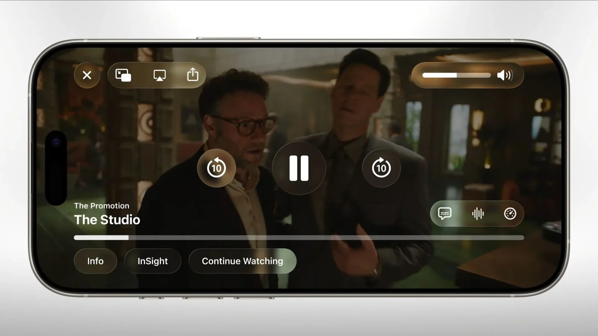
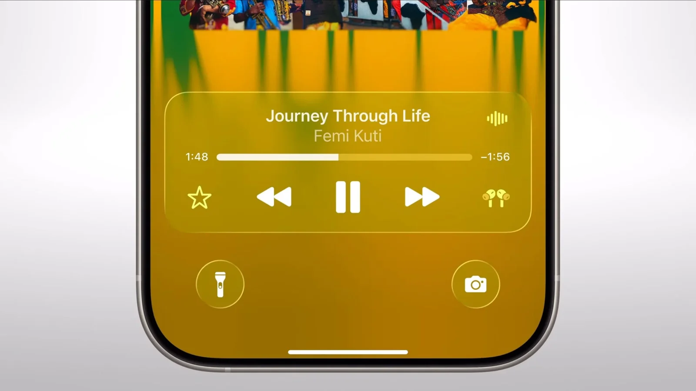
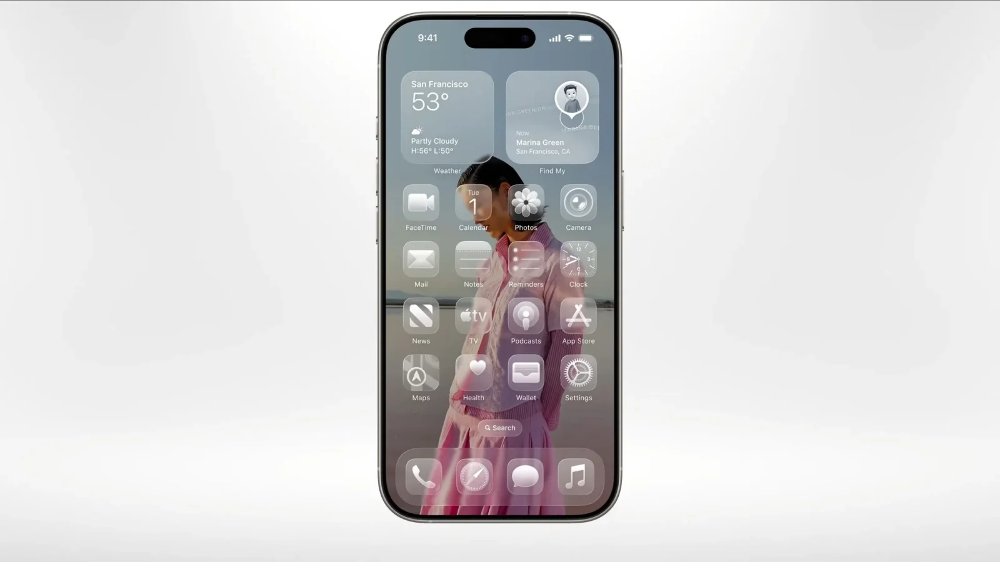
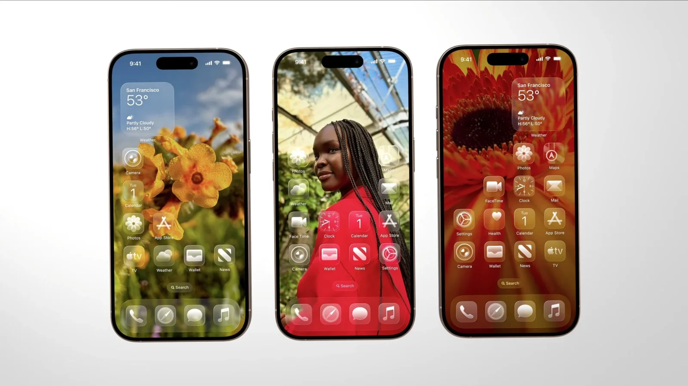

## **לראשונה מאז iOS 7: אפל משנה את כל החזות**

ב־WWDC 2025, אפל פתחה את הכנס עם הכרזה שהיא לא פחות ממהפכה ויזואלית:  
**Liquid Glass** – שפת עיצוב חדשה, רכה, שקופה ודינמית, שמגיעה ל־iOS 26, iPadOS 26, macOS Tahoe 26, וגם ל־watchOS ו־tvOS.

העיצוב שואב השראה ישירה מה־**Apple Vision Pro**, ומיועד לדור החדש של שבבי Apple Silicon. מדובר בשינוי כולל – לא רק קוסמטי.

## **מה זה Liquid Glass בעצם?**

זוהי שפת ממשק שמבוססת על:

- **שקיפויות חכמות**
    
- **השתקפויות דינמיות**
    
- **אנימציות זורמות**
    
- **מעברים רכים בין חלונות ותפריטים**
    

האלמנטים המרכזיים בעיצוב:

- כפתורים, תפריטים וסרגלים בעיצוב חדש לגמרי
    
- מרכז הבקרה (Control Center) – בעיצוב רענן ומותאם אישית
    
- מעבר בין אפליקציות – חלק וזורם יותר
    
- מצב חדש: **Glass Theme** – שמעצים את תחושת השקיפות והעומק
    

## **נראות אחידה בכל מכשירי אפל**

המטרה: ליצור שפה אחידה בין כל המערכות של אפל – iPhone, iPad, Mac, Apple Watch ו־Apple TV.  
לכל מערכת מותאם Liquid Glass לפי ההקשר שלה:

- iOS / iPadOS: ממשק יותר פתוח, אווירירי ומרווח
    
- macOS: דוק ותפריטים שקופים, התאמה אישית לפי נושא
    
- watchOS: אנימציות עדינות יותר, רקעים חיים
    
- tvOS: ניווט חזותי יותר וקל לעין
    

<figure>

<figcaption>

apple-liquid-glass-ios-26-2-scaled

</figcaption>

</figure>

<figure>

<figcaption>

apple-liquid-glass-ios-26-18-scaled

</figcaption>

</figure>

<figure>

<figcaption>

apple-liquid-glass-ios-26-22-scaled

</figcaption>

</figure>

<figure>

<figcaption>

apple-liquid-glass-ios-26-41-scaled

</figcaption>

</figure>

## **אלו האפליקציות שכבר קיבלו את הטיפול החדש**

אפל החלה לגלגל את הממשק החדש באפליקציות המובילות:

- מצלמה
    
- תמונות
    
- Safari
    
- Apple Music
    
- Apple Podcasts
    
- Apple News
    
- FaceTime
    

הממשק הפך לזורם יותר, קל ונעים לשימוש – עם התאמה לכל מצב תאורה (בהיר, כהה ו־Glass).

<figure>

<figcaption>

apple-liquid-glass-ios-26-27-scaled

</figcaption>

</figure>

<figure>

<figcaption>

apple-liquid-glass-ios-26-29-scaled

</figcaption>

</figure>

<figure>

<figcaption>

apple-liquid-glass-ios-26-35-scaled

</figcaption>

</figure>

## **לא רק יופי – גם תשתית לעתיד חכם יותר**

Liquid Glass הוא גם בסיס לאינטראקציות חכמות:

- **Apple Intelligence** תוכל להציג מידע “בתוך” העיצוב
    
- התראות משמעותיות יודגשו ויתמזגו ברקע באופן דינמי
    
- הממשק יתאים את עצמו לשימושים שונים – לפי הקשר, לפי מקום, לפי זמן
    

מפתחים יוכלו להשתמש ברכיבי Liquid Glass דרך **SwiftUI** כבר מהגרסה הבאה של Xcode.

## **מתי זה מגיע?**

- גרסת מפתחים – זמינה כבר עכשיו
    
- בטא ציבורית – ביולי 2025
    
- השקה רשמית – **בסתיו הקרוב**, עם iOS 26 ו־macOS Tahoe 26
    

