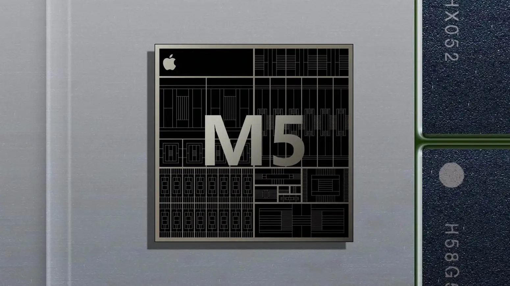

Apple ביצעה הזמנה מ-TSMC עבור דור המעבדים הבא שלה, ה-**M5**, אך עם שינוי אסטרטגי משמעותי. החברה מקופרטינו החליטה שלא להשתמש בתהליך הייצור המתקדם של **2 ננומטר** ומעדיפה במקום זאת את טכנולוגיית **System on Integrated Chip (SoIC)** של TSMC למעבדים החדשים.

## ייצור בטכנולוגיית 3 ננומטר

על פי דו"ח של **The Elec**, Apple כבר הזמינה מעבדי **M5** המיועדים ל-iPad Pro ול-Mac. המעבדים החדשים ייוצרו בטכנולוגיית **3 ננומטר** של TSMC, אותה הטכנולוגיה המשמשת לייצור מעבדי M4 הנוכחיים.

הבחירה בטכנולוגיה זו נובעת בעיקר משיקולי עלות, שכן תהליך הייצור ב-**2 ננומטר** יקר מדי בשלב זה לייצור בקנה מידה רחב. עם זאת, ייתכן שנראה את טכנולוגיית 2 ננומטר במעבדי **A19** שייועדו ל-**iPhone 17 Pro**.

## יתרונות טכנולוגיית SoIC

כדי לפצות על השימוש בתהליך הוותיק יותר, Apple מתמקדת בטכנולוגיית **SoIC** של TSMC. מדובר בגישת **הערמה תלת-ממדית** של שבבים, שמשתמשת בטכנולוגיית יציקה מבוססת סיבי פחמן תרמופלסטיים.

שיטה זו מספקת יתרונות משמעותיים, כמו:

- **שיפור בניהול תרמי**
- **הפחתת דליפות חשמל**

כל זאת בהשוואה לעיצובים דו-ממדיים מסורתיים.

Apple מקווה שטכנולוגיה זו תאפשר לה לשמור על יתרונות משמעותיים מבחינת ביצועים ויעילות אנרגטית בדור החדש של המעבדים.

## מתי יגיעו המכשירים הראשונים עם שבב M5 לישראל?

הייצור בנפח קטן של שבבי **M5** החל ככל הנראה ביולי האחרון. אם לא יתגלו בעיות טכניות משמעותיות, הייצור ההמוני צפוי להתחיל במחצית השנייה של 2025. לוח זמנים זה עשוי לגרום ל-Apple לדחות את עדכון ה-**iPad Pro**, שתוכנן לאביב 2025, למועד מאוחר יותר.

המכשירים הראשונים שיצוידו ב-**M5** יהיו ככל הנראה מחשבי [**MacBook Pro**](https://techhorizons.co.il/macbook-pro-m4/), ולאחריהם דגמי **MacBook Air** באביב 2026. ה-**iPad Pro** עם שבב M5 עשוי להיות מושק במקביל ל-MacBook Pro, אך לוח הזמנים המדויק טרם אושר.

Apple מתכננת להשתמש בשבב M5 גם בתשתיות השרתים שלה עבור יישומי אינטליגנציה מלאכותית. כזכור, החברה מפתחת מודל שפה חדש עבור Siri, שאמור להחליף את שילוב ChatGPT, והשקתו מתוכננת לאביב 2026.

- מתי נראה את שבב M5? הייצור ההמוני יתחיל במחצית השנייה של 2025, עם השקת MacBook Pro ו-iPad Pro בסוף 2025 או תחילת 2026.
- שימוש ב-AI: Apple תשלב את שבב M5 בתשתיות ה-AI שלה, כולל מודל שפה חדש עבור Siri, הצפוי להשקה באביב 2026.
