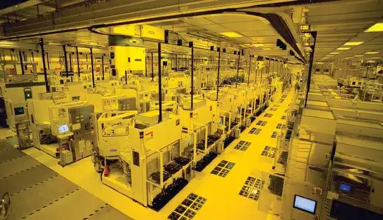

**השבב החדש של Apple, ה-M5, נכנס לייצור המוני בינואר 2025**, והוא צפוי להביא **קפיצה משמעותית בביצועים, בניצול אנרגיה וביכולות הבינה המלאכותית** של מכשירי החברה. **TSMC** מייצרת את השבב בטכנולוגיית **N3P (תהליך 3 ננומטר דור שלישי)**, והוא ישולב **תחילה ב-iPad Pro, MacBook Pro ו-Vision Pro 2**. דגמי **M5 Pro, M5 Max ו-M5 Ultra** יגיעו **מאוחר יותר, ב-2026**.

## **מה חדש בשבב ה-M5?**

השבב **מבוסס על תהליך ה-N3P של TSMC**, אשר מביא **שיפור של 5-10% ביעילות האנרגטית** לעומת הדור הקודם.  
הארכיטקטורה החדשה **מותאמת במיוחד לעיבוד בינה מלאכותית**, עם מנוע **Neural Engine משופר המסוגל לבצע יותר מ-38 טריליון פעולות בשנייה**.

🔹 **טכנולוגיית SoIC-mH** – מאפשרת **סידור תלת-ממדי של רכיבים**, מה שמשפר ביצועים וקירור.  
🔹 **פיצול אפשרי בין CPU ו-GPU בדגמי ה-M5 Pro** – עשוי לשפר את **הביצועים ביישומי בינה מלאכותית**.  
🔹 **שיפור ניכר בזיכרון ובמהירות העבודה** – דחיסת מידע מתקדמת מאפשרת **יעילות גבוהה יותר בעיבוד נתונים**.

## **אילו מכשירים יקבלו את M5?**

| **מכשיר** | **פרטים** | **השקה משוערת** |
| --- | --- | --- |
| **iPad Pro 2025** | המכשיר הראשון עם M5 בסיסי, שיפור משמעותי בגרפיקה | **מחצית שנייה של 2025** |
| **MacBook Pro 2025** | קפיצת ביצועים, עם ארכיטקטורה תרמית חדשה | **סוף 2025** |
| **Vision Pro 2** | מעבר מ-M2 ל-M5, תומך ב-Apple Intelligence | **סוף 2025 - תחילת 2026** |
| **Mac Studio / Mac Pro** | ישתמשו ב-M5 Ultra, אך לא לפני 2026 | **2026** |

## **יכולות הבינה המלאכותית של M5**

השבב החדש **משפר משמעותית את יכולות הבינה המלאכותית במכשירי Apple**, במיוחד בתחומים כמו **זיהוי שפה, עיבוד תמונה וראייה ממוחשבת**.

🔹 **לימוד מכונה מתקדם** – מאפשר הפעלה מהירה ויעילה של יישומי AI.  
🔹 **שיפור בזיהוי קולי ועיבוד שפה טבעית** – סירי צפויה להיות **מהירה ומדויקת יותר**.  
🔹 **יכולות צילום חכמות יותר** – שיפור בצילום חישובי ואיכות תמונה טובה יותר.  
🔹 **שדרוג משמעותי לחוויית המציאות הרבודה (AR)** – יהפוך את ה-Vision Pro 2 **למכשיר עוצמתי במיוחד**.

## **למה ה-M5 הוא קפיצת דור משמעותית?**

✔ **יותר טרנזיסטורים בצפיפות גבוהה יותר** – מאפשר כוח עיבוד מוגבר.  
✔ **ניצול אנרגיה משופר** – יעילות גבוהה יותר בהשוואה ל-M4. 
✔ **תמיכה מתקדמת ב-Apple Intelligence** – חוויית משתמש אינטואיטיבית וחכמה יותר.  
✔ **שימוש בארכיטקטורת SoIC-mH** – מסייעת **בקירור ובניהול עומסים גבוהים**.

## **מתי יגיעו דגמי ה-M5 החזקים יותר?**

🔹 **דגמי ה-M5 Pro ו-M5 Max** יושקו **רק בתחילת 2026**.  
🔹 **דגם ה-M5 Ultra**, המיועד ל-Mac Studio ול-Mac Pro, לא יגיע לפני **אמצע 2026**.

## **M5 לעומת M4: שיפור משמעותי או עדכון הדרגתי?**

השוואה בין **M5** ל-**M4** מראה **שיפורים בעיקר בבינה מלאכותית, בניהול חום וביעילות אנרגטית**, אך ללא קפיצה עצומה בביצועים הגולמיים. **ה-M5 מבוסס על טכנולוגיית 3 ננומטר מתקדמת יותר**, שמאפשרת **חיסכון של 5-10% בצריכת החשמל** ושיפורים קלים במהירות העיבוד.

ההבדל המשמעותי ביותר הוא **העוצמה של מנוע ה-Neural Engine**, שמאפשר **ביצועי AI מהירים פי 2** ויעזור בעיקר למשימות כמו Apple Intelligence ועיבוד תמונה מתקדם. דגמי **M5 Pro/Max** גם מציעים **מערכת קירור משופרת**, מה שמונע האטות תחת עומסים כבדים.

| קטגוריה | **M4** | **M5** |
| --- | --- | --- |
| **תהליך ייצור** | N3E (3nm דור שני) | **N3P (3nm דור שלישי) – חסכון של 5-10% באנרגיה** |
| **CPU/GPU** | משולבים | **הפרדה אפשרית (Pro/Max)** |
| **Neural Engine** | 38 TOPS | **מעל 40 TOPS – שיפור משמעותי בביצועי AI** |
| **ניהול חום** | רגיל | **מבנה חדש שמפחית התחממות ב-30%** |

בסופו של דבר, **M5 הוא שדרוג ממוקד יותר מאשר מהפכה**, עם יתרונות בולטים בעיקר **למשימות בינה מלאכותית ולשימוש מקצועי כבד**. אם כבר יש לכם מכשיר עם **M4**, ייתכן שההמתנה ל-M6 תהיה החלטה נבונה, אלא אם כן **אתם זקוקים לשיפור בביצועי AI ובניהול חום טוב יותר**.

## **מה המשמעות של שבב ה-M5 עבור המשתמשים?**

המעבר לשבב **M5** מסמן **קפיצת מדרגה משמעותית** עבור Apple. מדובר **לא רק בשיפור בביצועים**, אלא גם בהתמקדות עמוקה יותר ביכולות **בינה מלאכותית**, מה שיכול לשנות את הדרך שבה אנחנו משתמשים במכשירי החברה.

**עבור המשתמשים הרגילים**, זה אומר **חוויית שימוש מהירה וחלקה יותר** באייפד, במקבוק ובמכשירי ה-Vision Pro העתידיים. המשימות היומיומיות – כמו גלישה, עבודה עם מסמכים, עריכת תמונות ואפילו משחקים – יהפכו ליעילות יותר, עם **צריכת חשמל נמוכה יותר**, מה שאומר **חיי סוללה ארוכים יותר**.

**עבור יוצרי תוכן ואנשי מקצוע**, הדגמים החזקים יותר – כמו **M5 Pro ו-M5 Max** – צפויים להביא **שיפורים משמעותיים בביצועים הגרפיים ובעיבוד נתונים כבד**, מה שיקל על עריכת וידאו, רינדור תלת-ממד ושימוש בתוכנות מקצועיות.

אבל לא הכל ורוד – **מי ששוקל רכישת MacBook Pro או Mac Studio בעתיד הקרוב, צריך לקחת בחשבון שהגרסאות החזקות יותר של M5 יגיעו רק ב-2026**. המשמעות היא שההשקה של **M5 הבסיסי ב-2025** היא רק **השלב הראשון**, והשדרוגים המשמעותיים באמת יגיעו מאוחר יותר.

Apple מראה שוב שהיא **לא רק משפרת חומרה**, אלא גם **מכוונת לעתיד שבו בינה מלאכותית תשולב עמוק יותר במערכת ההפעלה**, ותשפר כל היבט בחוויית המשתמש. השאלה שנותרה פתוחה היא האם השיפורים האלה **יצדיקו את ההמתנה והשדרוג** עבור מי שכבר משתמש בדור הקודם.

- שבב M5 של Apple נכנס לייצור המוני ויביא שיפור משמעותי בביצועים, צריכת החשמל וביכולות הבינה המלאכותית במכשירים כמו iPad Pro, MacBook Pro ו-Vision Pro 2.
- הטכנולוגיה החדשה של TSMC (N3P) תשפר את היעילות האנרגטית ב-5-10%, וה-Neural Engine המשופר יאפשר עיבוד מתקדם יותר של משימות AI.
- ההשקה הראשונית תתחיל במחצית השנייה של 2025, אך דגמי M5 Pro, Max ו-Ultra יגיעו רק ב-2026, מה שעשוי להשפיע על החלטות הרכישה של המשתמשים.
