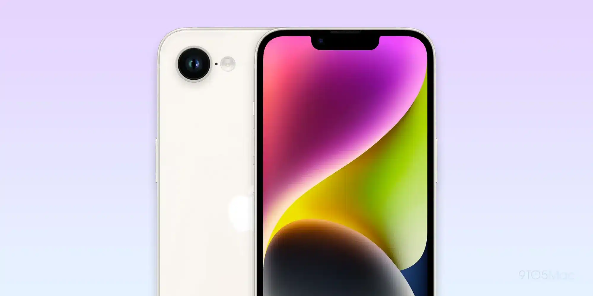
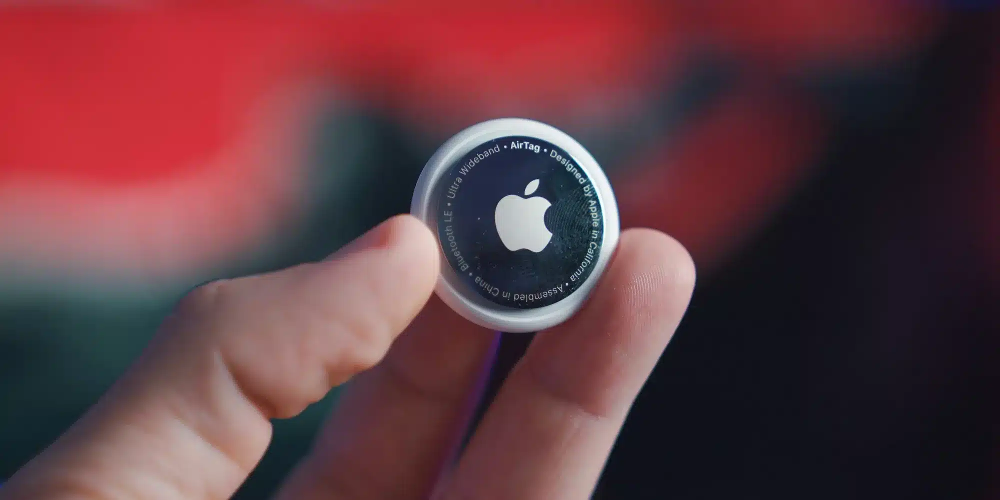
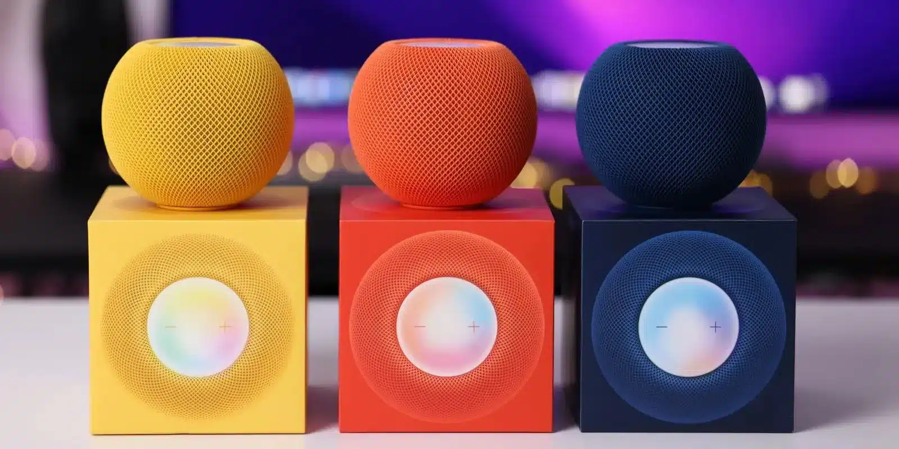
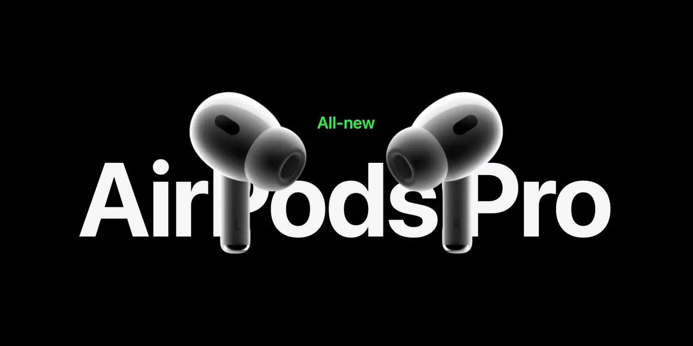
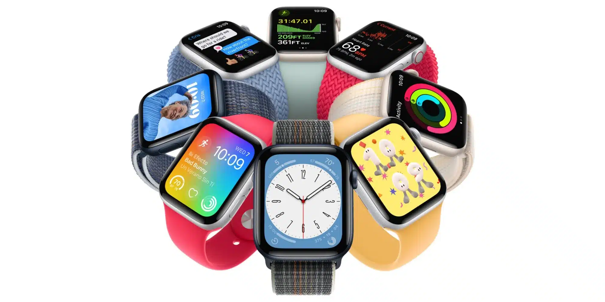
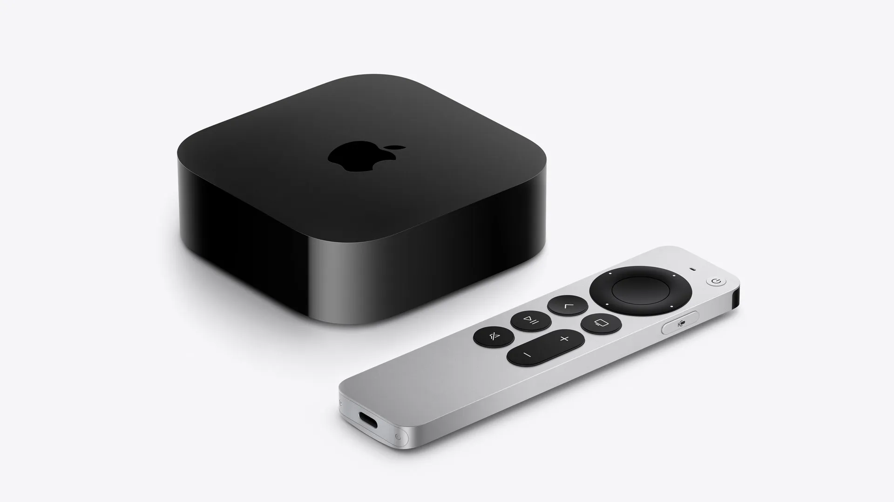

2025 הולכת להיות **שנה גדולה להשקות חומרה של Apple**, וזה נכון גם לגבי מוצרים שלעיתים רחוקות מקבלים עדכון. ישנם **שישה מוצרים** שיחוו **עדכון משמעותי השנה**, לאחר המתנה של **שלוש שנים או יותר**.

## iPhone SE 4 – האייפון התקציבי הטוב ביותר?

**עדכון אחרון: מרץ 2022**

אחרי שלוש שנים של המתנה, ה-**iPhone SE 4** יגיע עם שדרוגים שיכולים להפוך אותו **לאייפון המשתלם ביותר** עבור רוב המשתמשים.

✨ **השדרוגים הצפויים:**  
✅ **שבב A18** – אותו שבב שקיים ב-iPhone 16. 
✅ **תמיכה ב-Apple Intelligence**.  
✅ **מסך OLED עם Face ID ומגרעת**.  
✅ **8GB RAM + מצלמת 48MP**.  
✅ **טעינת USB-C + מודם 5G חדש תוצרת Apple**.

🗓 **השקה צפויה:** מרץ 2025.

## AirTag 2 – סוף סוף עדכון אחרי 4 שנים

**עדכון אחרון: אפריל 2021**

אחרי שנים של שמועות, ה-**AirTag 2** סוף סוף מגיע, עם **שיפורים בשלושה תחומים עיקריים**:

📡 **טווח שידור טוב יותר**.  
📶 **שבב תקשורת חדש ומשופר**.  
🔒 **שיפורי פרטיות**.

🗓 **השקה משוערת:** אמצע 2025.

## HomePod mini 2 – הרמקול החכם משתדרג

**עדכון אחרון: נובמבר 2020**

**HomePod mini** הפך לפתרון משתלם לרמקול חכם, אבל מאז 2020 הוא **לא קיבל עדכון משמעותי**.

🤖 **מה אנחנו מקווים לראות?**  
🔹 **תמיכה ב-Apple Intelligence**.  
🔹 **אינטגרציה עמוקה יותר עם מוצרי הבית החכם של Apple**.

🗓 **השקה משוערת:** סוף 2025.

## AirPods Pro 3 – עיצוב חדש וחיישן דופק?

**עדכון אחרון: ספטמבר 2022**

למרות ש-Apple מוסיפה עדכוני תוכנה ל-**AirPods Pro**, החומרה עצמה מתעדכנת רק כל **שלוש שנים**. הדגם החדש צפוי להציג **שיפורים משמעותיים**:

🎶 **עיצוב חדשני**.  
🎛 **שבב H3 חדש** לשיפור איכות הצליל.  
💓 **חיישן דופק** מובנה.  
🔕 **שדרוג משמעותי לביטול רעשים**.

🗓 **השקה משוערת:** ספטמבר 2025.

## Apple Watch SE 3 – השעון התקציבי משתדרג

**עדכון אחרון: ספטמבר 2022**

🆕 **השדרוגים הצפויים:**  
⚡ שבב חדש לחוויית שימוש מהירה יותר.  
📊 **אולי תוספת חיישני בריאות חדשים**.

🗓 **השקה משוערת:** ספטמבר 2025 (עם סדרת Apple Watch 11).

## Apple TV 4K חדש – השדרוג המפתיע של השנה

**עדכון אחרון: נובמבר 2022**

🎥 **Apple TV 4K** מקבל עדכונים באופן **לא עקבי**, והשנה הוא צפוי להגיע עם:  
🚀 **שבב חזק יותר**.  
📡 **Wi-Fi ו-Bluetooth משופרים**.

🗓 **השקה משוערת:** אוקטובר-נובמבר 2025.

## 🔎 Apple סוף סוף זוכרת לעדכן את המוצרים שלה

לא כל מוצר של Apple חייב עדכון שנתי, אבל כשהיא כן משחררת עדכונים – **הם חייבים להיות משמעותיים**. השנה הזו צפויה להביא **שדרוגים מוצדקים** לשישה מוצרים שהמתינו **יותר מדי זמן**.

- Apple תשיק ב-2025 שדרוגים נדירים ל-iPhone SE, AirPods Pro, HomePod mini, Apple TV ועוד, אחרי שנים ללא עדכון.
- iPhone SE 4 יקבל מסך OLED, Face ID, שבב A18 ומודם 5G חדש, בעוד ש-AirPods Pro 3 יכללו חיישן דופק ועיצוב חדש.
- HomePod mini 2, AirTag 2 ו-Apple Watch SE 3 צפויים להשתדרג עם ביצועים טובים יותר ותכונות חכמות חדשות.
