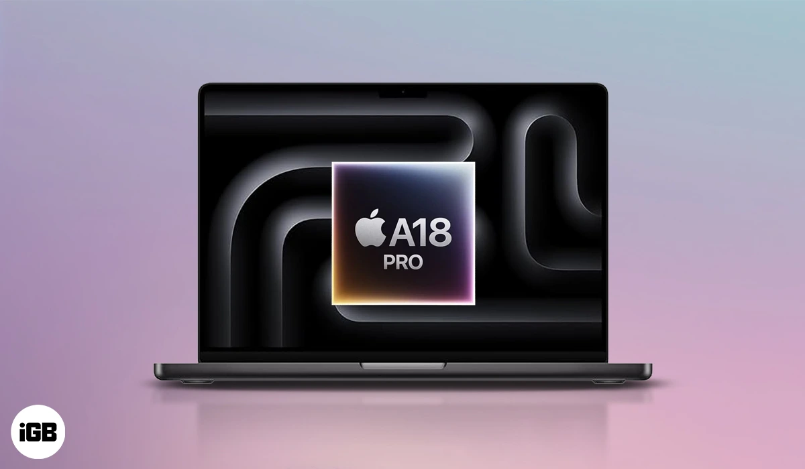
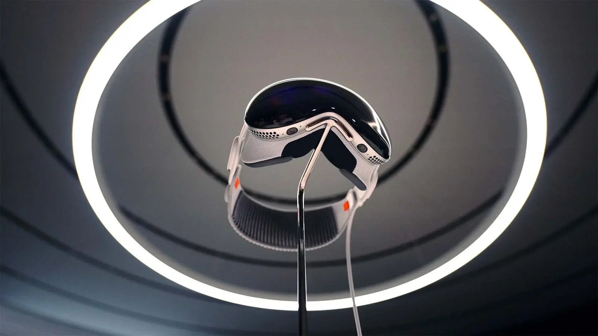
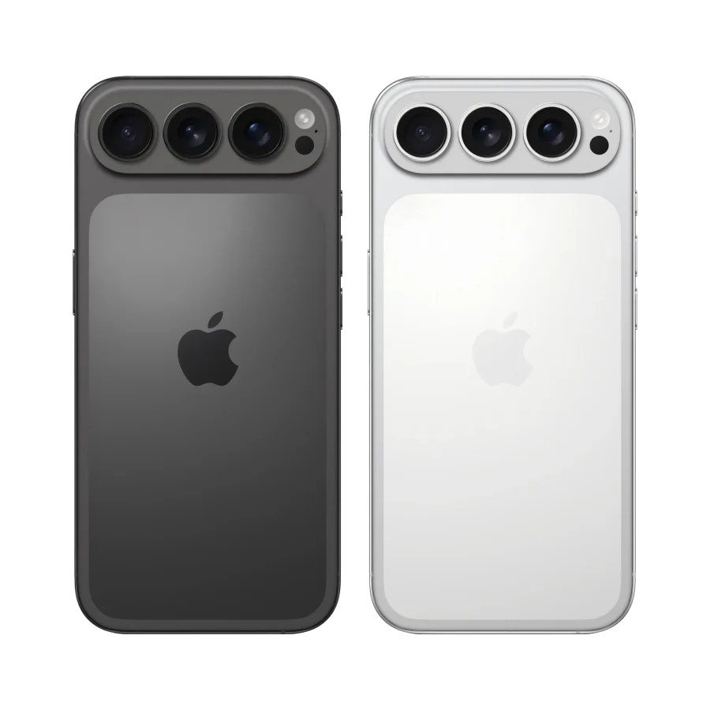

## **💻 מקבוק חדש עם שבב של אייפון – במחיר מפתיע**

אפל מתכננת מקבוק בגודל 13 אינץ' עם שבב A18 Pro (מהאייפון 16 פרו), וצפויה לקרוא לו פשוט "MacBook". מדובר בדגם מוזל שיגיע בצבעים צעירים (כחול, ורוד, צהוב, כסף) ויעלה בין **699 ל־799 דולר**.

📆 השקה צפויה: **סוף 2025 / תחילת 2026**

🎯 **המטרה:** להנגיש את עולם ה־Mac לקהל רחב, כמו שקרה עם האייפד.

## **👓 משקפי Vision: מפת הדרכים עד 2028 נחשפת**

דלפה חדשה מציגה את תוכניות אפל בתחום ה־XR:

- **Vision Pro עם M5** – שדרוג קל השנה
    
- **Vision Air (קל משקל)** – ב־2027
    
- **Vision Pro 2** – ב־2028
    
- **Apple Glasses אמיתיות** – ב־2027
    
- **XR Glasses היברידיות** – ב־2028
    

📌 מסקנה: אפל לא מוותרת על התחום – אבל המהפכה עדיין רחוקה.

## **📱 אייפד פרו דק יותר – אבל האייפד המתקפל מתעכב**

- **אייפד פרו עם שבב M6** ומסגרות דקיקות במיוחד – אולי השנה הבאה.
    
- **iPad Fold בגודל 18.8 אינץ’** – נדחה שוב, אולי ל־2028.
    

📝 הערה: אחרי iPadOS 26 – מתחשק יותר מאי פעם טאבלט מתקפל.

## **🍏 iPhone 17: מסך גדול יותר ולוגו חדש**

- **iPhone 17 הרגיל יקבל מסך 6.3 אינץ’** – כמו הדגם Pro.
    
- **הלוגו בגב זז טיפה למטה**, אולי בגלל שינויים במגנטים.
    

לא מדובר במהפכה – אבל אלו עדכונים שמבדלים את הדגם מגרסאות אחרות, כולל ה־iPhone 17e המוזל.

## 🔍 **לסיכום**:

אפל מתכוננת לשנה עמוסה: מקבוק חדש שיגיע עם תג מחיר מפתה, משקפיים מתקדמות שעדיין רחוקות מהמדף, ועיצובים חדשים למכשירים מוכרים. הרבה רעש – אבל גם הרבה ציפייה.
