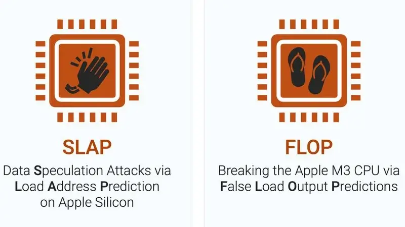

חוקרי אבטחה חשפו לאחרונה שתי פרצות חדשות במעבדים של Apple, הנקראות SLAP ו-FLOP, המהוות סיכון למידע האישי של משתמשי מכשירי הסדרות A ו-M. הפגיעות עשויה לאפשר לאתרים זדוניים לגנוב פרטי כרטיסי אשראי, היסטוריית גלישה ועוד, דרך דפדפנים כמו Safari ו-Chrome.

## מהן פרצות SLAP ו-FLOP?

פרצת SLAP (Speculative Load Address Prediction) משפיעה על מעבדים מדגם M2 ו-A15 ומעלה. היא מאפשרת להאקרים לגשת למידע מעבר לגבולות המוגדרים, באמצעות ניצול טעויות בתחזיות העומס של המעבד.

לעומתה, FLOP (Faulty Load Outcome Prediction) תוקפת את מעבדי M3 ו-A17 החדשים, על ידי ניצול טעויות בתחזיות הערכים, דבר שמאפשר לעקוף מנגנוני אבטחה.

שתי הפגיעויות הללו מסכנות מידע אישי כמו דואר אלקטרוני, היסטוריית גלישה ופרטי כרטיסי אשראי.

## כיצד מתבצעת ההתקפה?

אתרים זדוניים מנצלים את הפגיעויות הללו על ידי עמודים ייעודיים המושתלים בקוד זדוני. טכניקות כמו Cross-Site Scripting (XSS) או שימוש בתוספי דפדפן בעייתיים מאפשרות להאקרים גישה למידע רגיש ואף השתלטות על המכשיר.

Apple הודיעה כי היא מודעת לבעיה ועובדת על תיקון, אך נכון לעכשיו הסיכון נחשב נמוך.

## מה ניתן לעשות כדי להתגונן?

- **עדכוני תוכנה** – הקפידו לעדכן את מערכת ההפעלה והדפדפנים באופן שוטף.
- **זהירות בגלישה** – הימנעו מביקור באתרים שאינם מוכרים או חשודים.
- **שימוש בכלי אבטחה** – שקלו להשתמש בחוסמי פרסומות או הרחבות אבטחה מומלצות לדפדפנים.

## סיכום

הפגיעויות SLAP ו-FLOP מדגישות עד כמה גם החומרה המתקדמת ביותר אינה חסינה לחלוטין מפני פרצות אבטחה. בעוד ש-Apple עובדת על תיקונים, האחריות על שמירה על אבטחת המידע האישית נותרת בידי המשתמשים. עדכוני תוכנה שוטפים, גלישה זהירה ושימוש בכלים להגנה מפני איומים הם אמצעים חשובים לצמצום סיכונים. בסביבה טכנולוגית המשתנה במהירות, מודעות לאיומים והקפדה על נהלי אבטחה הם המפתח לשמירה על פרטיות ומידע אישי.

- פרצות SLAP ו-FLOP משפיעות על מעבדי Apple מסדרות M ו-A החדשות.
- הן מנצלות חולשות באופטימיזציית הביצועים של המעבדים לגניבת מידע רגיש.
- Apple מודעת לבעיה ועובדת על תיקונים, אך ממליצה למשתמשים להישאר ערניים.
