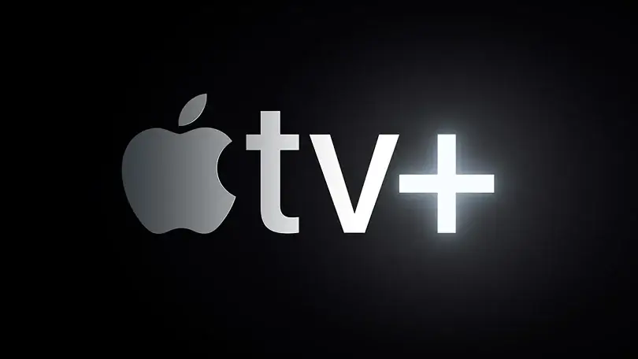
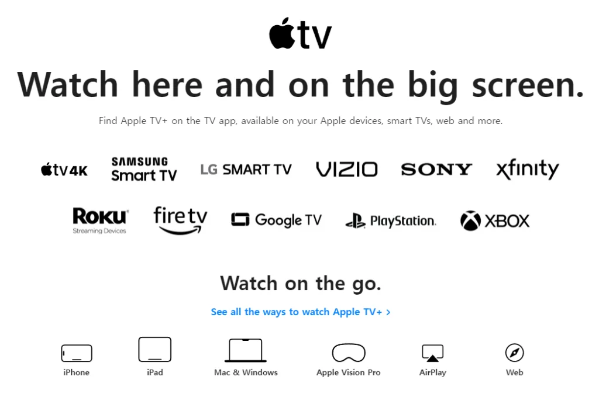
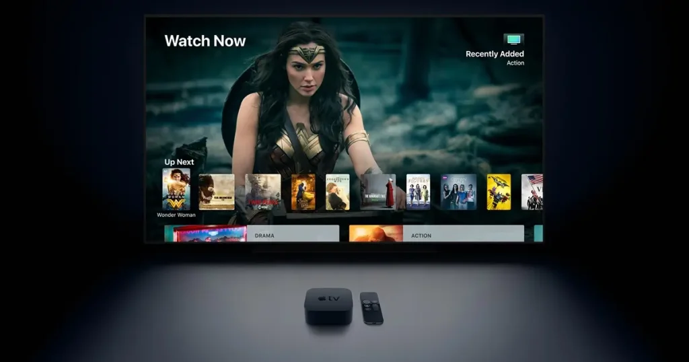
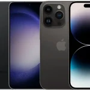

# סקירת Apple TV+ לשנת 2024: האם זה שווה את הכסף שלך?  

Apple TV+ הוא שירות הסטרימינג הבלעדי של אפל, שמתמקד בסדרות וסרטים מקוריים בלבד. מאז שהושק ב-2019, הפלטפורמה עברה מלהיות קטנה ולא מוכרת לאחד השחקנים הבולטים בעולם הסטרימינג, בעיקר בזכות ההשקעה של אפל בתוכן איכותי.

Apple ©

למרות שאין לה את מאגר התוכן הרחב כמו פלטפורמות אחרות, Apple TV+ בולטת הודות להתחייבות שלה להפקות מקוריות ברמה גבוהה. אבל השאלה המרכזית היא: האם השירות שווה את המחיר? בואו נבדוק את התוכן, הפיצ'רים והעלות כדי לעזור לכם להחליט.

## איך Apple TV+ עומדת ביחס לשירותי סטרימינג אחרים?

מבחינת מחיר, Apple TV+ מתומחרת באופן תחרותי. במחיר של ₪25.90 לחודש, זה אחד משירותי הסטרימינג ללא פרסומות הזולים ביותר שיש. בעוד שהיא לא מציעה חבילות עם שירותים כמו Disney+ או Netflix, ניתן לשלב אותה עם שירותים אחרים של אפל דרך החבילה Apple One.

איפה ש-Apple TV+ באמת מצטיינת זה בתוכן המקורי שלה. לא תמצאו כאן את הספריות הענקיות כמו ב-Netflix או Amazon Prime, אבל כן תמצאו סדרות כמו "Ted Lasso" ו-"Severance" (עונה 2 בקרוב), לצד סרטים כמו "CODA", שזכה באוסקר לסרט הטוב ביותר.

כמה עולה ?  
מנוי ל-Apple TV+ עולה ₪25.90 לחודש נכון לאוקטובר 2023. ניתן גם לשלב את השירות עם חבילת Apple One החל מ-₪35 לחודש לתוכנית האישית, הכוללת שירותים נוספים כמו Apple Music, iCloud+ ו-Apple Arcade.

החדשות הטובות הן שאם אתם עדיין מתלבטים, אפל מציעה מספר אפשרויות להתנסות חינם בשירות.

## אפשרויות ניסיון חינם

Apple TV+ מציעה מספר דרכים להתנסות בחינם, בהתאם לאופן בו אתם נרשמים:

ניסיון חינם ל-7 ימים: זמין לכל מי שנרשם לשירות, נותן שבוע לחקור את הפלטפורמה.  
ניסיון חינם לחודש עם Apple One: אם אתם מנויים ל-Apple One, תקבלו חודש ניסיון לכל השירותים של אפל.  
ניסיון חינם ל-3 חודשים: קנו מכשיר אפל חדש כמו iPhone או Mac, ותוכלו ליהנות מ-Apple TV+ חינם למשך 3 חודשים.  
תוכן מקורי של Apple TV+  
Apple TV+ מתמקדת באיכות ולא בכמות, וזה ניכר. עם תוכניות מקוריות כמו "Ted Lasso", "Severance", ו-"CODA", תוכלו ליהנות מתוכן בלעדי שקשה למצוא במקומות אחרים. למרות שהספריה אינה ענקית כמו שירותים אחרים, כל תוכנית וסרט נבחרים בקפידה, עם הפקה ברמה גבוהה ושמות גדולים בתעשייה.

## פיצ'רים של Apple TV+  

Apple ©

עם מנוי ל-Apple TV+, תוכלו לשתף את השירות עם עד חמישה בני משפחה דרך Family Sharing, וכל אחד יכול ליצור פרופיל אישי עם העדפות משלו. עבור אלה שמחפשים את איכות הצפייה הטובה ביותר, השירות תומך בזרימת תוכן באיכות 4K HDR עם Dolby Vision. כמובן, תצטרכו מכשירים תואמים כדי ליהנות מהמאפיינים הללו במלואם.

Apple TV+ פועלת בצורה חלקה על כל מכשירי אפל, בין אם אתם משתמשים באייפון, אייפד, מק או Apple TV. למי שאין מכשירים של אפל, השירות זמין גם על מכשירים כמו , Amazon Fire TV, ועוד מספר טלוויזיות חכמות תומכות.

האם Apple TV+ שווה את הכסף?  
במחיר של ₪25.90 לחודש, Apple TV+ הוא אחד משירותי הסטרימינג ללא פרסומות הזולים ביותר כיום, במיוחד כאשר מתחרים רבים העלו מחירים. עם ספריית תוכן מקורית שגדלה וממשיכה לצבור שבחים, Apple TV+ הוכיחה שהיא יכולה להתחרות בצורה טובה בשוק הסטרימינג.

אמנם אין לה את העומק של פלטפורמות כמו Netflix, אבל המבחר שלה איכותי וממוקד, עם תכנים מקוריים מרשימים שישאירו אתכם מרותקים. אם אתם מחפשים אלטרנטיבה ייחודית לשירותים הגדולים או רוצים לגלות על מה כל הרעש, Apple TV+ בהחלט שווה ניסיון – במיוחד עם אפשרויות ההתנסות החינמיות.

Apple TV+ לא מנסה להיות הכל לכולם, אבל עבור מי שמעריך סיפור טוב והפקה באיכות גבוהה, זה בהחלט תמורה מצוינת למחיר.

## מה עוד כדאי לדעת על Apple TV+ ?

Apple ©

אחד היתרונות של Apple TV+ הוא חוויית הצפייה המותאמת אישית. מעבר לתוכן המקורי המיוחד שלו, השירות מציע איכות וידאו מצוינת עם תמיכה ב-4K HDR ו-Dolby Atmos, מה שהופך אותו לאופציה מעולה עבור חובבי קולנוע ואוהבי חוויית צפייה מהשורה הראשונה.

בזכות שיתוף הפעולה עם פלטפורמות רבות, ניתן לגשת ל-Apple TV+ לא רק ממכשירי אפל, אלא גם ממגוון רחב של מכשירים אחרים כמו טלוויזיות חכמות של סמסונג, LG ועוד.

סיכום  
בסופו של דבר, Apple TV+ הוא שירות סטרימינג נהדר עבור מי שמחפש תוכן איכותי ומקורי. למרות שאין לו את המאגר העצום של פלטפורמות כמו Netflix או Amazon Prime Video, הוא מציע סדרות וסרטים ייחודיים ומקוריים שלא תמצאו בשום מקום אחר. המחיר ההוגן של ₪25.90 לחודש, יחד עם אפשרויות הניסיון החינמיות, הופך את Apple TV+ לשירות ששווה לבדוק, במיוחד אם אתם מעריכים איכות גבוהה בתוכן שאתם צורכים.

- 
    Apple TV+ מציע תוכן מקורי ואיכותי כמו "Ted Lasso" ו-"Severance", אך עם מאגר תוכן קטן בהשוואה לפלטפורמות כמו Netflix. הדגש הוא על תוכן ייחודי ולא על כמות.
- 
    במחיר של ₪25.90 לחודש, Apple TV+ הוא אחד משירותי הסטרימינג ללא פרסומות הזולים ביותר בישראל, ומציע מספר אפשרויות לניסיון חינם כולל שבוע אחד ועד שלושה חודשים עם רכישת מכשיר אפל חדש.
- 
    התמיכה בטכנולוגיה מתקדמת כמו 4K HDR ו-Dolby Atmos, יחד עם זמינות על מכשירי אפל וגם פלטפורמות נוספות כמו טלוויזיות חכמות ו- הופכת את Apple TV+ לשירות אידיאלי עבור חובבי איכות צפייה גבוהה.

חדשות אחרונות  

### [הנה רשימת 10 הסמארטפונים הפופולריים ביותר](https://techhorizons.co.il/top-10-most-popular-smarthpones-2024/)

### [Ghost of Yōtei: ההמשך השאפתני של Ghost of Tsushima](https://techhorizons.co.il/ghost-of-yotei-%d7%94%d7%94%d7%9e%d7%a9%d7%9a-%d7%94%d7%a9%d7%90%d7%a4%d7%aa%d7%a0%d7%99-%d7%a9%d7%9c-ghost-of-tsushima/)

### [לינקין פארק משיקים המנון ליג 2024](https://techhorizons.co.il/%d7%9c%d7%99%d7%a0%d7%a7%d7%99%d7%9f-%d7%a4%d7%90%d7%a8%d7%a7-%d7%9e%d7%a9%d7%99%d7%a7%d7%99%d7%9d-%d7%94%d7%9e%d7%a0%d7%95%d7%9f-%d7%9c%d7%99%d7%92-2024/)

### [Palworld: נינטנדו תובעת, Pocketpair לא נכנעים](https://techhorizons.co.il/palworld-pocketpair-justice/)

### [דליפת וידאו של Galaxy S24 FE](https://techhorizons.co.il/galaxy-s24-fe-leak/)
