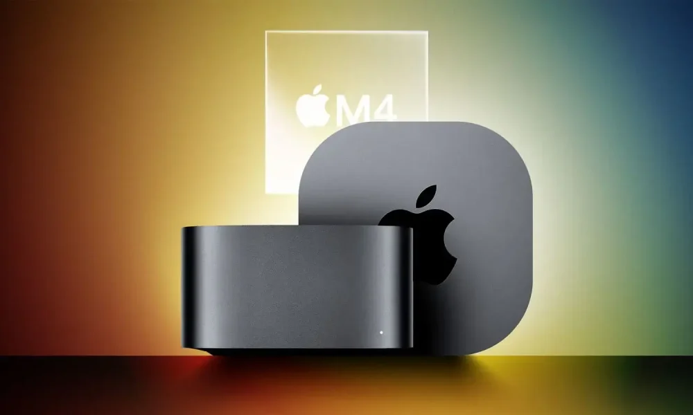
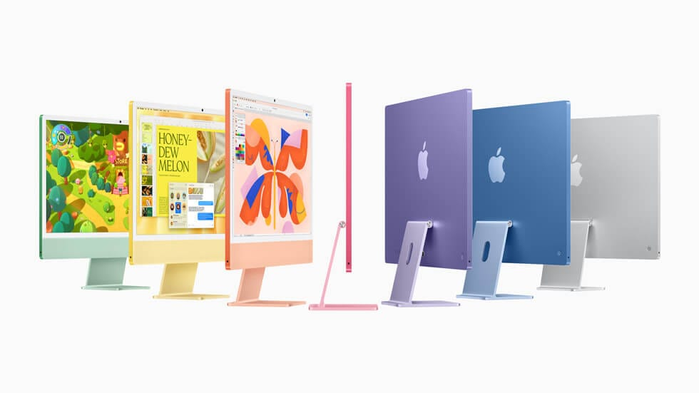
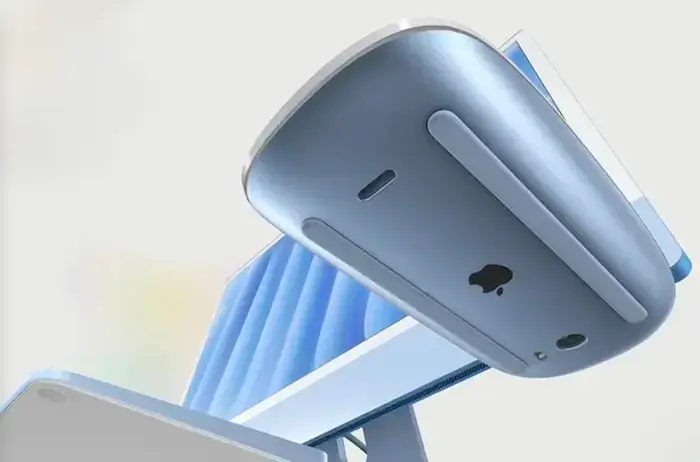

לאחר שבועות ארוכים של שמועות, אישרה אפל ב-25 באוקטובר 2024 כי היא מתכננת סדרת הכרזות במהלך השבוע שמתחיל ב-28. הנה זה מגיע – השבוע החברה תחשוף מספר חידושים.

## שבבי M4 Pro ו-M4 Max

לאחר ההשקה המפתיעה של שבב ה-Apple M4 בתחילת השנה עבור ה-iPad Pro, אפל עומדת כעת לצייד גם את מחשבי ה-Mac באותו שבב.

נזכיר כי עם השבב הזה אפל מכריזה על תאימות מלאה ל-Apple Intelligence, חבילת הכלים שלה המשתמשת בבינה מלאכותית גנרטיבית.

שבב ה-Apple M4 ילווה גם בשבבי M4 Pro ו-M4 Max, אשר ישולבו באופן טבעי בדגמי ה-MacBook Pro החדשים.

עם זאת, אין לצפות לשיפורי ביצועים משמעותיים מהשבבים הללו.

## כוכב השבוע: ה-Mac mini

כוכב השבוע צפוי להיות ה-Mac mini החדש. הדור הקודם הרשים אותנו כבר עם יחס ביצועים-מחיר מצוין.

כעת, עם המעבר לשבב M4, אפל ככל הנראה עיצבה מחדש את המחשב כדי להקטין אותו עוד יותר. לפי השמועות, ייתכן שהמארז יהיה קומפקטי כמו זה של ה-Apple TV.

החיבורים במכשיר צפויים לעבור שינוי, עם דגש על USB-C והסרה של חלק מחיבורי ה-USB-A.

יש בכך סיבה לחשש מעליית מחיר המכשיר. נקווה שזה לא יהיה משמעותי מדי.

## iMac ו-MacBook Pro

אפל צפויה לנצל את ההזדמנות גם כדי לחדש את קו ה-iMac וה-MacBook Pro שלה. לא צפויים שינויים גדולים במכשירים הללו, מלבד המעבר לדור השבבים M4.

החיבורים במכשיר צפויים לעבור שינוי, עם דגש על USB-C והסרה של חלק מחיבורי ה-USB-A.

יש בכך סיבה לחשש מעליית מחיר המכשיר. נקווה שזה לא יהיה משמעותי מדי.

## סוף עידן ה-Lightning

למרות המעבר של כמעט כל מכשיריה ל-USB-C, אפל עדיין משווקת מוצרים מסוימים עם חיבור Lightning, בעיקר אביזרים ל-Mac.

השבוע צפוי לסמן את המעבר המיוחל של ה-Magic Mouse, ה-Magic Keyboard וה-Magic TrackPad ל-USB-C.

## iOS 18.1 ו-Apple Intelligence

לצד ההכרזות על קו מחשבי ה-Mac, אפל צפויה להתחיל בהפצת iOS 18.1 למכשירי האייפון. גרסה זו תשלב לראשונה את פונקציות Apple Intelligence.

**למרבה הצער, הפונקציות הללו לא יהיו זמינות בישראל בשלב זה.**

- אפל משיקה את iOS 18.1 עם שילוב ראשון של פונקציות Apple Intelligence.
- העדכון כולל יכולות חדשות אך לא יהיה זמין בישראל בשלב זה.
- ההכרזה על העדכון מתקיימת לצד חשיפות חדשות בקו מחשבי ה-Mac של אפל.
