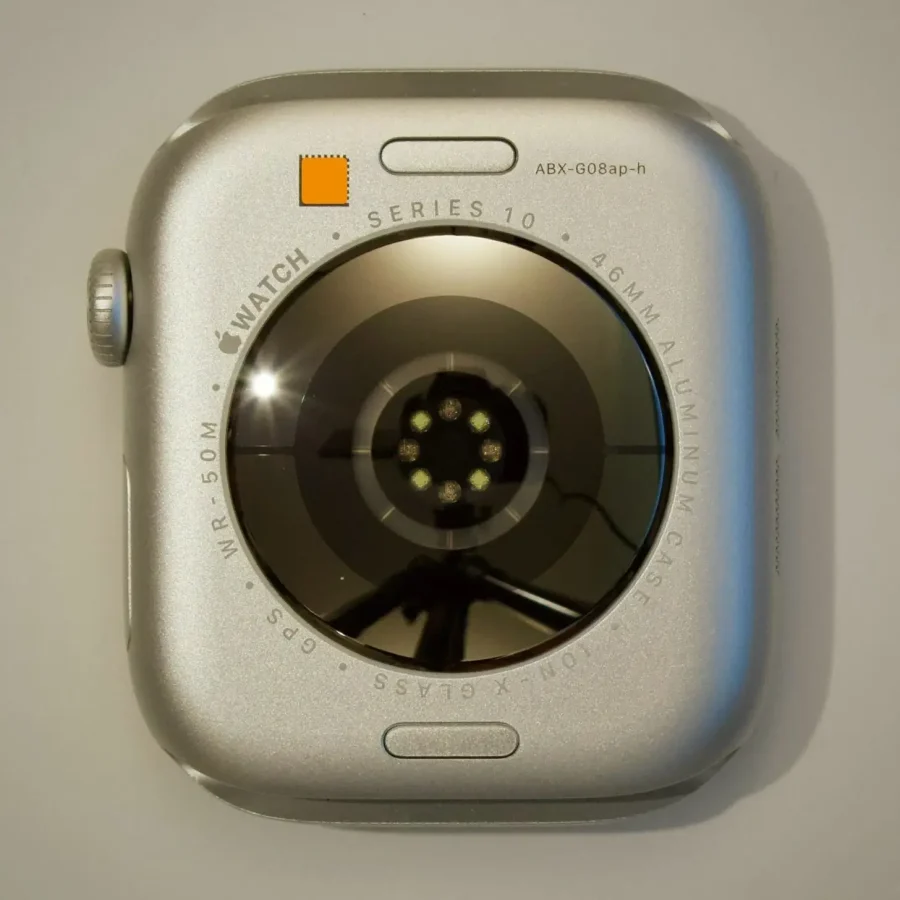
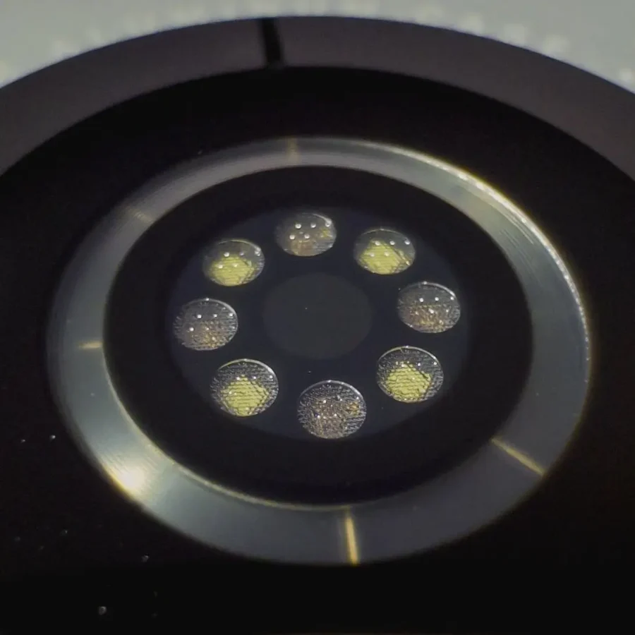

תמונות חדשות שדלפו לרשת חושפות מה שיכול היה להפוך את Apple Watch Series 10 לשעון פורץ דרך באמת – **חיישן בריאות חדש**, שלא נכנס בסופו של דבר לדגם המסחרי.

> Prototype Apple Watch Series 10 with… A very unique health sensor arrangement.  
>   
> The health sensors got shrunk down a lot and there was an extra light ring around the perimeter. The watch is also running an unreleased build of watchOS11, somewhere between 11.1b5 and 11.1rc. [pic.twitter.com/8n06JkQT39](https://t.co/8n06JkQT39)
> 
> — Stella - Fudge (@StellaFudge) [March 31, 2025](https://twitter.com/StellaFudge/status/1906777369546727641?ref_src=twsrc%5Etfw)

## **חיישן קיים – אבל לא בשעון שיצא לחנויות**

על פי הדלפה של @StellaFudge, אב טיפוס של ה-Apple Watch Series 10 הציג **סידור חיישנים חדש מאחור**, הכולל טבעת אור נוספת מסביב למעגל המרכזי. זהו שינוי ברור מהדגם שכולנו מכירים, שיצא בסוף 2024 עם **שדרוגים מינימליים בלבד**: מסך מעט גדול יותר ומבנה דק יותר.

החיישן החדש הזה מעולם לא הגיע לדגם הסופי – מה שמעלה שאלות לגבי ייעודו.

<figure>

<figcaption>

Apple-Watch-Series-10-prototype-1456×1456 (1)

</figcaption>

</figure>

<figure>

<figcaption>

Apple-Watch-Series-10-prototype-2 (1)

</figcaption>

</figure>

## **למה נועד החיישן המסתורי הזה?**

כאן מתחילה התעלומה. אב הטיפוס מריץ גרסה פנימית לא רשמית של watchOS 11, ואין אפשרות להתקין עליו אפליקציות שמאפשרות לבדוק את פעילות החיישנים.

לפי ההשערות, ייתכן שמדובר ב**פלטפורמת ניסוי לחיישן מדידת סוכר בדם** – תחום שאפל משקיעה בו שנים, אך עדיין לא הבשיל למוצר מסחרי. אם נכון, ייתכן שזהו אותו חיישן מסתורי שמוזכר בדיווחים כבר תקופה ארוכה.

## **יותר מדי שאפתני עבור 2024?**

כבר בעבר דווח כי אפל תכננה לשלב **מד לחץ דם** ב-Series 10, אך בעיות טכניות ועיצוביות הביאו לדחיית הפיצ'ר. ייתכן שהחיישן שזוהה בדגם הזה הוא חלק מהניסיון לשלב אחת מהיכולות האלה – ניסיון שלא הצליח להגיע לשלב הייצור ההמוני.

## **מה זה אומר על העתיד של Apple Watch?**

למרות שהתכונה הזו לא יצאה לפועל, היא מהווה **הוכחה לכך שאפל ממשיכה לדחוף קדימה את תחום הבריאות** עם בדיקות מתקדמות, גם אם חלקן נשארות בגרסאות נסיוניות בלבד.

אז האם Series 11 תהיה סוף סוף השעון שיעשה מהפכה אמיתית בתחום הבריאות?  
**ומי יודע – אולי בפעם הבאה הוא אפילו יהיה כלול בסל התרופות של מכבי.**
