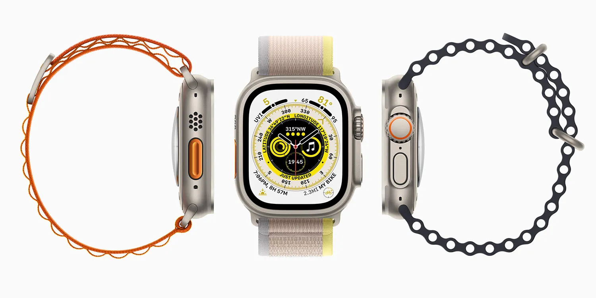

## **📆 ההשקה: ספטמבר 2025**

לאחר שנה שקטה מצד אפל בתחום השעונים החכמים – שבה קיבלנו רק גימור חדש ל-Ultra 2 – השנה צפוי שינוי: לפי מקורות מהימנים, Apple Watch Ultra 3 יוכרז באירוע הסתיו של אפל, שצפוי להיערך סביב יום שני, 8 בספטמבר.

📦 ההזמנות המוקדמות צפויות להיפתח כבר באותו השבוע  
🛍️ והמכירה הרשמית תתחיל ככל הנראה ביום שישי, 19 בספטמבר

## **🆕 מה צפוי להיות חדש ב־Ultra 3?**

אחרי שה־Ultra 2 לא קיבל שדרוגים מהותיים בשנה שעברה, ה־Ultra 3 צפוי "להדביק פערים" – וגם להפתיע.

### **✨ שדרוגים צפויים:**

- **מסך חדש בטכנולוגיית LTPO3 OLED**  
    יאפשר ריענון דינמי חכם יותר, תצוגה חדה יותר בזוויות קשות וחיסכון בסוללה.
    
- **מעבד S10 או S11 חדש**  
    (בהתאם למה שיקבל ה־Series 11), עם פוטנציאל לשילוב תכונות AI חדשות בשעון.
    

## **💥 פיצ'רים חדשים לגמרי? כן, והם מסקרנים**

מעבר לשיפורי חומרה צפויים, ישנם גם שמועות על שלוש תכונות חדשות שישדרגו את חוויית המשתמש — במיוחד למטיילים ואנשי שטח:

- **זיהוי לחץ דם גבוה** 🩺  
    אם יתממש, זו תהיה קפיצה עצומה בתחום הבריאות החכמה.
    
- **חיבור לווייני להודעות** 📡  
    שימושי למצבי חירום ולשטחים ללא קליטה סלולרית.
    
- **תמיכה בדור 5 (5G)** 📶  
    לגלישה והודעות מהירות יותר – גם ללא טלפון צמוד.
