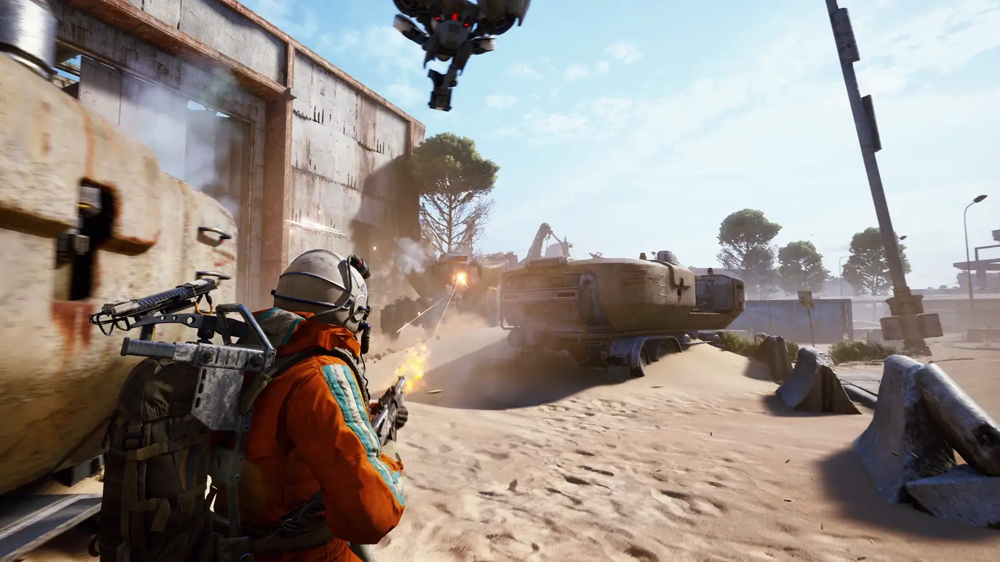
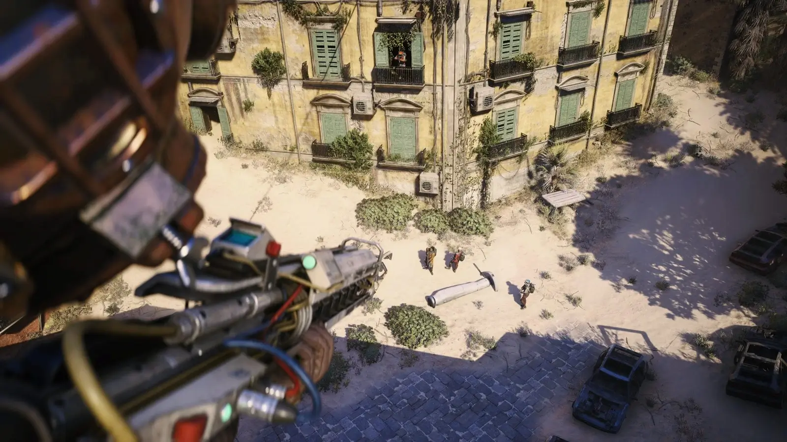

## **מה שהיה משחק שיתוף פעולה – חוזר עכשיו כמשחק הישרדות אינטנסיבי ומבטיח**

שלוש וחצי שנים עברו מאז ש-ARC Raiders הוכרז לראשונה, והכיוון השתנה לגמרי.  
המשחק, שפותח על ידי Embark Studios השוודי (בבעלות NEXON), עובר מהפך – והופך ל־**משחק Extraction PvPvE** עם דגש על הישרדות, אסטרטגיה, וקרבות מותחים נגד שחקנים ומכונות.

## **מה זה ARC Raiders בגרסה החדשה?**

העלילה מתרחשת בעתיד שבו מכונות בשם ARC שלטו בכדור הארץ ודחקו את האנושות למחתרת.  
השחקנים מגלמים את ה-"Raiders" – לוחמים שיוצאים לשטח ההרוס כדי לאסוף משאבים יקרים… ולנסות לשרוד מול שחקנים אחרים, וגם מול המכונות.

בניגוד לגרסה המקורית שהייתה שיתוף פעולה מול AI, הפעם מדובר ב־**משחק הישרדות תחרותי של ממש**, עם מערכות לוט, מוות קבוע (למעט ציוד ב"כיס בטוח") ומסלולי חילוץ מסוכנים.

https://www.youtube.com/watch?v=mFcydjdXbVY&ab\_channel=NVIDIAGeForce

## **איך המשחק עובד בפועל?**

- משחקים לבד או בקבוצות של עד 3 שחקנים
    
- לפני היציאה, בוחרים Loadout הכולל נשק, שריון, תחמושת וגאדג'טים
    
- אם מתים – מאבדים את רוב הציוד, אלא אם הוא היה בכיס הבטוח (Safe Pocket)
    
- שלבי המשחק נמשכים עד 30 דקות וכוללים אפשרות חילוץ בכל רגע, אך רק מנקודות ייעודיות (מעליות, תחנות מטרו)
    
- המשחק תומך גם בתקשורת קולית קרובה (Proximity VoIP), למי שמעז לנסות משא ומתן
    

המפות כוללות **גובה משתנה**, קווי זיפליין, ואויבים מסוגים שונים – ממל"טים קלים ועד רובוטים כבדים.  
השחקנים חייבים לתאם היטב – ירי בודד יכול להפיל אותך למצב של "נפצע, לא מת", ואז רק חבר לקבוצה יכול להציל אותך.

## **התקדמות, קראפטינג ומה שביניהם**

המשחק מציע מערכת **XP רגילה** (גם אם לא חילצתם), לצד מערכת **Mastery** שמתקדמת רק עם חילוץ מוצלח.

🎯 כל פעולה (להביס אויב, להשלים אתגר, להחזיק לוט) מקנה נקודות ניסיון.  
🎯 רמות חדשות פותחות שדרוגי יכולות פסיביות: ריצה חסכונית יותר, שליפה מהירה יותר, וכו'.  
🎯 בנוסף יש **מערכת יצירה (Crafting)** רחבה:

- יצירת תחמושת (קלה, בינונית, כבדה)
    
- חבישות לריפוי
    
- שדרוג ציוד ואוגמנטים להרחבת התיק
    

אפשר גם לבנות תחנות קראפט מתקדמות בין הסשנים, בעזרת משימות NPC – אבל כן, זה נעשה דרך תפריטים ולא דרך עולם פתוח כמו שמצופה ממשחק ב-2025.

## **גרפיקה וביצועים: מרשים, אבל עוד לא מושלם**

המשחק רץ על **Unreal Engine 5**, עם תמיכה ב־**NVIDIA RTXGI**, ו־**DLSS 4 Multi-Frame Generation**.

🎮 הגרפיקה נראית נהדר, אבל גם על מחשב עוצמתי (RTX 5090, Ryzen 7 9800X3D) יש גמגומים קלים.  
זה אמנם רק מבחן טכני, אך בהחלט נדרש שיפור באופטימיזציה.

## **מיקרו-תשלומים ומודלים כלכליים**

- אין כרגע אלמנט של Pay-to-Win
    
- קונים **Battle Pass** באמצעות Raider Tokens שמרוויחים במשחק
    
- בתוך ה-Battle Pass, משתמשים במטבע נוסף (Cred) שמתקבל ממשימות יומיות
    
- במבחן הנוכחי זמינים שלושה פסים: Shuttered Storefront, Back-Alley Market ו-Secluded Courtyard
    

## **פוטנציאל ענק או טרנד חולף?**

ARC Raiders מציג שילוב מעניין בין PvE ל־PvP, עם מערכת קראפטינג מתקדמת, מפת גובה עשירה, ותחושת הישרדות אמיתית.  
המשחק בהחלט **עוד לא גמור**, אבל מה שמוצג עד כה – מבטיח.

האם הוא יהפוך לדבר הבא בז'אנר האקסטרקשן? מוקדם לקבוע.  
אבל אם אתם אוהבים את Hunt: Showdown, Escape from Tarkov או The Cycle – שווה לכם לשים עין.
