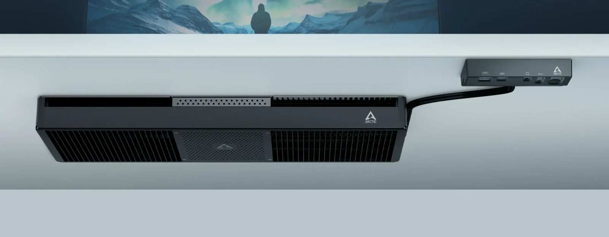
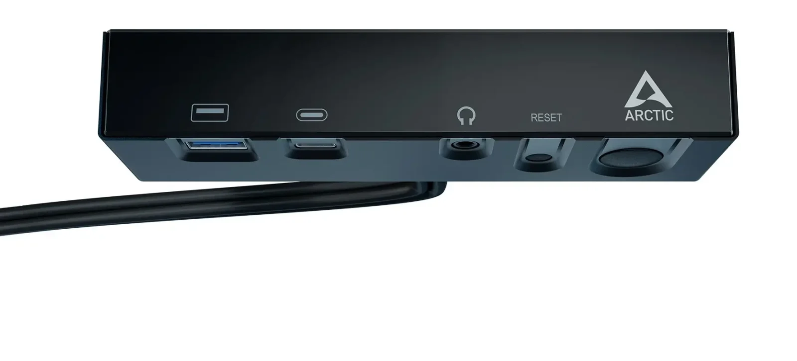

## **מחשב ה־Senza של ARCTIC מופעל על ידי AMD Ryzen ותומך בעד ארבעה מסכים במקביל**

יצרנית פתרונות הקירור הפופולרית ARCTIC חשפה מחשב חדש בשם Senza, שבניגוד למחשבים נייחים רגילים – מותקן ישירות מתחת לשולחן העבודה. מדובר במחשב "מתחת לשולחן" שנועד לארגון עבודה סמוי לגמרי, מבלי לתפוס מקום על השולחן או באחד המדפים.

 

מבחינה חיצונית, ה־Senza מזכיר מתג רשת (Switch) וכולל מידות של 282 מ"מ רוחב, 618 מ"מ אורך, וכ־120 מ"מ גובה. העובי המדויק עדיין לא פורסם אך מוערך בכ־1.5 אינץ'.  
המחשב פועל על מעבדי Ryzen 5000G וכולל שלוש אפשרויות APU לבחירה: Ryzen 5 5500GT, Ryzen 7 5700G ו־Ryzen 5700G Pro.

המערכת פועלת ללא רעש לחלוטין, בזכות פתרון קירור פסיבי שמבוסס על גוף קירור ענק עם צינורות נחושת לפיזור חום מהיר.  
בלב המחשב נמצאת לוח אם ייעודי קטן עם תושבת AM4 סטנדרטית של מחשבי דסקטופ וזיכרון DDR4 רגיל.

המערכת כוללת זיכרון RAM של 32GB מסוג DDR4 ואחסון NVMe SSD בנפח 1TB. מבחינת קישוריות, המחשב מציע חיבור 2.5G LAN, תקשורת Wi-Fi 6E ו־Bluetooth 5.3.

## **חיבורים קדמיים עם גישה נוחה – בלוח נפרד מתחת לשולחן**

המחשב כולל לוח קדמי נפרד שיש להתקין בצידו הקדמי של השולחן, לנוחות מרבית. הלוח כולל חיבורי USB Type-A, USB Type-C, שקע אוזניות, וכן כפתורי הדלקה ואיפוס.  
יתר החיבורים נמצאים בגב המחשב וניתנים לניהול נוח באמצעות ניתוב כבלים יעיל – כולל 2x USB 3.2, ‏2x USB 2.0, שקעי שמע, HDMI 2.0 ו־DisplayPort 1.2.

## **מותאם לאירופה – עם גרסת Windows N**

נראה שה־Senza מיועד במיוחד לשוק האירופי, שכן הוא מגיע עם מערכות הפעלה Windows 11 Home N או Pro N.  
גרסאות אלו אינן כוללות אפליקציות מדיה מובנות כמו Windows Media Player, Skype ואפליקציות מוזיקה ווידאו.  
עם זאת, ניתן להוריד את חבילת המדיה (Media Feature Pack) מאתר מיקרוסופט.

המחשב מיועד הן לשימוש אישי והן לשימוש מסחרי. בשלב זה, ARCTIC לא פרסמה את תאריך ההשקה המדויק או את מחירו הסופי של ה־Senza.

למרות ש־ARCTIC Senza עדיין לא זמין לרכישה, הוא כבר מעורר עניין בזכות הגישה הלא שגרתית שלו למחשוב משרדי ושקט.  
האם מדובר בקונספט שיתפוס גם בשוק הביתי? ימים יגידו – אבל אין ספק שמדובר במחשב ששווה לעקוב אחריו.
