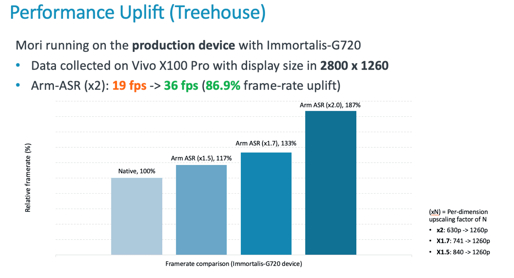

**עד 87% יותר פריימים, גרפיקה חדה יותר ופחות חימום – הכל באמצעות פלאגין פשוט למפתחים.**

אם אתם אוהבים משחקים בנייד, אתם יודעים כמה זה יכול להיות מתסכל:  
המשחק מתחיל לקרטע, הגרפיקה נהיית מטושטשת כשהאקשן גובר, והסוללה נמסה תוך דקות.  
אז הנה חדשות טובות: **חברת Arm חושפת כלי חדש שיכול להפוך את החוויה כולה לזורמת, מהירה וחכמה הרבה יותר.**

## **מה זה בעצם ASR?**

ASR (Accuracy Super Resolution) היא **טכנולוגיית תוכנה חדשה של Arm**, שמאפשרת למפתחים **לשדרג את הגרפיקה במשחקים** בצורה חכמה – בלי להעמיס על המעבד הגרפי של הסמארטפון.

הטכנולוגיה מבוססת על FSR 2 של AMD, שנחשבת לפתרון מתקדם במיוחד לאפסקלינג בזמן אמת. כלומר, המשחק מרונדר ברזולוציה נמוכה יותר, והאלגוריתם "מרים" את האיכות למראה חד וברור – תוך שמירה על ביצועים גבוהים וצריכת חשמל נמוכה.

**אז איך זה נראה בפועל? בדיוק ככה:**

_🔍 ההבדלים הגרפיים כמעט לא נראים, אך הביצועים מוכפלים: מ־20 ל־40fps._

## **כמה זה אפקטיבי באמת?**

Arm מצהירה על **שיפור ביצועים של עד 87%** בשימוש ב־ASR עם אפסקיילינג של פי 2 – למשל על שבב Immortalis-G720.

_📈 גרף ההשוואה מראה מעבר מ־19fps ל־36fps עם ASR ברזולוציית x2 על Vivo X100 Pro עם שבב Immortalis-G720._

לשחקנים תהיה שליטה על רמת האפסקלינג: אפשר לבחור בין 1.5x, 1.7x או 2x – לפי העדפה בין איכות גרפית לבין ביצועים מקסימליים.

## **Unreal כבר תומך – Unity תצטרף בהמשך**

כדי לאפשר למפתחים לשלב את ASR בקלות, Arm שחררה ערכת פיתוח בקוד פתוח ל־Unreal Engine. הערכה כוללת קוד מקור, פלאגין, מדריכים ודוגמאות.  
בהמשך השנה יושק גם פלאגין ייעודי ל־Unity – מנוע המשחקים הפופולרי ביותר בעולם המובייל.

המטרה: לאפשר **שילוב פשוט ומהיר** של ASR במשחקים קיימים ועתידיים, בדיוק כמו ש־NVIDIA ו־AMD עושות בעולם ה-PC.

## **מה ההבדל מול Qualcomm?**

Qualcomm, המתחרה הגדולה של Arm בשוק המעבדים למובייל, מציעה גם היא טכנולוגיית אפסקיילינג – בשם GSR.  
אבל יש הבדל חשוב: GSR מבוססת על FSR 1, בעוד ש־ASR משתמשת ב־FSR 2 – אלגוריתם מתקדם יותר, שמספק איכות גבוהה יותר וחיסכון טוב יותר באנרגיה.

בשורה התחתונה: **Arm מציבה רף חדש לאיכות גיימינג בנייד**, עם פתרון יעיל, פתוח ונגיש לכל מפתח.

## **למה זה משנה עכשיו?**

בעידן שבו משחקי מובייל הופכים ליותר ויותר מורכבים ודרמטיים – והחומרה מתקשה לעמוד בקצב – פתרונות כמו ASR הם לא תוספת מותרות, אלא **מהפכה קטנה שמביאה ביצועים גדולים**.
