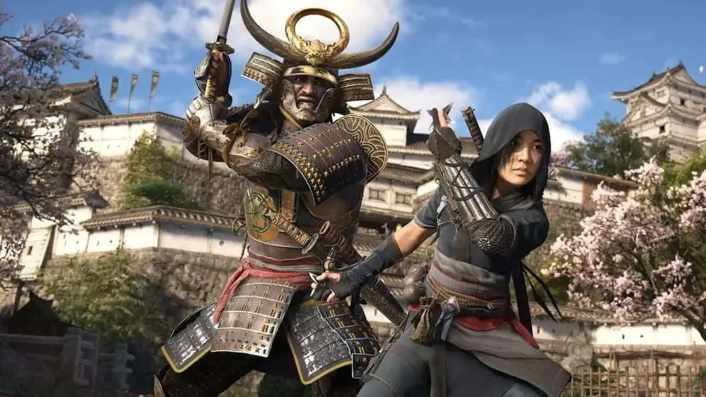

אחד המשחקים המצופים ביותר של שנת 2025, שכבר נדחה בעבר, **Assassin's Creed Shadows**, נדחה שוב בכמה שבועות. Ubisoft מבקשת לוודא שהמשחק יעמוד בסטנדרטים הגבוהים שהיא מציבה.

## נדחה שוב!

אם היינו נשארים עם תאריך היציאה המקורי, כבר היינו מסיימים את **Assassin’s Creed Shadows** מזמן! המשחק המצופה מאוד על ידי מעריצי סדרת הדגל של Ubisoft נדחה בעבר לפני כמה חודשים. במקום לצאת בנובמבר 2024, הוכרז שתאריך היציאה ידחה ל-14 בפברואר 2025, מה שהפך אותו מיד לאחד המשחקים המצופים ביותר של השנה.

אך בעוד שהמעריצים כבר התחילו לספור את הימים עד שיוכלו לשחק בדמויות **נאואה** ו-**יאסוקה**, שני גיבורי המשחק, Ubisoft הכריזה זה עתה על חדשות לא טובות: המשחק נדחה שוב.

> Assassin’s Creed Shadows now releases March 20, 2025. [pic.twitter.com/wTPzY0oiHy](https://t.co/wTPzY0oiHy)
> 
> — Assassin's Creed (@assassinscreed) [January 9, 2025](https://twitter.com/assassinscreed/status/1877400048314528126?ref_src=twsrc%5Etfw)

_**שחקנים יקרים,**_

_אנו רוצים שוב להודות למעריצים המדהימים ולקבוצות המסורות על התמיכה הבלתי מתפשרת שלכם מאז ההכרזה שלנו בספטמבר האחרון, שבה שיתפנו את רצוננו ללטש ולהביא את **Assassin’s Creed Shadows** לרמה הגבוהה ביותר._

_מאז נובמבר, חלקנו את ההתקדמות שלנו באמצעות סרטוני משחקיות, והתגובות הנלהבות שלכם ממש העניקו לנו השראה. בכל שבוע קיבלנו פידבק יקר ערך מהקהילה, שהניע אותנו לשפר עוד יותר את החוויה. למרות ההתקדמות המרשימה שכבר הושגה, אנו מאמינים כי אנו זקוקים לעוד כמה שבועות נוספים כדי לשלב את התגובות הללו ולהבטיח חוויית יום השקה שאפתנית במיוחד._

_**לכן, תאריך ההשקה החדש נקבע ל-20 במרץ 2025.** אנו ממשיכים להיות ממוקדים ביצירת חוויה סוחפת ואיכותית, המונעת על ידי דיאלוג מתמיד בין השחקנים לבין צוותי הפיתוח._

_אנו מבינים שאתם מצפים לשמוע עוד על **Assassin’s Creed Shadows**, ואנחנו שמחים להודיע כי מידע חדש ייחשף בקרוב מאוד!_

_**מארק-אלקסיס קוטה**_  
_וכל הצוותים שעובדים כיום על Assassin’s Creed Shadows_

## יוביסופט בונה רבות על Assassin’s Creed Shadows

כן, קראתם נכון. יוביסופט בחרה לדחות פעם נוספת את השקת **Assassin’s Creed Shadows**. התאריך החדש נקבע ל-20 במרץ 2025, דחייה של קצת יותר מחודש מהתאריך המקורי שתוכנן. אין ספק שחדשות אלו יגרמו לאכזבה בקרב רבים מהמעריצים, אך חשוב לזכור כי יוביסופט נמצאת בתקופה מאתגרת במיוחד. החברה שמה את כל יהבה על הצלחת המשחק הזה כדי לשפר את מצבה.

יוביסופט יודעת היטב שהמשחק חייב לשכנע את הקהל כבר מיום ההשקה. לכן, היא לוקחת את הזמן הנוסף כדי להבטיח ש**Assassin’s Creed Shadows** יספק חוויה שתעמוד בציפיות הגבוהות.

נשאר רק לקוות שהזמן הנוסף שהוקדש לפיתוח Assassin’s Creed Shadows יניב תוצאות, ויספק משחק יציב ואיכותי ביום ההשקה. מעבר ליציבות, המעריצים מצפים גם לאיכות גבוהה שתשאיר חותם חיובי על הסדרה.

למי שפספס, יוביסופט שיתפה לאחרונה בקטעי משחקיות חדשים מתוך Assassin’s Creed Shadows, שבהם ניתן לראות את נאואה (Naoe) בפעולה. המעריצים התרשמו במיוחד מיכולות ה-Parkour המרהיבות שלו, שנותנות הצצה לעומק המשחקיות שמחכה לשחקנים.

https://www.youtube.com/watch?v=pIOXhdKxdPw&ab\_channel=WildGamerSK

- דחייה נוספת אך הכרחית: Assassin's Creed Shadows יושק כעת ב-20 במרץ 2025, עם הבטחה לשיפור יציבות וחוויית משחק מתקדמת.
- קטעי משחקיות חדשים: נאואה וה-Parkour המרשים שלו מככבים בקטעי משחקיות שנחשפו לאחרונה, עם הבטחה לעומק משחקי מרהיב.
- יוביסופט משקיעה הכל: המשחק הקרוב הוא חלק מרכזי באסטרטגיית יוביסופט לשיקום מעמדה בשוק הגיימינג.
