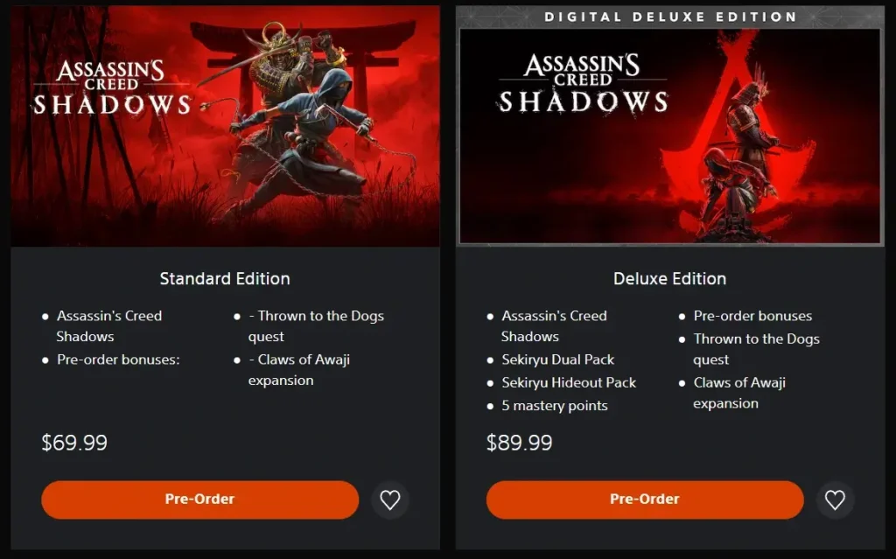
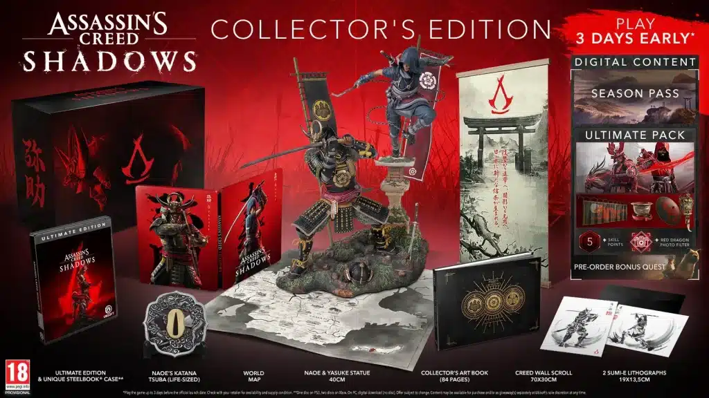

אחרי עיכובים ושערוריות, **Assassin’s Creed Shadows** מתקרב להשקה על **קונסולות ומחשב**. המשחק, שנחשף במקור כ-_Codename Red_, הוכרז רשמית במאי 2024 וצפוי להכניס את השחקנים **ללב יפן של המאה ה-16** – חלום שהתגשם עבור מעריצי הסדרה.

## **מתי Assassin’s Creed Shadows יוצא?**

Ubisoft תכננה במקור לשחרר את המשחק **ב-15 בנובמבר 2024**, אך לאחר ביטול השתתפותה ב-Tokyo Game Show, ההשקה נדחתה. בתחילת ינואר 2025, החברה הודיעה על **דחייה נוספת**, והמשחק ייצא כעת ב-**20 במרץ 2025**.

ראוי לציין שהתאריך נופל על **ה-30 שנה למתקפת הסארין ברכבת התחתית של טוקיו**, אירוע טרגי שבו נהרגו 14 אנשים ונפצעו יותר מ-5,800.

## **איפה אפשר לשחק ב-Assassin’s Creed Shadows?**

בניגוד לכותרים אחרים, המשחק **לא יהיה בלעדי לפלטפורמה אחת**, ויהיה זמין על:

- **PlayStation 5**
- **Xbox Series X|S**
- **Amazon Luna**
- **Mac**
- **iPad (בהמשך)**

המשחק ייכלל גם **בשירות Ubisoft+**, שם ניתן לשחק בו במנוי חודשי.

## **מה המחיר של Assassin’s Creed Shadows?**

המשחק יימכר בכמה גרסאות:

  PS Store@

- **69.99$** (ל-PS5 ול-Xbox Series X|S)
- **גרסת Deluxe 89.99$** עם תוספות דיגיטליות כמו חבילות נשקים ובונוסים
- **גרסת אספנים – 229.99**$, הכוללת:  
    - **פסל של Naoe ו-Yasuke**
    - **ספר אומנות מהודר (76 עמודים)**
    - **תיבת SteelBook ייחודית**
    - **מפת העולם של המשחק**
    - **ה-Tsuba של קטאנה בגודל אמיתי**
    - **פרגמנט קיר של תורת המתנקשים**
    - **שתי ליתוגרפיות בסגנון sumi-e**

## **עלילת המשחק: מי הדמויות המרכזיות?**

המשחק יכניס את השחקנים **ללב יפן הפיאודלית**, שם ניתן לבחור לשחק באחת משתי דמויות:

- **Naoe**, נינג'ה מהירה, קטלנית ומיומנת בהתנקשות שקטה
- **Yasuke**, סמוראי חזק שמסתער על אויביו בעוצמה אדירה

השחקנים ינועו בין **ערים מבוצרות, נמלים עמוסים ומקדשים שלווים**, כשהם משלבים קרבות אקשן חדים עם התגנבות מתוחכמת.

## **סיכום**

**Assassin’s Creed Shadows יושק ב-20 במרץ 2025**, עם חוויית משחק ייחודית ביפן הפיאודלית. המשחק יגיע ל-PS5, Xbox, Mac ואפילו ל-iPad, עם גרסאות שונות כולל **מהדורת אספנים יוקרתית**. האם הוא יעמוד בציפיות של מעריצי הסדרה? נחכה ונראה.
