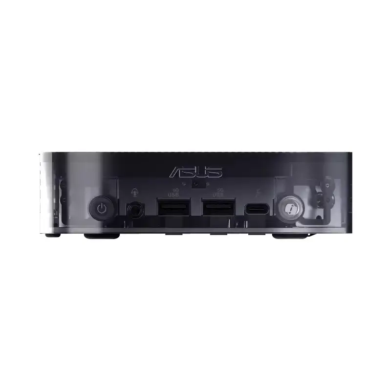
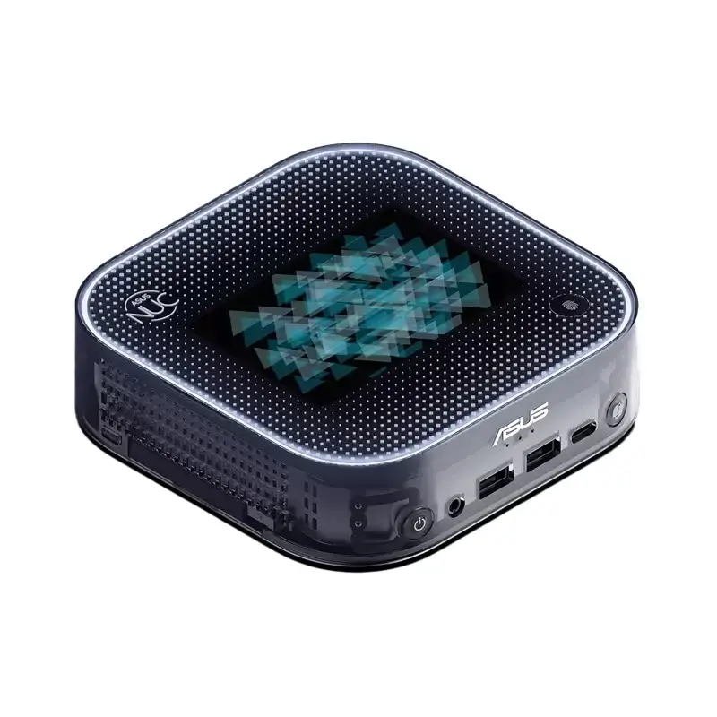
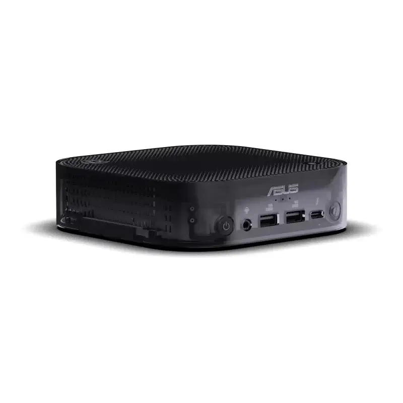

Asus מחזירה את הנוסטלגיה של המארזים השקופים מהסוף של שנות ה-90, אבל עם שדרוג מודרני – **מסך E Ink צבעוני**. המיני PC הזה כבר מוכר במארז סולידי יותר, אך הגרסה השקופה היא לא רק אסתטית. במקום להסתיר את הרכיבים מאחורי חזית אטומה, Asus בחרה להציג אותם בצורה מרשימה וגלויה.

<figure>

<figcaption>

NUC 14 Pro AI Plus

</figcaption>

</figure>

<figure>

<figcaption>

NUC 14 Pro AI Plus

</figcaption>

</figure>

<figure>

<figcaption>

NUC 14 Pro AI Plus

</figcaption>

</figure>

## מסך E Ink מחובר לאפליקציית בינה מלאכותית

Asus מציגה שדרוג ייחודי עם **מסך E Ink צבעוני**, המתחבר לאפליקציה ייעודית ליצירת תמונות באמצעות בינה מלאכותית. התמונות המופקות ניתנות להצגה ישירות על גבי המסך, מה שמוסיף נופך ייחודי למחשב המיני.

## מה יש מתחת למכסה השקוף?

המחשב מצויד במעבד העדכני ביותר של **Intel Core Ultra (Luna Lake)**. בנוסף, Asus שילבה כפתור ייעודי ל-**Microsoft Copilot**, כולל מיקרופון ורמקול מובנים, לתקשורת קולית נוחה עם המחשב.

## חיבורים מתקדמים:

המיני PC לא חוסך ביכולות קישוריות: **Wi-Fi 7**, **Bluetooth 5.4** ו-**Thunderbolt 4** מבטיחים חוויית שימוש מתקדמת. שילוב זה הופך את ה-NUC 14 Pro AI Plus למתחרה רציני ב-Mac mini M4.

- עיצוב פורץ דרך: מארז שקוף עם מסך E Ink צבעוני לתצוגה מותאמת אישית בעזרת בינה מלאכותית.
- טכנולוגיה מתקדמת: מעבד Intel Core Ultra, כפתור Microsoft Copilot וחיבורים מתקדמים כמו Wi-Fi 7 ו-Thunderbolt 4.
- מכונה עתידנית: שילוב של עיצוב ייחודי וביצועים שמציבים את המיני PC של Asus מול ה-Mac mini M4.
