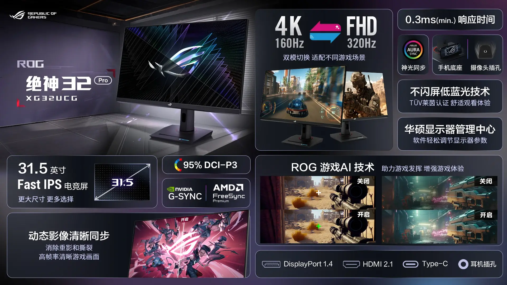
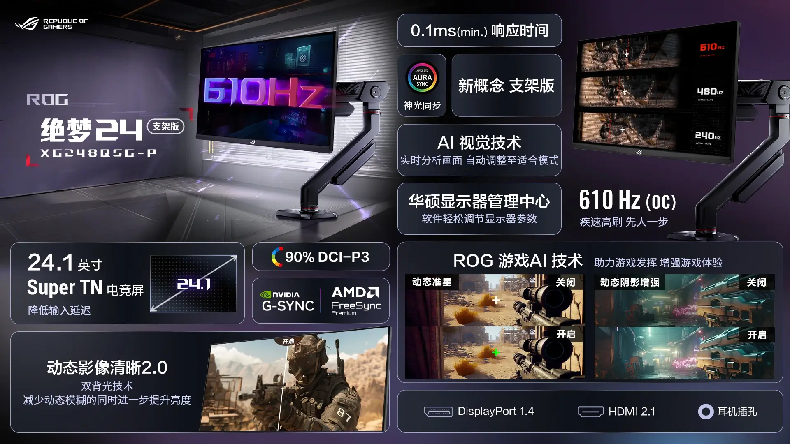
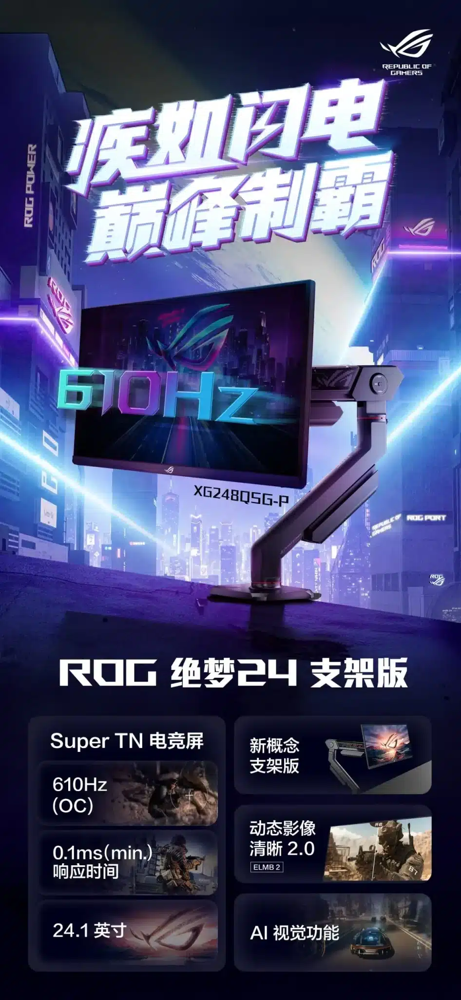
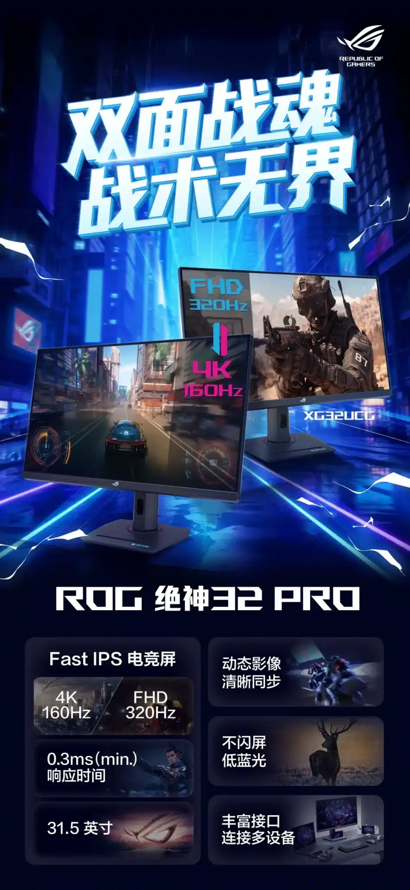

**מסך אחד פונה לגיימרים תחרותיים שמחפשים את הביצועים הגבוהים ביותר, והשני מציע חוויית משחק חלקה ב־4K או 320Hz – בלחיצת כפתור.**

## **היכרות עם שני המסכים החדשים מבית ASUS**

ASUS הכריזה על שני מסכים חדשים מסדרת ROG, שכל אחד מהם נועד לקהל יעד שונה:

- **ROG XG248Q5G-P** – מסך בגודל 24.1 אינץ', עם קצב רענון מטורף של עד **610Hz**
    
- **ROG XG32UCG** – מסך 32 אינץ' עם **מצב כפול**: 4K ב־160Hz או FHD ב־320Hz
    

 

## **ROG XG248Q5G-P – קצב רענון קיצוני לגיימרים תחרותיים**

המסך הקומפקטי הזה נועד במיוחד עבור **שחקני eSports שדורשים מינימום שיהוי**.  
הוא כולל פאנל Super TN בגודל 24.1 אינץ', עם **זמן תגובה של 0.1ms** ותמיכה ב־**G-Sync ו־FreeSync Premium**.  
כיסוי הצבעים עומד על 90% מ־DCI-P3, עם תאורה אחורית כפולה להפחתת מריחות תנועה.

### **שלושה מצבים לבחירת קצב רענון:**

- 240Hz
    
- 480Hz
    
- **610Hz (במצב Overclock)**
    

כמו כן, תמצאו כאן טכנולוגיית ROG Gaming AI, עם התאמות תמונה בזמן אמת, כוונת מובנית ושיפור אזורי צל.

### **אבל האם באמת צריך 610Hz?**

למרות שזה מרשים על הנייר, **קשה להצדיק שימוש אמיתי בקצב רענון כזה**:

- רוב המשחקים פשוט לא רצים בקצב פריימים כזה – אפילו עם כרטיס מסך עוצמתי.
    
- גם **ההבדלים בין 360Hz ל־610Hz כמעט ואינם נראים בעין**, אלא אם אתה שחקן מקצועי ברמות הגבוהות ביותר.
    
- ברוב המצבים, מדובר **יותר בהצהרת יכולת שיווקית** מאשר בצורך אמיתי של הגיימר הממוצע.
    

לסיכום, זהו מסך שנועד **למי שמתחרה ברמה הכי גבוהה** – או מי שפשוט רוצה את הטוב ביותר, גם אם זה מוגזם.

**מחיר:** כ־₪4,030 (7999 יואן / $1100)  
**חיבורים:** DisplayPort 1.4, HDMI 2.1, שקע אוזניות

## **ROG XG32UCG – שילוב בין חדות לבין קצב**

המסך השני בגודל 32 אינץ' מציע פאנל Fast IPS עם זמן תגובה של **0.3ms**, וכיסוי צבעים של 95% DCI-P3. 
מה שמייחד אותו הוא מצב כפול שמאפשר לבחור בין:

- **4K בקצב של 160Hz** – לחוויית משחק חדה ועשירה
    
- **FHD בקצב של 320Hz** – לגיימרים שרוצים חלקות מקסימלית
    

המסך כולל גם טכנולוגיית Clear-Sync להפחתת מריחות והבהובים, ומיועד למי שרוצה **מסך גמיש שמתאים לכל מצב משחק**.

**מחיר:** כ־₪2,000 (3999 יואן / $550)  
**חיבורים:** DisplayPort 1.4, HDMI 2.1, USB-C, שקע אודיו

## **אז למי זה מתאים?**

- **XG248Q5G-P** – לשחקני FPS תחרותיים ברמה הכי גבוהה, שמחפשים מהירות תגובה קיצונית.
    
- **XG32UCG** – לגיימרים שרוצים גם חדות של 4K וגם אפשרות לקצב מהיר יותר למשחקים תובעניים – במסך אחד.
