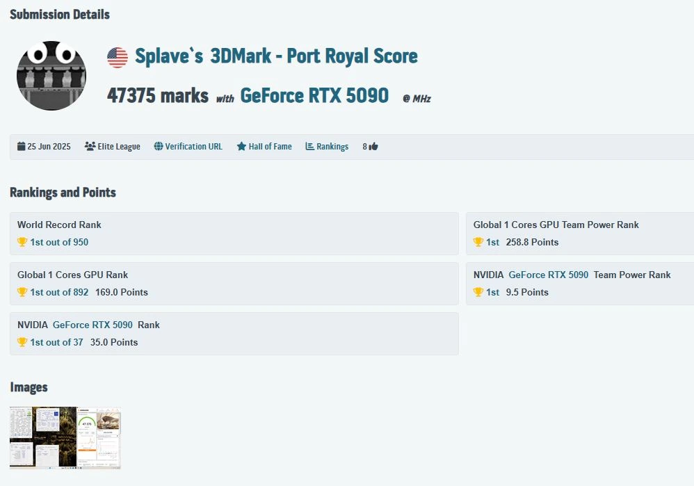
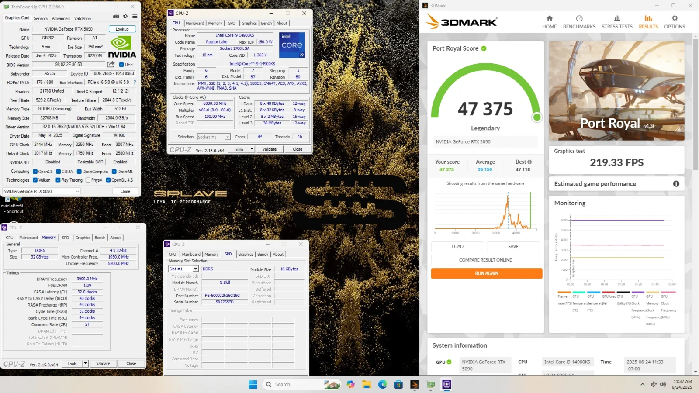

> 🏆 WORLD RECORD SMASHED!  
>   
> 🚀💪[@SplaveOC](https://twitter.com/SplaveOC?ref_src=twsrc%5Etfw) conquered 3DMark Port Royal with the ROG Astral GeForce RTX 5090 OC Edition—achieving an incredible 47375 marks! 💯  
>   
> Explore our 50 Series graphics cards: [https://t.co/u40vGTNUbU](https://t.co/u40vGTNUbU)[#GeForceRTX50](https://twitter.com/hashtag/GeForceRTX50?src=hash&ref_src=twsrc%5Etfw) [pic.twitter.com/uzwUmiycSs](https://t.co/uzwUmiycSs)
> 
> — ROG UK (@ASUS\_ROGUK) [June 30, 2025](https://twitter.com/ASUS_ROGUK/status/1939700114572083435?ref_src=twsrc%5Etfw)

## **קירור חנקן, ביצועים בשמיים – והשיא שכולנו חיכינו לו**

ה־RTX 5090 עוד לא סיים להפתיע:  
ה־ASUS ROG Astral RTX 5090 OC שבר שיא עולמי חדש במבחן **Port Royal של 3DMark**, כשנרשמו **47,375 נקודות** – הגבוה ביותר שנמדד אי פעם לכרטיס מסך מסחרי.

האחראי על ההישג: **Splave**, מהאוברקלוקרים המוכרים בעולם.

## **31% יותר מהביצועים הממוצעים**

כרטיסי RTX 5090 מגיעים לרוב ל־36,000 נקודות ב־Port Royal.  
Splave הצליח לחצות את רף ה־47 אלף – **קפיצה של כ־31% לעומת הממוצע**, או מעל 11,000 נקודות תוספת. זה הבדל שבדרך כלל רואים בין דורות, לא באותו כרטיס.

כדי להגיע לשם הוא השתמש בקירור חנקן נוזלי (LN2) ובגרסת OC קיצונית של ASUS Astral – אחת הגרסאות המובחרות בשוק.

## **איזה מפרט עמד מאחורי השיא?**

- **GPU:** ASUS ROG Astral RTX 5090 OC
    
- **קירור:** חנקן נוזלי
    
- **מהירות Boost:** לפי הצילום – 3007MHz (כנראה יותר בפועל)
    
- **FPS ב־Port Royal:** 219.33 ממוצע (!)
    

אגב, השעון הרשמי של הכרטיס הוא 2610MHz – כלומר השיא נעשה בהרבה מעל הקצבים הסטנדרטיים.

## **יא חדש, אבל לכמה זמן?**

השיא הקודם הוחזק ע״י OGS עם 47,196 נקודות – והוא נשבר תוך ימים ספורים.  
בעולם האוברקלוקינג הקיצוני, שיאים נוטים להחזיק **ימים ספורים בלבד**, כשקהילת ה־benchmark לא מפסיקה לדחוף את הגבול.

ASUS חגגה את ההישג ברשתות החברתיות – עם קריצה למי שמחפש עיצוב ייחודי וביצועים בלי פשרות.

## **לסיכום**

- 🏆 שיא Port Royal חדש: 47,375 נקודות
    
- 🚀 ביצועים 30% מעל הממוצע
    
- ❄️ בעזרת קירור LN2 וקצת טירוף
    
- 🎮 לא לגיימרים רגילים – אבל בהחלט השראה למה אפשר לסחוט מה־RTX 5090
