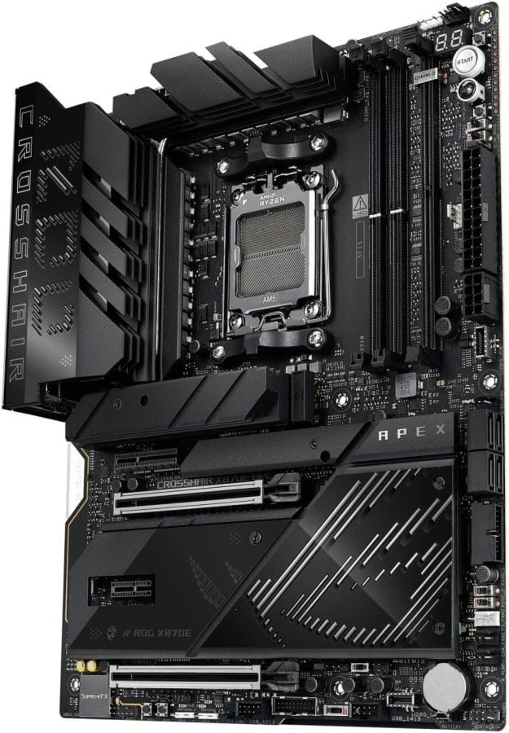
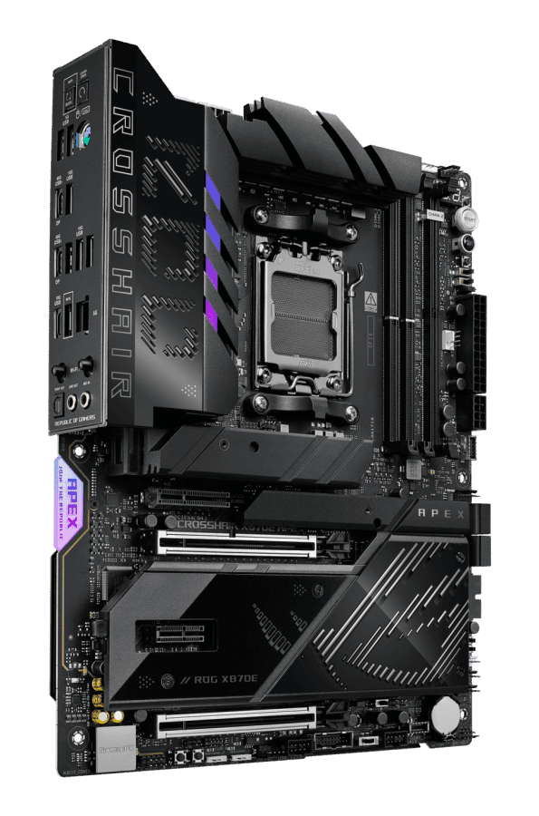
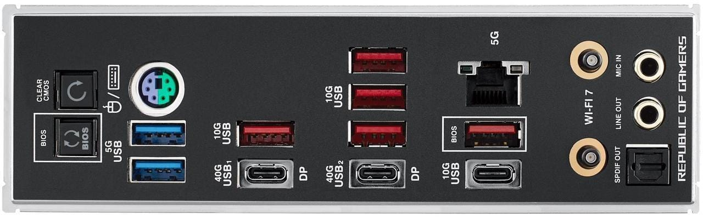

## **לוח אם למי שלא אוהב גבולות**

אם אתם מהסוג שלא מסתפק בסטנדרט ונהנים לדחוף את המערכת שלכם עד הקצה, ASUS הכינה לכם משהו מיוחד. ה-ROG Crosshair X870E APEX סוף סוף נוחת בחנויות ומבטיח להיות מפלצת אמיתית לאוברקלוקרים וחובבי ביצועים.

הלוח הזה מיועד למעבדי AMD Ryzen 7000, 8000 ו-9000, והוא נבנה כדי למצות כל טיפה של ביצועים מהמערכת שלכם. ASUS כבר השיקה כמה לוחות מסדרת 800 השנה, אבל הדגם הזה היה מהמצופים ביותר – ובצדק.

## **זיכרון שרץ מהר יותר מרוכב אופניים אחרי קפה שחור**

הדגם הזה לא מיועד למשתמשים מזדמנים. ASUS כבר הוכיחה שהוא מסוגל להקפיץ זיכרון **G.Skill DDR5 ל-10,600 MT/s**, עם ערכת 2x 24GB. זה הישג רציני, במיוחד על פלטפורמת AM5, שם להגיע למהירויות כאלה זה לא עניין של מה בכך.

לפי ASUS, לוח האם תומך רשמית במהירות של **9600 MT/s** עם מעבדי Ryzen 8000, אבל עם הגדרות נכונות (וקצת סבלנות), אפשר להגיע גם רחוק יותר.

## **כוח רציני עם חיבוריות מהשורה הראשונה**

ASUS לא חסכה כאן, והלוח הזה מביא איתו:

- **18+2+2 שלבי כוח**, כדי לשמור על יציבות גם בתנאי אוברקלוק קיצוניים.
- **גופי קירור מסיביים**, כדי שלא תמצאו את עצמכם עם תנור במקום מחשב.
- **תמיכה ב-PCIe 5.0**, גם לחריצי x16 וגם ל-M.2.

וכמובן, כלים מובנים שיעזרו לכם לשמור על המערכת שלכם במצב אופטימלי בלי לחפור יותר מדי ב-BIOS.

## **הרכבה קלה יותר, עם תיקון חשוב מ-ASUS**

ASUS שילבה כמה פיצ'רים שהופכים את חוויית הבנייה לנוחה יותר:

- **Q-Release לכרטיסי מסך ו-M.2** – גישה קלה בלי לפרק חצי מחשב.
- **Q-Antenna ו-Q-Dashboard** – תוספות שמביאות נוחות לחובבי השיפצורים.
- **FlexKey Button** – התאמה אישית לפי הצרכים שלכם.

ולגבי בעיה שהטריפה משתמשים לאחרונה: ASUS נאלצה לעדכן את מנגנון ה-Q-Release שלה אחרי שכמה גיימרים גילו שכרטיס המסך שלהם נשאר "נעול" קצת יותר מדי טוב… הגרסה החדשה מגיעה עם עיצוב מתוקן שפותר את הבעיה.

## **זמין כבר עכשיו להזמנה מוקדמת, אבל מי יודע מה יהיה המלאי?**

ה-**ROG Crosshair X870E APEX** זמין כבר עכשיו להזמנה מוקדמת, כשהמשלוחים הראשונים צפויים להתחיל ב-4 באפריל. אבל כמו שאנחנו מכירים את השוק בישראל, השאלה היא כמה יחידות באמת יגיעו – וכמה זה יעלה בסוף...
