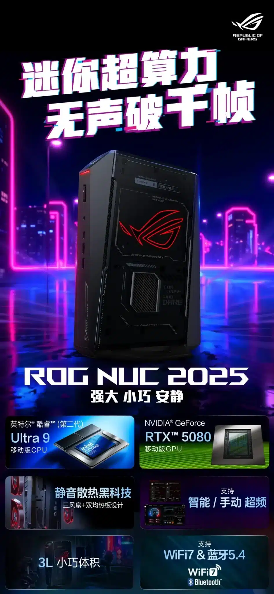
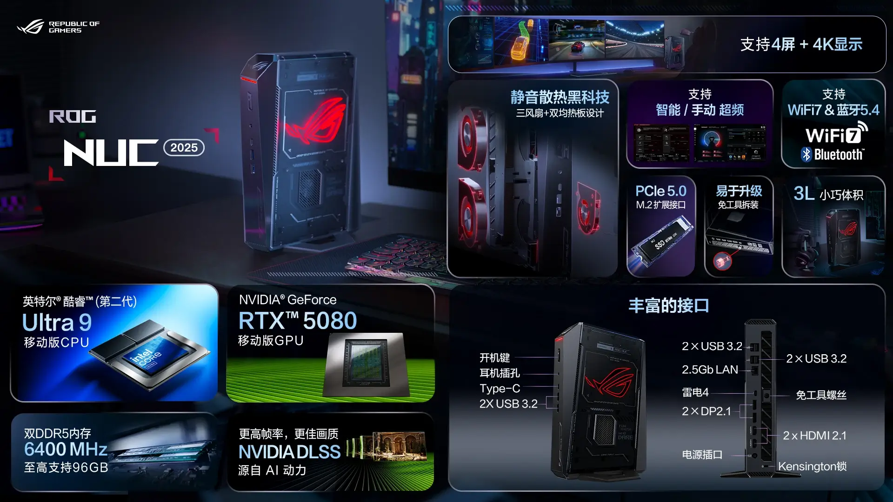
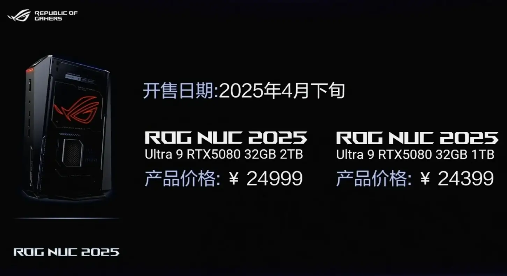

**אחרי ההכרזה על לוח האם החדש [ROG Crosshair X870E Extreme](https://techhorizons.co.il/asus-rog-x870e-extreme-motherboard), אסוס ממשיכה להפתיע עם ROG NUC 2025 – מחשב בגודל של קונסולה עם ביצועים של תחנת גיימינג.**

במשך שנים, מחשבי NUC נחשבו לפתרון משרדי קטן. אבל ASUS, במסגרת מותג הגיימינג ROG, לקחה את הפורמט הזה והפכה אותו לדבר אחר לגמרי: **מחשבים קומפקטיים בעיצוב מתקדם עם מפרטים שמיועדים לגיימרים, יוצרים מקצועיים ומי שמחפש עוצמה באריזה קטנה**.

ה־ROG NUC 2025 הוא הדור החדש בסדרה – מחשב בנפח 3 ליטרים בלבד, שמצליח לדחוס בתוכו מעבד מהחזקים ביותר של אינטל וכרטיס מסך מסדרת RTX 50.

## **מה יש בפנים – מפרט טכני של מפלצת מוקטנת**

ה־ROG NUC 2025 מגיע עם:

- **Intel Core Ultra 9 275HX** מהדור Arrow Lake – 24 ליבות (8 ביצועים + 16 יעילות), תדר טורבו עד 5.4GHz, 76MB קאש, וצריכת חשמל מירבית של 160W
    
- כרטיס מסך **NVIDIA RTX 5080** עם 7680 ליבות, 16GB GDDR7 וביצועים דומים ל־RTX 5070 בגרסת הדסקטופ
    

למרות גודלו הקטן, המחשב תוכנן בקפידה כדי לתמוך ברכיבים עתירי עוצמה – עם פתרונות קירור מתקדמים שמונעים התחממות יתר.

## **קירור חכם בגוף קטן – עיצוב 3 ליטרים**

כדי לשמור על יציבות המערכת במארז כה קטן, ASUS שילבה:

- **שתי יחידות קירור (Heat Sink) עצמאיות**
    
- **שלושה מאווררים פנימיים לפיזור חום יעיל**
    
- תכנון אווירודינמי עם כיסוי מחורר
    
- ויתור על RTX 5090 ככל הנראה בגלל מגבלות תרמיות
    

## **זיכרון, אחסון וחיבורים – בלי פשרות**

המחשב תומך ב־:

- **עד 96GB של DDR5 במהירות 6400MT/s**
    
- **תמיכה ב־4 מסכים ברזולוציית 4K**
    
- **SSD מסוג PCIe 5.0 M.2**
    
- **WIFI7 + Bluetooth 5.4**
    

### חיבורים בולטים:

- 4 חיבורי USB 3.2
    
- יציאת רשת **2.5GbE**
    
- Thunderbolt 4
    
- 2 יציאות HDMI 2.1
    
- 3 חיבורים קדמיים נוספים (USB + אודיו)
    

## **כמה זה עולה ומתי זה זמין?**

ASUS תציע את המחשב בשתי גרסאות, עם הבדל בגודל ה־SSD בלבד:

- גרסת **1TB** – במחיר של **24,399 יואן (≈ ₪4,925)**
    
- גרסת **2TB** – במחיר של **24,999 יואן (≈ ₪5,035)**
    

הזמינות מתחילה עוד החודש – אפריל 2025.

## **למי זה מתאים – ולמה לבחור דווקא בזה?**

ה־ROG NUC 2025 הוא פתרון אידיאלי למי שמחפש:

- כוח עיבוד וגרפיקה ברמה גבוהה
    
- מחשב שקט, קטן ודקורטיבי
    
- מערכת גיימינג או עבודה ניידת שלא תופסת מקום
    

אם אתם לא צריכים הרחבות PCIe או קירור נוזלי – זה מחשב שיכול להחליף לחלוטין מערכת Full Tower, בלי לוותר כמעט על ביצועים.
