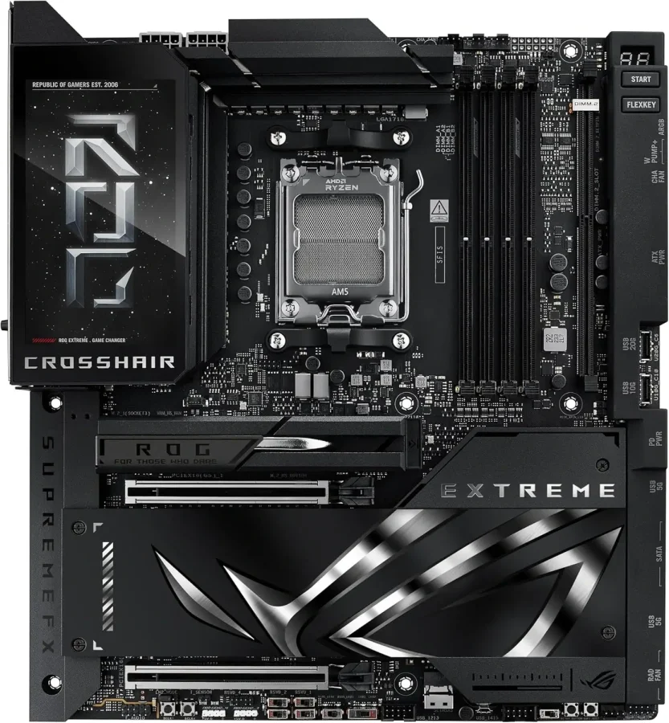
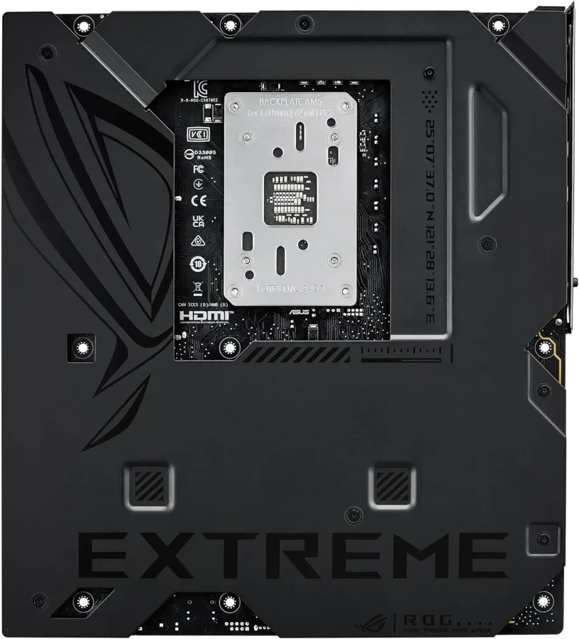
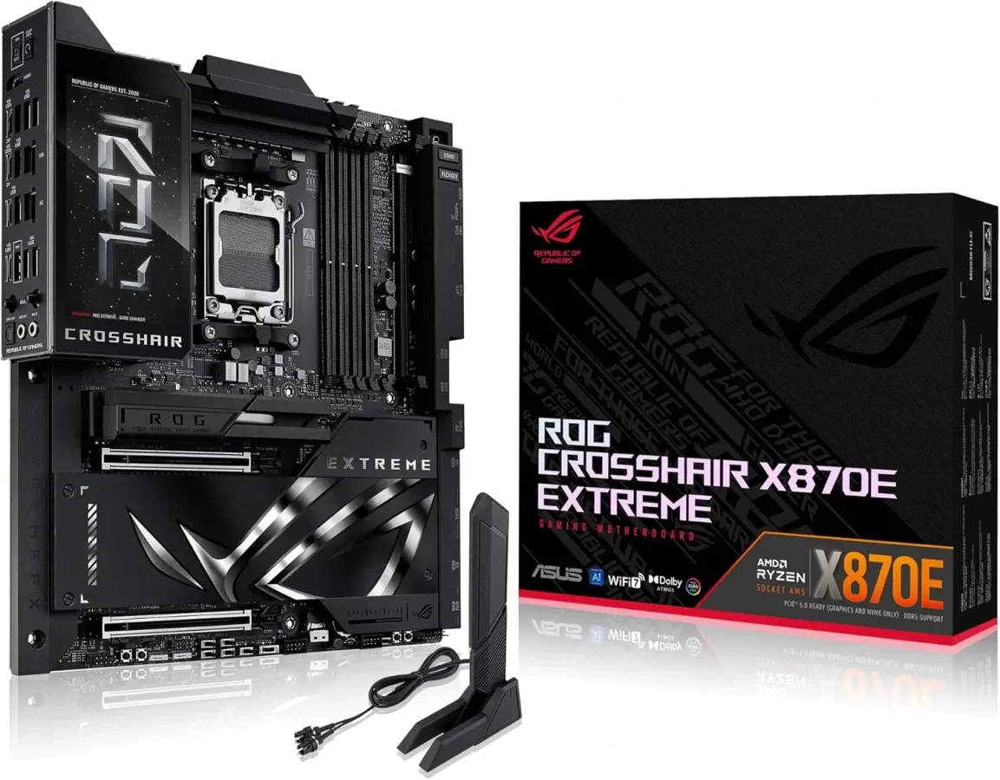
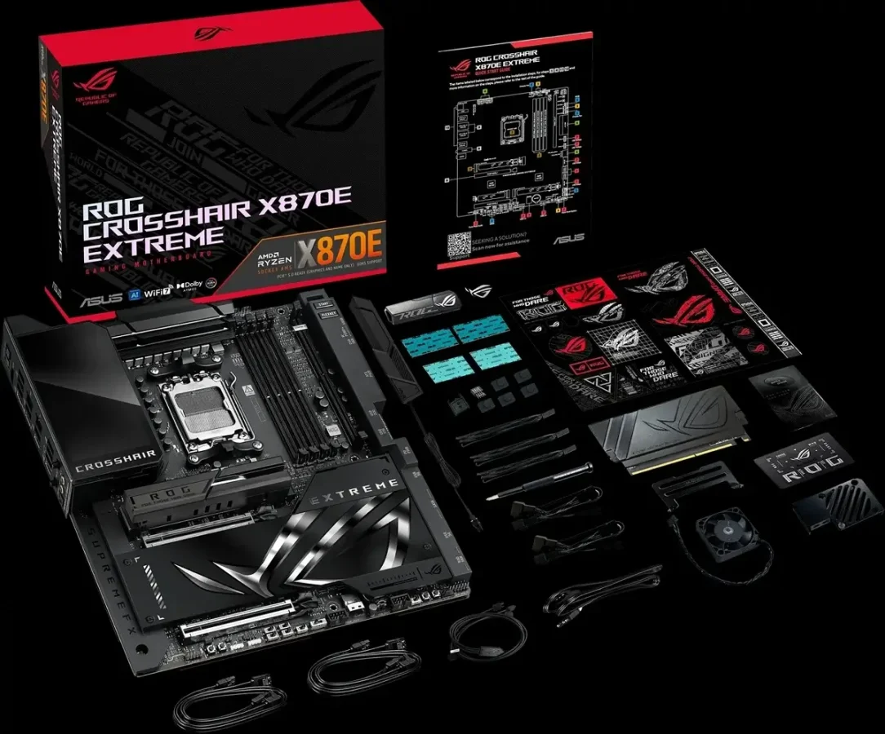

**ASUS משיקה את לוח האם הכי מתקדם שלה ל־AM5 עם תמיכה ב־DDR5-8200, קירור Vapor-Chamber ל־SSD, ומסך LCD על הלוח עצמו.**

אם אתם מחפשים את לוח האם הכי מתקדם לשוק AMD ב־2025, כנראה שזה מה שחיפשתם.  
ASUS הכריזה רשמית על _ROG Crosshair X870E Extreme_ – לוח אם חדש ואקסטרימי באמת, עם מפרט שמכוון לגיימרים כבדים, אוברקלוקרים, ובוני מערכות יוקרה.

## **מה זה בכלל ה־ROG Crosshair X870E Extreme?**

זהו לוח אם חדש בתצורת **E-ATX**, המיועד למעבדי AMD בתושבת **AM5**. הוא כולל:

- מערך חשמל מתקדם: **24 שלבים (20+2+2) בעוצמה של 110A**
    
- חיבורי חשמל כפולים 8-PIN
    
- ארבעה חריצי DDR5 עם תמיכה בזיכרון עד **DDR5-8200** ומהירות אדירה
    
- תמיכה עד **256GB RAM**
    

## **למי הלוח הזה מתאים?**

למי שבונה מחשב High-End מהשורה הראשונה, עם מעבד Ryzen 9, כרטיס מסך עוצמתי, והרבה מקום לשדרוגים.  
אם אתם עושים אוברקלוקינג, עובדים עם קבצים כבדים, משחקים על מסכים 4K/240Hz, או פשוט אוהבים את הטוב ביותר – זה הלוח בשבילכם.

## **מה חדש ומה מייחד אותו?**

  

- **קירור Vapor Chamber ל־SSD מסוג Gen 5** – נדיר מאוד בלוחות אם
    
- **מסך LCD בגודל 5 אינץ’** על לוח ה־I/O לצג מותאם אישית
    
- **2 חריצי PCIe 5.0 x16**
    
- **עד 5 חריצי M.2**, כולל Q-DIMM.2 עם הרחבה ל־2 נוספים
    
- עיצוב בולע חום עם **צלעות קירור ענקיות וצינורות חום**
    
- **כפתורי DEBUG, Power, Clear CMOS**, ועוד
    

## **מה חיבורי ה־USB והרשת שמגיעים?**

- **4 חיבורי USB Type-C**, מתוכם 2 במהירות 40Gbps
    
- **10GbE + 5GbE LAN**
    
- **WIFI7 מובנה**
    
- **HDMI**, חיבורי שמע 7.1
    
- מגוון חיבורי USB-A קדמיים ואחוריים (20G, 10G, 5G)
    

## **האם הוא מתאים לי?**

 

- ✔ מתאים למעבדי **Ryzen בתושבת AM5** בלבד
    
- ✔ נדרש מארז שתומך **E-ATX**
    
- ✔ מומלץ לשלב עם **SSD Gen 5.0** ו־**זיכרון DDR5 מהיר**
    
- ❌ לא מיועד לבונים בתקציב נמוך – מדובר בלוח אם שעולה מעל ₪5,000
    

## **כמה זה עולה ומתי זה מגיע לישראל?**

- מחיר ב־סין: **9999 יואן** (כ־**$1400 / ₪5,150**)
    
- ההשקה הגלובלית צפויה **עד סוף אפריל 2025**
    
- בישראל: ייתכן מחיר גבוה אף יותר (מעל ₪5,500), תלוי בזמינות ומיסוי
    

## **אז לקנות או לחכות?**

אם אתם מחפשים את הלוח הכי מתקדם שקיים היום ל־AM5 – זה כנראה הדגם הכי מפתה.  
אבל אם אתם לא מתכננים לנצל **זיכרון של 8200MT/s**, לא מחזיקים **SSD Gen 5**, או לא עושים אוברקלוק – יש אלטרנטיבות טובות במחיר נמוך יותר.

למי שבונה ריג גיימינג קיצוני או מחשב לתצוגה – _ROG Crosshair X870E Extreme_ הוא חיה אמיתית.
