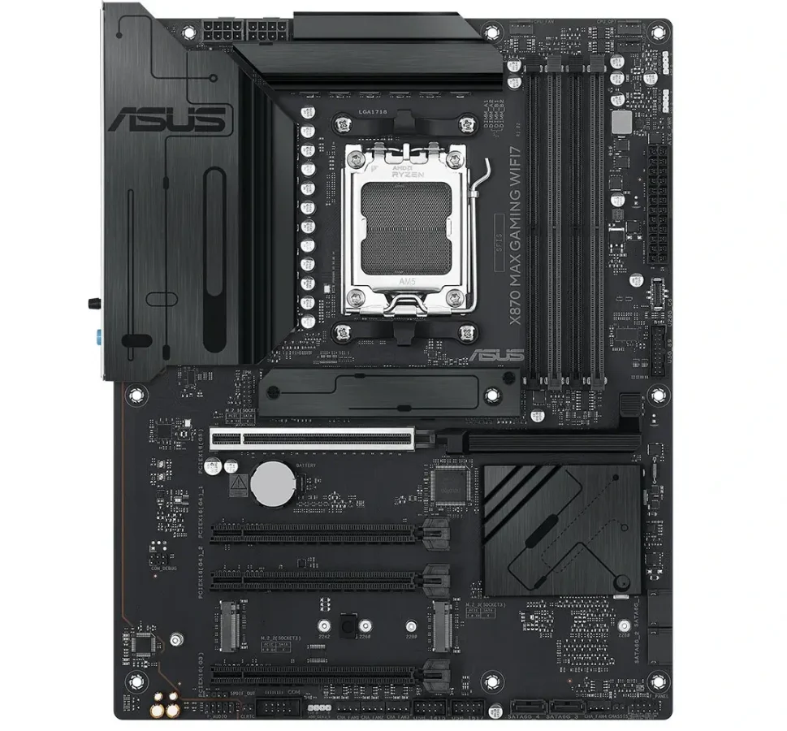
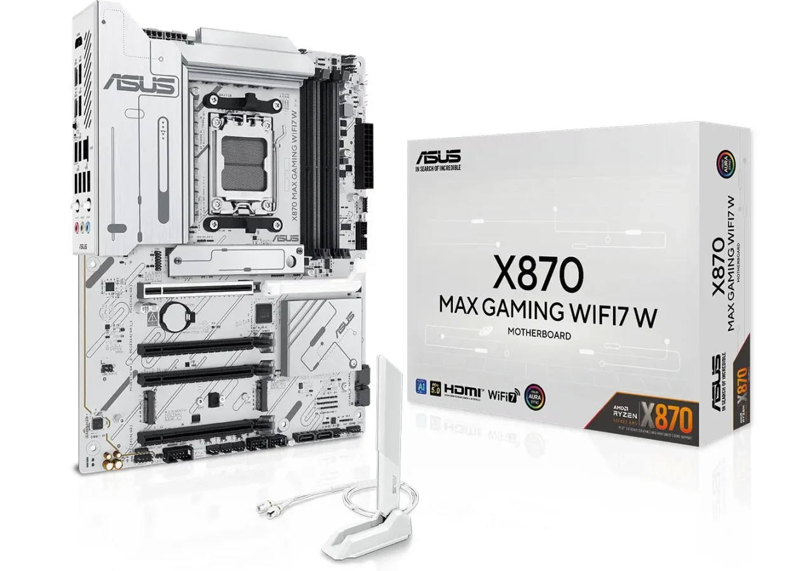

**ASUS משיקה את לוח האם הראשון בסדרת "MAX" החדשה – ומציבה תחרות אמיתית ל־MSI, Gigabyte ו־ASRock.**

## **מה זה ASUS MAX ומה מייחד אותו?**

בעבר, ASUS הציעה שתי סדרות תקציב עיקריות: **Prime**, שהייתה בסיסית מאוד, ו־**TUF**, שהציעה פיצ'רים מתקדמים יותר במחיר נגיש.  
אבל בין השתיים נוצר פער – אותו בדיוק ASUS מנסה לסגור עם סדרת **MAX החדשה**.

לוח האם **X870 MAX Gaming WiFi 7** הוא הראשון בסדרה הזו, והוא מגיע כדי לתת **תמורה גבוהה יותר למחיר** מול המתחרים הישירים – במיוחד מול לוחות ביניים של MSI ו־ASRock.

## **לוח אם חדש, באותו תקציב – עם חיבורים מודרניים**

ASUS X870 MAX מבוסס על **שקע AM5** ותומך באופן מלא במעבדי **Ryzen 9000** החדשים.  
הוא כולל:

- **תמיכה ב־PCIe 5.0** – גם לחריץ הגרפי הראשי וגם ל־M.2
    
- **שלוש יציאות M.2** + **4 חיבורי SATA**
    
- **4 חריצי RAM** (המהירות המקסימלית טרם פורסמה)
    
- **Wi-Fi 7** ו־**Bluetooth 5.4**
    
- חיבורים מודרניים מסוג **USB-A ו־USB-C**
    
- אך **ללא יציאת אודיו אופטית** (S/PDIF)
    

## **עיצוב כפול: שחור או לבן**

הלוח מגיע בשתי גרסאות עיצוב – **שחור מלא או לבן מלא**, עם גוף קירור בצבע תואם ולוח PCB באותו סגנון.  
מבחינה טכנית אין הבדל – רק עניין של טעם והתאמה למארז.

## **למי זה מתאים – ולמה זה מעניין?**

סדרת MAX מיועדת למי שרוצה לבנות מחשב גיימינג או תחנת עבודה בתקציב **של כ־700–900 ש״ח**, אבל לא להתפשר על חיבורים מהירים, עיצוב מודרני ותמיכה בטכנולוגיות חדשות.

למרות שמדובר בלוח "תקציבי", ASUS ממקמת אותו **מעל סדרת Prime** ומתחת ל־TUF, כך שזו יכולה להיות **הבחירה החדשה האידאלית לבוני מחשבים בשנת 2025**.

## **מתי זה יוצא וכמה זה יעלה?**

ASUS עדיין לא חשפה את המחיר הרשמי או תאריך ההשקה המדויק, אבל לפי ההערכות – **ה־X870 MAX יעלה בין $200 ל־$250**, מה שממקם אותו **בול מול הלוחות התקציביים המובילים בשוק**.
