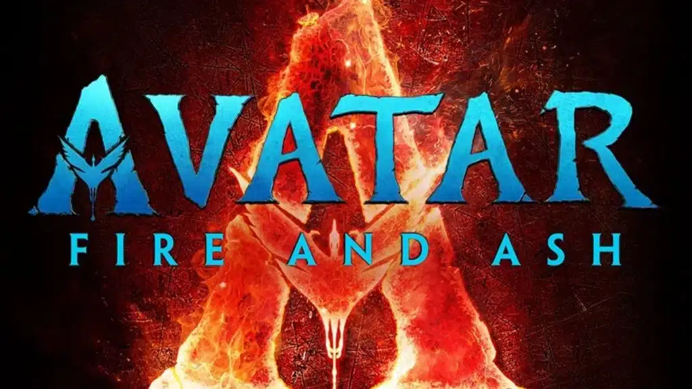

אחרי ההצלחה של _Avatar: The Way of Water_ ב-2022, ג’יימס קמרון מרחיב את היקום הקולנועי שלו עם _Avatar: Fire and Ash_. הסרט, שצפוי לצאת **ב-15 בדצמבר 2025**, יציג שבטים נאבי חדשים וקרב אדיר בין תושבי פאנדורה לכוחות האנושיים של ה-RDA.

לפי **בן פרוקטור**, המעצב הראשי של הסרט, הקרב שיתרחש בו יהיה חסר תקדים, ויהפוך את העימות הימי ב-_The Way of Water_ ל"שוליים בלבד" לעומת מה שמצפה לנו.

## **שבט האפר: נאבי לוחמניים יותר מאי פעם**

אחת התוספות החדשות היא **שבט האפר (Mangkwan)**, שבט נאבי שחי בסביבות געשיות קשות. בניגוד לאומטיקאיה ולמטקאינה, שבט האפר יותר אגרסיבי ולוחמני, ונראה כי הוא ישחק תפקיד מרכזי בסיפור.

### **מי מנהיג אותם?**

שבט האפר יונהג על ידי **ווארנג** (Varang), בגילומה של **אונה צ'פלין** (_משחקי הכס_). הדמות הזו תהיה שונה מכל מה שהכרנו עד עכשיו, ותציג צד אפל ומסוכן יותר של הנאבי.

## **שבט הרוח: קבוצה מסתורית נוספת**

מלבד שבט האפר, הסרט יציג גם את **שבט הרוח (Tlalim)**. עדיין לא ידוע הרבה עליהם, אבל ייתכן שהם ישמשו כמתווכים בין השבטים הנאבי ויהיו בעלי תפקיד חשוב בעימות מול ה-RDA.

## **קרב חסר תקדים בין בני האדם לנאבי**

הסיום האפי של _The Way of Water_ הביא קרב מרשים באוקיינוס, אך _Fire and Ash_ הולך לקחת את הלחימה לרמה הבאה. הקרב המרכזי יכלול **קרבות אוויריים, ימיים ויבשתיים**.

### **נשק העל של ה-RDA**

בכדי להתמודד עם הנאבי, בני האדם חוזרים לפאנדורה עם **Factory Ship** עצום ממדים – פי שניים מגודלם של ספינות ה-SeaDragon. ספינה זו **נועדה ללכוד ולעבד את ה-Tulkun בתעשייה מסיבית**, מה שעלול להחריף את הסכסוך עוד יותר.

### **קרב בשלושה מימדים**

- **קרבות אוויריים** – דרקוני ההרים של הנאבי מול צי ספינות הקרב האנושיות.
- **קרבות ימיים** – נוכחות מוגברת של ה-Tulkun לצד כלי נשק ימיים חדשים.
- **קרבות קרקעיים** – ככל הנראה בשטחים הגעשיים של שבט האפר.

## **ציון דרך חשוב בעלילה של אווטאר**

ג’יימס קמרון ציין שהסרט הזה ישמש **כשלב מעבר** לקראת _Avatar 4 ו-5_, וכי הוא לא רק יציג מלחמה בין הנאבי לבני האדם, אלא גם **קונפליקטים פנימיים בתוך עולם הנאבי עצמו**.

## **מי חוזר בסרט?**

הקאסט המוכר חוזר לתפקידים המרכזיים:

- **ג’ייק סאלי** (סם וורת'ינגטון)
- **נייטירי** (זואי סלדנה)
- **קירי** (סיגורני וויבר)
- **רונאל** (קייט ווינסלט)
- **הקולונל קוואריץ’** (סטיבן לאנג)

אליהם מצטרפת **אונה צ'פלין** בתור ווארנג, דמות חדשה ומרכזית בעלילה.

## **תאריך יציאה וחוויית צפייה**

הסרט יעלה לאקרנים **ב-15 בדצמבר 2025**, וצפוי להיות **חוויית IMAX 3D עוצרת נשימה**. קמרון, שתמיד מחפש לשבור גבולות טכנולוגיים, עשוי לשלב **קצב פריימים חדשני (120fps)** ולשפר עוד יותר את הריאליזם של העולם המדהים של פאנדורה.

## **העתיד של פאנדורה מונח על כף המאזניים**

עם שבטים חדשים, סכסוכים בלתי נמנעים והקרב הגדול ביותר עד כה, _Avatar: Fire and Ash_ הולך להיות סרט מכריע ביקום של אווטאר. האם בני האדם ינצחו הפעם, או שהנאבי יצליחו להדוף אותם אחת ולתמיד?

מה אתם הכי מצפים לראות בסרט החדש? שתפו אותנו בתגובות!
