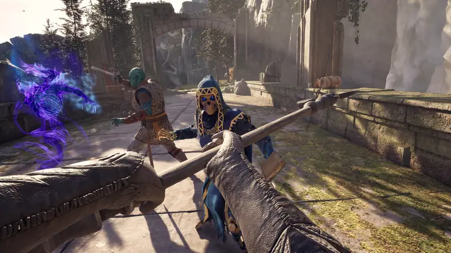
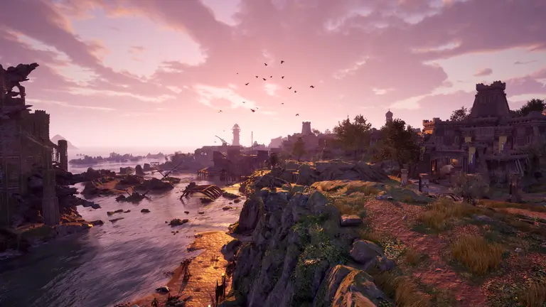
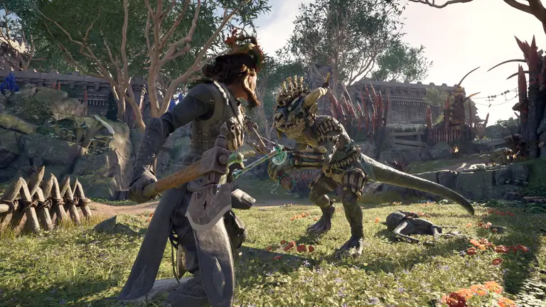
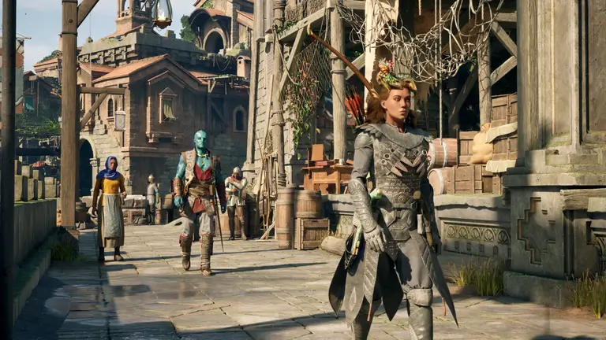
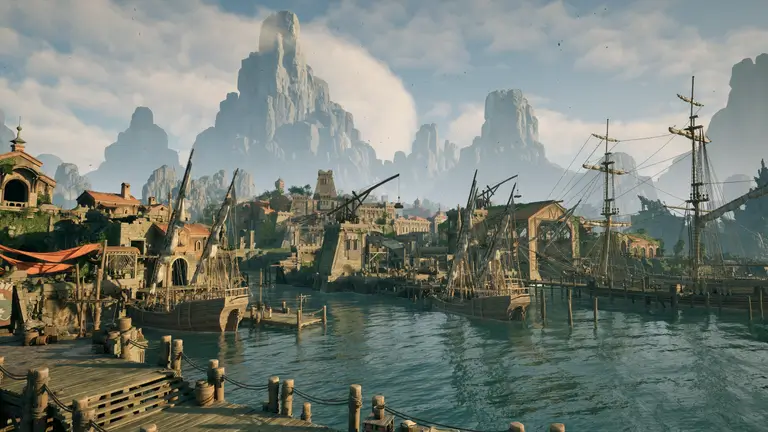

המאסטרים של משחקי התפקידים חוזרים לפעולה בשנת 2025 עם יצירה חדשה ומסקרנת במיוחד לחובבי הז'אנר. הסטודיו שמאחורי משחקים מצוינים כמו Star Wars ו-Fallout שב אל עולם שהוא כולו יצירה מקורית שלו. Avowed מביא עומק נוסף לעולם של Pillars of Eternity, ולא חושש לקחת סיכונים. האם Obsidian Entertainment הצליחו להמר נכון?

## סיפור המשחק

ב-Avowed אנו מגלמים שליח מהאימפריה הרחוקה איידיר, שנשלח לחקור מגפה מסתורית בשם "סיוט רע" (Malrêve) שמתפשטת ברחבי ה"ארצות החיות". לרוע המזל, הספינה שלנו נטרפת מול חופי אי קטן עוד לפני שהגענו ליעד ומסרנו את המסר הקריטי למי שצריך לקבל אותו. כך מתחיל סיפורו של משחק התפקידים החדש, המתרחש בעולם של **Pillars of Eternity**. עלילת המשחק מתרחשת כמה שנים לאחר אירועי הכותר הראשון בסדרה שפותחה על ידי Obsidian Entertainment.

Avowed הוא ספין-אוף שמשלב אלמנטים מרכזיים מהעולם של הסדרה המקורית, לצד רפרנסים ורמיזות שמיועדים לפנק את המעריצים הוותיקים. עם זאת, הקשר בין Pillars of Eternity ל-Avowed אינו מחייב. אין צורך לסיים את המשחקים הקודמים כדי ליהנות מההרפתקה הזו, שמיועדת לא רק לחובבי משחקי תפקידים אלא גם לקהל הרחב. העולם הפנטסטי של Eora מחכה שתצטרפו אליו – וההזמנה הזו פשוט בלתי אפשרית לסירוב.

## גרפיקה

הדבר הראשון שתפס את תשומת ליבנו כשהגענו לחופי ה"ארצות החיות" היה הסגנון האמנותי הצבעוני והזורח של המשחק. בניגוד גמור ליצירות ה"הרואיק פנטזי" האפלות והמוגזמות שצצות לאחרונה, **Avowed** בולט בגישה ויזואלית קלילה ומרעננת. המשחק נמצא בקצה השני של הספקטרום בהשוואה ל"סקיירים" הריאליסטי, וזה ללא ספק יתרון. הבחירה האמנותית הזו מאפשרת ל-RPG של Obsidian Entertainment להתבדל מהמתחרים כבר מהרגע הראשון, עוד לפני שנכנסים למשחקיות עצמה.

הסביבות שראינו במהלך הדמו עוררו בנו תחושת פליאה שהמשיכה ללוות אותנו לאורך כל הדרך. העולם של Eora הוא יפהפה, מלא הבעה ושונה בתכלית מכל מה שהכרנו.

עם זאת, **Avowed** רחוק מלהיות המשחק היפה ביותר שראינו בז'אנר. מבחינה טכנית, הוא לא מתקרב לסטנדרטים הגבוהים שהציבו הכותרים המובילים בעולם משחקי הווידאו, אך חשוב לזכור שהמשחק עדיין נמצא בפיתוח. נצטרך לשפוט את התוצאה הסופית עם יציאת המשחק בעוד כמה חודשים.

בכל מקרה, הטכניות היא לא הכול, במיוחד במשחקים מהסוג הזה. מה שבאמת חשוב הוא היכולת של המשחק לשאוב אותנו לעולם אקזוטי, מלא אפשרויות וסקרנות. תחושת ההרפתקה והגילוי הופכת את החוויה לייחודית ומהנה במיוחד.

## Gameplay

**Avowed** הוא משחק תפקידים בגוף ראשון, בשונה מהמשחקים הקודמים בסדרת **Pillars of Eternity**, שהציגו נקודת מבט איזומטרית. הבחירה של **Obsidian Entertainment** במבט סובייקטיבי נועדה למשוך קהל רחב יותר ולספק חוויה מלאה של שקיעה בעולם הפנטזיה של Eora.

המשחקיות מתמקדת בחקירה, המהווה את ליבת החוויה. המשחק אינו "עולם פתוח" לגמרי, אלא עולם חצי-פתוח המחולק לאזורים גדולים ומחוברים זה לזה. המפה בנויה כך שנוכל לגלות אותה בקצב העלילה, עם מערכת מסע מהיר שמקלה על הניווט בין האזורים.

במהלך החקירה, ה"ארצות החיות" מלאות במקומות סודיים המיועדים לשחקנים סקרנים. במקומות אלה ניתן למצוא שלל וציוד חשוב שמקדמים את התקדמות הדמות. כיאה למשחק תפקידים, **Avowed** מציע מערכת מפורטת ליצירת דמות, רכישת נשקים וציוד, והשגת יכולות חדשות באמצעות צבירת ניסיון ועליית רמות. ניתן לשדרג ציוד קיים או לרכוש חדש בעזרת משאבים וכסף, אותם ניתן להוציא במחנות ייעודיים או אצל סוחרים בעולם המשחק.

**הקרבות** מהווים חלק מרכזי ומהנה במשחק. הם יכולים להיות אינטנסיביים במיוחד מול אויבים חזקים. השחקן יכול להחליף בין שני סטים של נשקים בזמן אמת, מה שמאפשר התאמה לאופי הקרב. בנוסף, ניתן להשתמש בקסמים, לירות בפרויקטילים ולהיעזר בשני מלווים ייחודיים. כל אחד מהם מצויד ביכולות משלו, המתאימות גם לקרב וגם לחקירה, לפי הצורך.

הקרבות הראשונים שלנו בגרסת הדמו הוכיחו ש-Obsidian Entertainment הצליחו ליצור מערכת קרב דינמית וטקטית. הקרבות מצליחים להעביר תחושת אפיות, בין אם מדובר במפגש עם דוב ענק או בעימות מול חיילי משמר מיומנים.

## תסריט

קשה, ואולי אפילו בלתי אפשרי, לשפוט את העלילה של **Avowed** אחרי שעתיים בלבד של משחק. עם זאת, אין ספק שהמוניטין של **Obsidian Entertainment** בתחום הסיפורים ניכר גם כאן. הניסיון שצברו לאורך השנים מתבטא כבר בשלבים הראשונים של המשחק.

אחד האלמנטים המרכזיים בעלילה הוא יצירת הדמות. השחקן בוחר עבר לדמות שלו, בחירה שמשפיעה על הדיאלוגים העתידיים ועל האופן שבו תושבי ה"ארצות החיות" תופסים אותו. בנוסף, הסטטיסטיקות של הדמות יכולות לפתוח אפשרויות תגובה חדשות. עם זאת, בשלבים הראשונים, השיחות מרגישות מעט ליניאריות ומובנות מראש, ולא תמיד מפתיעות.

הסיפור מועבר בעיקר דרך שילוב של קטעי סינמטיקה קצרים, מסמכים הפזורים בעולם, וכמובן דיאלוגים. הבחירות בדיאלוגים משפיעות על התפתחות האירועים: דמויות מסוימות עשויות לבחור להילחם בנו או דווקא לאפשר לנו להמשיך בדרכנו.

כמו ברוב משחקי התפקידים, תחילת המשחק היא רק הקדמה, ולא מספיק זמן כדי לגבש דעה מבוססת על העלילה או על עומק ההסתעפויות שלה. רק לאחר השקעה ממושכת ניתן לראות אם **Avowed** מצליח ליצור סיפור ייחודי ושונה, שיגרום לכל שחקן להרגיש שההרפתקה שלו באמת שונה מזו של אחרים.

## תוכן

**Obsidian Entertainment** מבטיחים חוויה עשירה במשימות ראשיות, קווסטים צדדיים, מבוכים לחקור ותעלומות לפענח, כל זאת בהרפתקה שזורמת באופן טבעי. **Avowed** הוא משחק תפקידים המיועד לשחקן יחיד בלבד, ללא שום אפשרות למצב מרובה משתתפים. הבחירה הזו לא מפתיעה, שכן Obsidian מתמחים במשחקי RPG חווייתיים המיועדים לשחקן בודד, עם דמויות משנה מלאות אופי ותוכן עשיר.

המשחק מדובב באנגלית ומציע כתוביות בצרפתית, מה שמבטיח חוויית משחק נוחה עבור דוברי השפה. לגבי משך המשחק, נצטרך לחכות לעוד פרטים שייחשפו ככל שנתקרב להשקה. מה שכן, כל הסימנים מראים שמדובר במשחק עמוק שיכול להחזיק שעות רבות של משחקיות מהנה.

## סיכום

**Avowed** יושק ב-18 בפברואר 2025 ויהיה זמין ב-Xbox Series X|S, באפליקציית Xbox למחשב, ב-Battle.net, ב-Steam ובשירותי ענן. המשחק יהיה זמין גם ביום ההשקה במסגרת Xbox Game Pass, והוא עשוי להפוך להפתעה הנעימה של תחילת 2025.

משחק התפקידים מבית **Obsidian Entertainment** פונה בראש ובראשונה לחובבי הז'אנר, אך גישתו הפתוחה לקהל הרחב עשויה להפוך אותו לאטרקטיבי גם לשחקנים פחות מנוסים. עם סגנון אמנותי ייחודי, עולם מלא הבטחות ומערכת קרב דינמית ומהנה, ל-**Avowed** יש את כל הנתונים להפוך לאחת ההצלחות הבולטות של הסטודיו.

האתגר האמיתי יהיה לראות אם הסיפור יעמוד בציפיות ואם המשחק אכן יציע חוויית גיבור ייחודית ומלאה בבחירות, או שמא יסתפק בעלילה ליניארית ופשוטה מדי. כל שנותר הוא לחכות ולהתכונן למסע בעולם המופלא של Eora.

- תאריך יציאה: Avowed יגיע ב-18 בפברואר 2025, זמין ב-Xbox, מחשב וענן.
- משחקיות ייחודית: שילוב בין חקר עולמות חצי-פתוחים, קרבות אינטנסיביים ושדרוג דמויות.
- סגנון אמנותי צבעוני: ויזואליה מפתיעה ושונה מהנורמות בז'אנר הפנטזיה.
- מותאם לקהל רחב: פונה גם לחובבי הז'אנר וגם לשחקנים חדשים בזכות גישה ידידותית.
- סיפור עשיר: מערכת דיאלוגים ובחירות שמעצבות את העלילה ואת חוויית השחקן.
