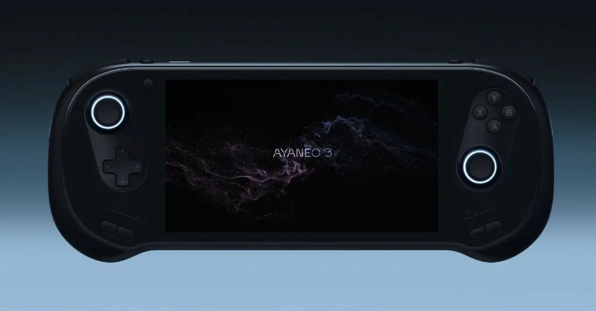
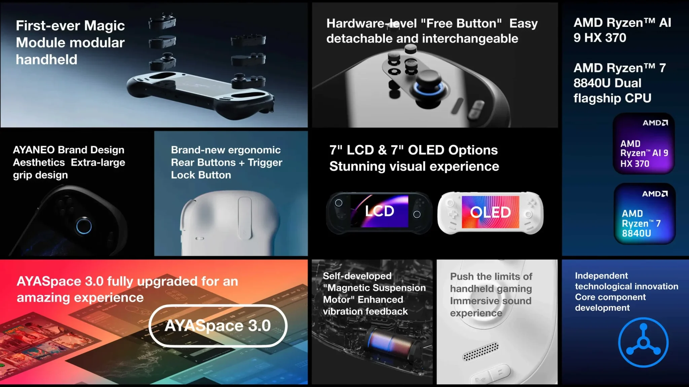
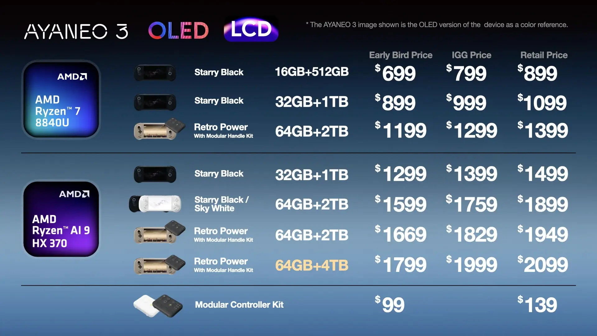

בעולם שבו קונסולות ניידות זוכות לפופולריות עצומה, ה-**AYANEO 3** נכנסת לזירה עם הבטחות גדולות. עם מפרט עוצמתי, עיצוב מודולרי ותמיכה רחבה במשחקים, הקונסולה הזו מציבה את עצמה כמועמדת מעניינת בתחום. אך האם כדאי לכם להכיר אותה?

## מה זה AYANEO 3?

ה-AYANEO 3 היא קונסולה ניידת המשלבת חומרה חזקה, עיצוב מתקדם ותכונות ייחודיות המאפשרות התאמה אישית. המכשיר פועל על מערכת ההפעלה Windows 11, מה שמאפשר לו להריץ כמעט כל משחק PC.

הקונסולה מציעה שתי גרסאות מרכזיות:

- **דגם בסיסי:** עם AMD Ryzen 7 8840U.
- **דגם מתקדם:** עם AMD Ryzen AI 9 HX 370, המספק ביצועים חזקים יותר.

## עיצוב מודולרי: חופש להתאים את החוויה

אחד החידושים המרכזיים של ה-AYANEO 3 הוא **עיצוב מודולרי**, המאפשר לשחקנים להחליף ג'ויסטיקים, כפתורים, ופדים בהתאמה אישית.

- **מודולים זמינים:**
    - ג'ויסטיקים סטנדרטיים.
    - מודול של 6 כפתורים למשחקי קרב.
    - פד מגע למשחקים מודרניים.
- **עלות המודולים:** ₪530 ליחידה.
- **זיהוי אוטומטי:** המכשיר מזהה את המודולים ומעדכן את ההגדרות בהתאם.

## יכולות משחק: ממודרני לרטרו

ה-AYANEO 3 מיועדת להתאים לכל סוגי המשחקים:

- **משחקי PC מודרניים:** יכולה להריץ משחקי AAA ברזולוציית 1080p, כמו Resident Evil 8 ו-Sekiro.
- **משחקי רטרו ואמולציה:** תומכת באמולציה של קונסולות קלאסיות (SNES, PlayStation 2) ועד Switch למשחקים מסוימים.
- **משחקי סטרימינג:** אידיאלית לשירותי ענן כמו Xbox Game Pass.

## חיי סוללה: מה הציפיות?

חיי הסוללה משתנים לפי סוג המשחק והגדרות המערכת:

- משחקי AAA: כ-2-3 שעות.
- משחקי רטרו: עד 5 שעות.
- שימוש קל עם הגבלת CPU: עד 10 שעות.  
    הקונסולה כוללת מצב חסכון באנרגיה, המאפשר לאזן בין ביצועים לאוטונומיה.

## נקודות חשובות על הפרויקט

ה-AYANEO 3 היא פרויקט ב-Early Access, מה שאומר שהמכשיר עדיין בשלבי שיפור ופיתוח. למרות ההבטחות, חשוב לזכור:

- **יתרונות:** מפרט עוצמתי, עיצוב מודולרי ומסך OLED איכותי.
- **חסרונות:** מחיר גבוה (₪2,699 לדגם בסיסי ו-₪6,990 לדגם מתקדם) וחיי סוללה מוגבלים.
- **שאלת האמינות:** רכישת מוצר ב-Early Access דורשת מודעות לכך שהמוצר עשוי להשתנות.
- **משלוח לישראל:** החברה מציעה משלוחים גם לישראל בתוספת עלות של כ-**₪130** (35 דולר).

## למה כדאי לשים לב?

ה-AYANEO 3 מציגה חידושים מעניינים, אך כמו כל פרויקט ב-Early Access, היא מעלה שאלות בנוגע לאמינות ולתמורה למחיר. אם אתם שוקלים לרכוש אחת, מומלץ להמתין עד שיתקבלו ביקורות נוספות ממשתמשים מוקדמים.

למי שסקרן ורוצה ללמוד עוד, ניתן למצוא פרטים נוספים באתר הרשמי: [AYANEO 3](https://www.ayaneo.com/product/AYANEO-3).

- AYANEO 3 היא קונסולה ניידת עם עיצוב מודולרי ייחודי ותמיכה במשחקי PC ורטרו.
- הקונסולה מציעה חופש התאמה אישית עם מודולים נשלפים, אך סובלת מחיי סוללה מוגבלים.
- מדובר בפרויקט Early Access, ולכן מומלץ להמתין לביקורות לפני רכישה.
