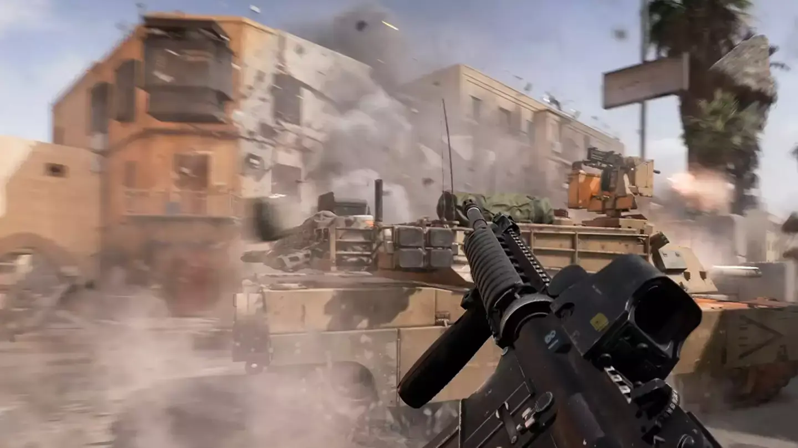

**Electronic Arts** חשפה הצצה ראשונה ל**משחקיות ה-pre-alpha** של **Battlefield 6**, וחובבי הסדרה כבר מזהים **חזרה לאלמנטים הקלאסיים**. למרות שהטריילר קצר (10-18 שניות), הוא מציג **שיפורים טכניים משמעותיים ואווירה אותנטית יותר**.

## 🔥 חידושים עיקריים במשחקיות

🎯 **סביבות דינמיות** – מנגנון ההרס השתפר משמעותית, עם **בניינים קורסים באופן מציאותי** לאחר פגיעות RPG, ומשאירים אחריהם **הריסות אינטראקטיביות**.

🏙️ **עיצוב מפות מודרני** – הקרבות יתרחשו ב**סביבה עירונית במזרח התיכון**, תוך **וויתור על האלמנטים העתידניים של Battlefield 2042**, לטובת **ריאליזם דומה ל-Battlefield 3**.

🎖️ **חזרת מצב הקמפיין** – לראשונה מאז Battlefield V, המשחק יכלול **קמפיין סינגל מלא**, שנעדר מ-Battlefield 2042.

https://www.youtube.com/watch?v=BvJ1tKZyDtw&ab\_channel=Punish

## 🛠️ ארבעה סטודיואים מאחורי הפיתוח

כדי להבטיח חוויית Battlefield אותנטית, **ארבעה אולפנים** עובדים על המשחק במקביל:

- **DICE** – אחראים על **המצב המרובה משתתפים (Multiplayer)** ומערכות הליבה.
- **Ripple Effect** – עובדים על חוויית משחק חדשה שמטרתה **להרחיב את קהל השחקנים**.
- **Motive Studios** – מתמקדים ב**מצב הקמפיין ומפות המולטיפלייר**.
- **Criterion** – אחראים על **החוויה הסולו** ושיפורים במכניקות המשחק.

ההשקעה הגדולה מרמזת על **חזרה לאיכות ולתוכן עשיר**, אחרי הביקורות השליליות שספג Battlefield 2042.

## 🎮 Battlefield Labs – בדיקות ציבוריות ראשונות

https://www.youtube.com/watch?v=\_fGteYuaNxA&t=242s&ab\_channel=Battlefield

EA הכריזה על **Battlefield Labs**, שלב בדיקות ציבורי שיאפשר לשחקנים לחוות את המשחק בגרסת ה-pre-alpha.

📌 **הרשמה פתוחה כעת**, אך כמות הנרשמים כבר עברה **33,000 איש**, מה שצפוי להוביל לזמני המתנה ארוכים.

🎮 **פלטפורמות נתמכות** – **Xbox Series X|S, PlayStation 5 ו-PC**. שחקני **Xbox ידרשו מנוי Xbox Game Pass Core** כדי להשתתף.

## 📅 מתי המשחק יוצא?

נכון לעכשיו, **אין תאריך השקה רשמי**, אך העובדה שהמשחק עדיין **בשלב ה-pre-alpha** מעידה על כך שהפיתוח עוד ארוך.  
המשוב מהשחקנים במהלך הבדיקות **ישפיע ישירות** על הכיוון שהמשחק ייקח.

Battlefield 6 מבטיח **להחזיר את המותג לגדולתו**, עם שילוב של **גרפיקה מתקדמת, הרס ריאליסטי וקמפיין סינגל מלא**. אחרי האכזבה מ-Battlefield 2042, EA מנסה להחזיר את האמון של המעריצים – ואם הביצוע יעמוד בציפיות, זה עשוי להיות **הכותר הכי טוב של הסדרה מזה שנים**.

- Battlefield 6 חוזר לריאליזם עם סביבות הרס מתקדמות, קמפיין סינגל מלא ועיצוב מפות מודרני בהשראת Battlefield 3.
- ארבעה סטודיואים מובילים את הפיתוח, כולל DICE ו-Motive, כדי להבטיח חוויית משחק איכותית ומאוזנת.
- EA פתחה שלב בדיקות ציבורי (Battlefield Labs), אך ללא תאריך השקה רשמי, מה שמעיד שהמשחק עדיין בשלבי פיתוח מוקדמים.
