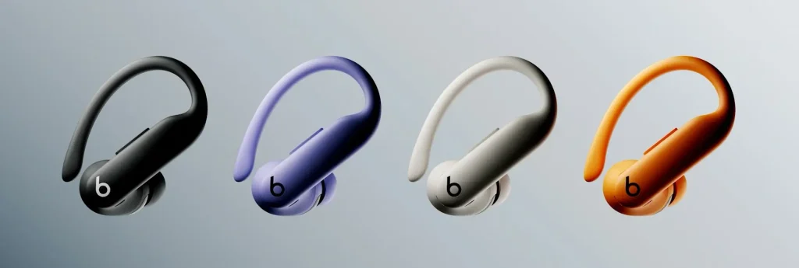
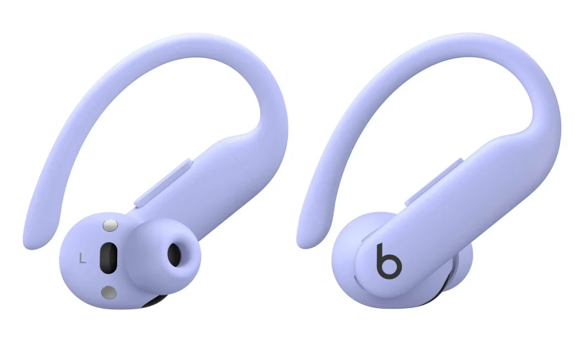

**Beats** חשפה את הדור החדש של **Powerbeats Pro 2**, עם **תכונות מתקדמות שלא נראו בעבר** בסדרת האוזניות שלה. מעבר לשיפורי עיצוב ונוחות, האוזניות החדשות כוללות **מד דופק מובנה** ושיפור משמעותי באיכות השמע.

## **עיצוב חדש ועמידות גבוהה יותר**

ה-Powerbeats Pro 2 עברו **שדרוג משמעותי** כדי להתאים לאימונים ולפעילויות ספורטיביות:

- **קשתות האוזניים גמישות יותר** עם סגסוגת ניקל-טיטניום, המספקת אחיזה יציבה ונוחות משופרת.
- **20% קלות יותר** מהדגם הקודם.
- **חמישה גדלים של מתאמי סיליקון (XS, S, M, L, XL)** להתאמה אישית מקסימלית.
- **עמידות לזיעה ומים בתקן IPX4**, כך שניתן להשתמש בהן גם בגשם או בזמן אימון אינטנסיבי.
- פתחי אוורור חדשים משפרים את **איכות השמע והנוחות לאורך זמן**.

## **מדידת דופק ישירות מהאוזניות**

התוספת החדשנית ביותר ב-Powerbeats Pro 2 היא **מד הדופק המובנה** – תכונה שלא הייתה זמינה קודם לכן באוזניות של Beats.

- באמצעות **חיישנים אופטיים LED**, האוזניות מודדות **מעל 100 פעימות בשנייה** כדי לעקוב אחר זרימת הדם.
- הנתונים זמינים **בזמן אמת** באפליקציות ספורט תומכות כמו **Nike Run Club, Open, Runna ו-Slopes**.

## **השוואה בין Powerbeats Pro ל-Powerbeats Pro 2**

| **תכונה** | **Powerbeats Pro (2019)** | **Powerbeats Pro 2 (2025)** |
| --- | --- | --- |
| **שנת השקה** | 2019 | 2025 |
| **משקל** | 26 גרם | 20% קל יותר |
| **חומר קשתות האוזן** | פלסטיק | סגסוגת ניקל-טיטניום |
| **גדלי מתאמים** | 4 גדלים (S, M, L, XL) | 5 גדלים (XS, S, M, L, XL) |
| **עמידות למים** | IPX4 | IPX4 |
| **חיישן דופק** | לא | כן |
| **ביטול רעשים אקטיבי (ANC)** | לא | כן |
| **מצב שקיפות** | לא | כן |
| **שבב** | Apple H1 | Apple H2 |
| **אודיו מרחבי** | לא | כן |
| **חיי סוללה (אוזניות בלבד)** | 9 שעות | 10 שעות |
| **חיי סוללה כוללים (עם מארז)** | 24 שעות | 45 שעות |
| **טעינה מהירה** | 5 דקות = 1.5 שעות | 5 דקות = 1.5 שעות |
| **טעינה אלחוטית** | לא | כן (Qi) |
| **מחיר (₪)** | ₪899 | ₪1,250 |

## **סינון רעשים אקטיבי ושמע מותאם אישית**

- **סינון רעשים אקטיבי (ANC)** מאפשר בידוד מוחלט מהסביבה.
- **מצב שקיפות** מאפשר לשמוע את הסביבה תוך כדי האזנה.
- **איקולייזר אדפטיבי** שמתאים את השמע לפי ההתאמה של האוזניות לאוזן.

## **חיי סוללה ושיפור בקישוריות**

ה-Powerbeats Pro 2 מצוידות **בשבב Apple H2** שמבטיח **איכות שמע מאוזנת יותר, תמיכה ב-Dolby Atmos ואודיו מרחבי עם מעקב ראש דינמי**.

- **עד 10 שעות שימוש רצוף לכל אוזנייה**.
- **עד 45 שעות האזנה** עם מארז הטעינה.
- **טעינה מהירה – 5 דקות טעינה מעניקות 90 דקות שימוש**.
- **מארז טעינה קטן יותר ב-33%** עם תמיכה **בטעינה אלחוטית Qi** לראשונה ב-Beats.
- **Bluetooth Class 1** לחיבור יציב יותר ולתמיכה באודיו מרחבי.

## **מחיר וזמינות בישראל**

ה-Powerbeats Pro 2 זמינות **להזמנה מוקדמת כבר עכשיו** באתר הרשמי של אפל.

- **מחיר בישראל: כ-₪1,250** (בהמרה מהמחיר הרשמי 299.95€).
- זמינות **בארבעה צבעים**: Obsidienne (שחור כהה), Sable (חול), Ultraviolet (סגול כהה) ו-Orange Électrique (כתום).
- המכירה הרשמית בחנויות תתחיל **ב-13 בפברואר 2025**.

## **סיכום**

ה-Powerbeats Pro 2 מציעות **שדרוג משמעותי לעומת הדור הקודם**, עם **ניטור דופק, סינון רעשים וחיי סוללה ארוכים יותר**. עם עיצוב חדש ומשקל קל יותר, הן מתאימות במיוחד **לספורטאים ולמשתמשים פעילים**. האם הן האוזניות המושלמות לאימונים שלכם?
