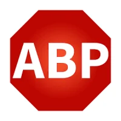

גוגל החלה להסיר בהדרגה את **uBlock Origin** מ-Chrome בעקבות המעבר ל-**Manifest V3**. השינוי הזה משפיע על חוסמי הפרסומות המסורתיים ומכריח משתמשים לחפש **חלופות יעילות**. הנה **חוסמי הפרסומות הטובים ביותר** ל-Chrome ומה שאתם צריכים לדעת על השינוי הזה.

## **למה uBlock Origin כבר לא עובד ב-Chrome?**

גוגל מיישמת את **Manifest V3**, תקן חדש שמגביל את הגישה של תוספים לפילטרים מתקדמים לחסימת פרסומות. כתוצאה מכך, **uBlock Origin ותוספים אחרים כבר לא יכולים לחסום פרסומות באותה יעילות**.

עם זאת, חלק מהתוספים עוד עובדים למרות ההגבלות. אלו **האלטרנטיבות הטובות ביותר לחסימת פרסומות ב-Chrome** בשנת 2025.

## **האלטרנטיבות הטובות ביותר ל-uBlock Origin ב-Chrome**

### **1\. AdGuard – חוסם הפרסומות המתקדם ביותר**

✅ **יתרונות:**

- חוסם **פרסומות, עוקבים ואתרים זדוניים**
- **תואם ל-Manifest V3**
- **גרסה חינמית אפקטיבית** לדפדפן

❌ **חסרונות:** הגרסה לדפדפן פחות עוצמתית מאשר האפליקציה הייעודית ל-Windows ול-macOS.

### **2\. AdBlock Plus – הפתרון הפופולרי ביותר**

✅ **יתרונות:**

- **קל לשימוש ולניהול**
- תואם ל-**Manifest V3**
- מאפשר **רשימת פרסומות מאושרות** (ניתן לבטל את האופציה)

❌ **חסרונות:** חוסם פחות פרסומות מהמתחרים.

### **3\. Privacy Badger – הגנה מוגברת על פרטיות**

✅ **יתרונות:**

- **חוסם עוקבים ולא פרסומות ישירות**
- פותח ע"י **Electronic Frontier Foundation (EFF)**
- **קל משקל ויעיל לשמירה על פרטיות**

❌ **חסרונות:** לא חוסם **את כל** הפרסומות, אלא רק עוקבים.

### **4\. Ghostery – דגש על פרטיות**

✅ **יתרונות:**

- **חוסם פרסומות וסקריפטים עוקבים**
- מגן מפני **טביעת אצבע דיגיטלית (fingerprinting)**
- **קל להתקנה ולשימוש**

❌ **חסרונות:** צורך יותר משאבי מערכת מאשר תוספים אחרים.

### **5\. Brave – דפדפן עם חוסם פרסומות מובנה**

✅ **יתרונות:**

- **חוסם פרסומות ועוקבים כברירת מחדל**
- **מצב Tor מובנה** לגלישה פרטית
- **מהיר יותר וצורך פחות סוללה** מ-Chrome

❌ **חסרונות:** מחייב **מעבר לדפדפן אחר**, אבל מספק פתרון מקיף.

## **השוואה בין חוסמי הפרסומות הטובים ביותר**

| תוסף/דפדפן | חוסם פרסומות | חוסם עוקבים | תואם ל-Manifest V3 | יתרונות מרכזיים |
| --- | --- | --- | --- | --- |
| **AdGuard** | ✅ כן | ✅ כן | ✅ כן | חוסם חזק ויעיל ב-Chrome |
| **AdBlock Plus** | ✅ כן | ❌ לא | ✅ כן | פופולרי ונוח לשימוש |
| **Privacy Badger** | ❌ חלקית | ✅ כן | ✅ כן | מעולה לפרטיות, לא חוסם הכל |
| **Ghostery** | ✅ כן | ✅ כן | ✅ כן | מגן מפני מעקב ואיסוף מידע |
| **Brave** (דפדפן) | ✅ כן | ✅ כן | 🚫 לא רלוונטי | הפתרון המקיף והמהיר ביותר |

## **מה זה בעצם Manifest V3 ולמה זה משנה?**

### **מה זה Manifest V3?**

[**Manifest V3**](https://developer.chrome.com/docs/extensions/develop/migrate/what-is-mv3?hl=he) הוא שינוי שמגוגל הכניסה לתוספים ב-Chrome, שמשפיע במיוחד על **חוסמי הפרסומות** ומגביל את הגישה שלהם לרשת.

### **למה גוגל עושה את זה?**

לפי גוגל, המטרה היא **שיפור אבטחה וביצועים**:

- למנוע תוספים זדוניים
- להקטין צריכת משאבים
- להפוך את הדפדפן למהיר יותר

### **איך זה משפיע על חוסמי פרסומות?**

לפני Manifest V3, חוסמי פרסומות יכלו:  
✅ **ליירט בקשות רשת** ולחסום פרסומות לפני שהן נטענות  
✅ **להפעיל פילטרים מתקדמים בזמן אמת**

עכשיו, עם Manifest V3:  
🚫 **נחסמה היכולת ליירט בקשות רשת**  
🚫 **התווסף מגבלה על כמות הפילטרים**  
🚫 **פחות שליטה על חסימת פרסומות מתקדמות**

### **מה הפתרון?**

- **AdGuard ו-AdBlock Plus** עובדים תחת Manifest V3 עם שיטות אחרות.
- **Firefox ו-Brave** אינם כפופים למגבלות של גוגל ולכן uBlock Origin עובד בהם כרגיל.

## **מה הכי כדאי לעשות עכשיו?**

🔹 **רוצים חוסם פרסומות טוב ל-Chrome?** → **AdGuard** הוא הבחירה הטובה ביותר.  
🔹 **רוצים להימנע ממגבלות Manifest V3?** → **Brave או Firefox** עדיפים.  
🔹 **רוצים להגן על הפרטיות שלכם?** → **Ghostery ו-Privacy Badger** יספקו פתרון משולב.  
🔹 **עדיין רוצים להשתמש ב-uBlock Origin?** → **עברו ל-Firefox**.

## **סיכום: איך לחסום פרסומות ב-Chrome אחרי uBlock Origin?**

**Manifest V3** משנה את חוקי המשחק, אבל עדיין יש דרכים לחסום פרסומות ולשמור על פרטיות. הפתרונות הטובים ביותר כוללים **AdGuard, Ghostery, Brave ו-Privacy Badger**.

אם גוגל תמשיך במגבלותיה, ייתכן שהמשתמשים יתחילו לחפש דפדפנים חופשיים יותר כמו **Firefox** כדי להימנע ממודעות מעיקות.

🔎 **המאבק נגד פרסומות פולשניות לא נגמר – אבל יש דרכים להתמודד איתו!**
