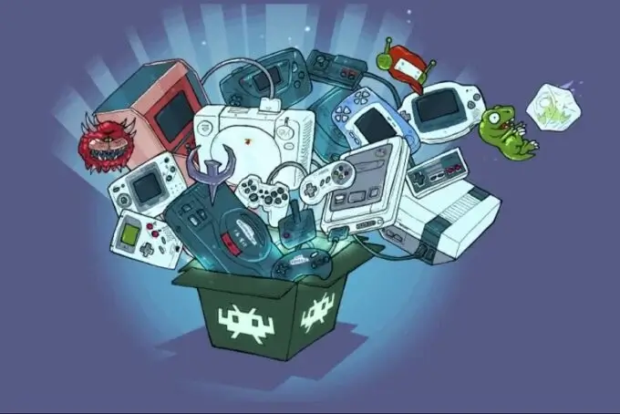
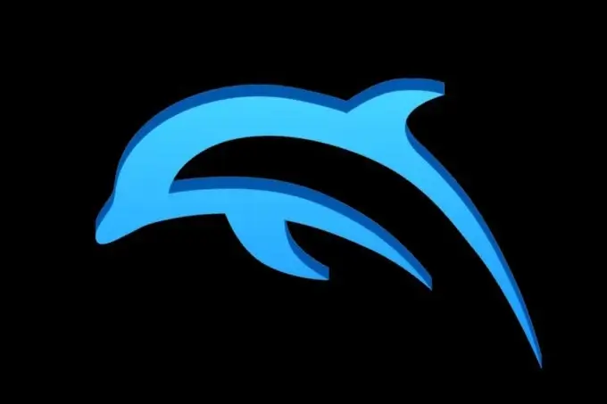
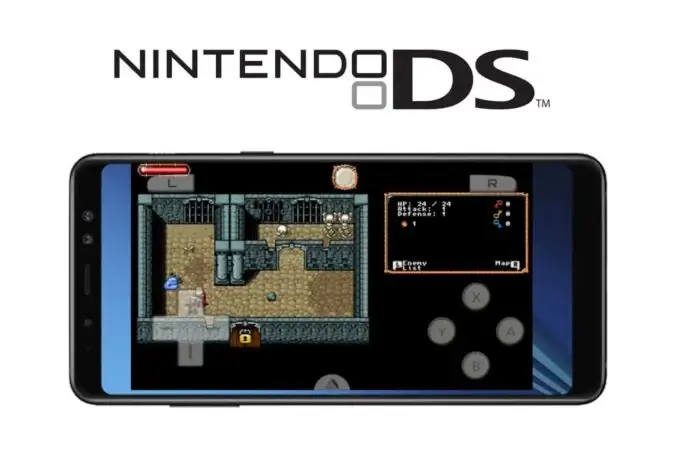
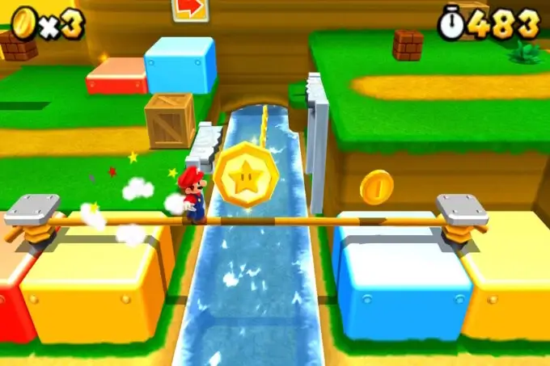
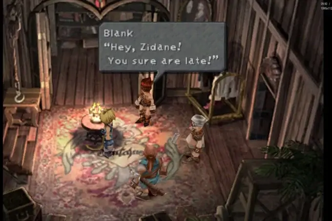
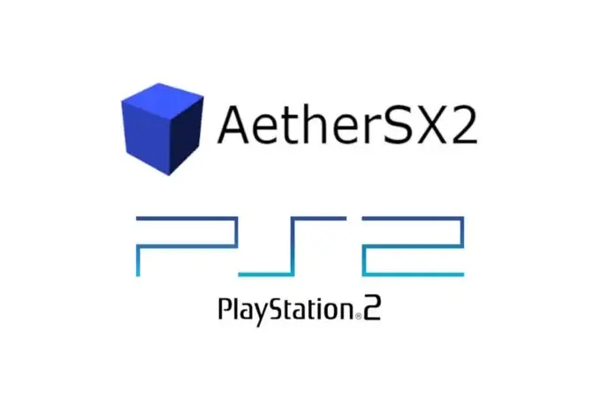
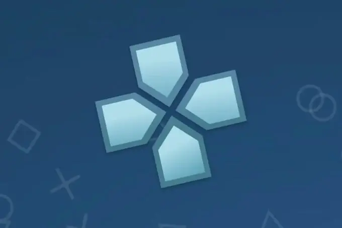
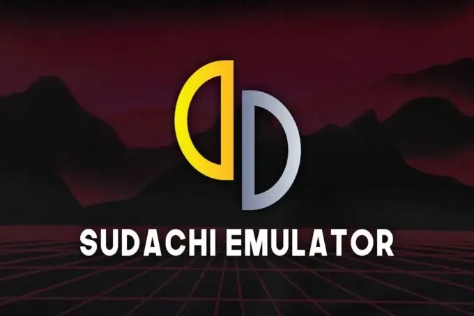

לשחק במשחקים של פעם בטלפון שלנו זו חוויה אדירה, ואנדרואיד מאפשר את זה כבר שנים. למזלנו, יש לנו מבחר ענק של אמולטורים, כאלה שיחזירו אותנו לילדות וישחזרו את הכיף של כל הקונסולות האהובות. בכתבה הזו, אני אעבור על האמולטורים הכי טובים שאתם חייבים לבדוק באנדרואיד, בין אם זה בטלפון שלכם או בקונסולות ניידות כמו Retroid Pocket או Ayn Odin.

## חוקיות: מה חשוב לדעת על אמולטורים הכי טובים באנדרואיד

לפני שנצלול לרשימת האמולטורים להתקנה באנדרואיד, חשוב להבין את המצב החוקי. שימוש באמולטור הוא חוקי, אבל הורדת ROMs ללא קובץ מקורי של המשחק אינה חוקית. כדאי לבדוק את כללי השימוש בכל מדינה, כמו שמוסבר במדריכים רשמיים באתרי חוקיות של משחקי רטרו ([חוקיות אמולטורים](https://techhorizons.co.il/best-android-emulator/)).

## 1\. RetroArch - אמולטור כללי הכי טוב להתקנה באנדרואיד

[RetroArch](https://www.retroarch.com/) הוא כמו אולר שוויצרי של אמולטורים. הוא מאפשר לכם לאמץ כמה קונסולות ישנות בתוך אפליקציה אחת. הוא תומך ב-NES, SuperNES, Gameboy, Gameboy Advance, Nintendo 64, Megadrive ועוד. היתרון הכי גדול הוא כמה שהוא קל לשימוש. הוא מתאים גם למי שמעולם לא השתמש באמולטור לפני, עם ממשק נוח שאפשר להתאים לפי מה שמתאים לכם.

RetroArch © 

## 2\. Dolphin Emulator - אמולטור GameCube ו-Wii לאנדרואיד

אם גדלתם על משחקי GameCube ו-Wii, אתם חייבים להכיר את [Dolphin Emulator](https://dolphin-emu.org/). עם Dolphin, אפשר לחזור לשחק במשחקים כמו Zelda Wind Waker או Mario Kart Wii ישר מהטלפון שלכם. האמולטור הזה קיים כבר הרבה שנים והוא ממש טוב, אבל צריך מכשיר חזק כדי שהמשחקים יפעלו חלק.

Dolphin Logo © 

## 3\. Drastic DS Emulator - אמולטור Nintendo DS הכי טוב באנדרואיד

הקונסולה הניידת עם שני המסכים של נינטנדו, Nintendo DS, מקבלת חיים חדשים עם Drastic DS Emulator. הוא מנצל את מסך המגע של הטלפון כדי לדמות את המשחק כמו שהיה ב-DS. רוצים לשחק שוב בPhoenix Wright או Zelda Spirit Tracks? זה האמולטור הכי טוב לזה, וממש קל לשימוש.

 Drastic © 

## 4\. Citra Emulator - אמולטור 3DS להתקנה באנדרואיד

Citra הוא אמולטור ל-Nintendo 3DS, ואפשר לשחק איתו במשחקים כמו Pokémon X & Y או Animal Crossing New Leaf. צריך לדעת שהאמולציה ב-Citra על אנדרואיד עדיין לא מושלמת, לפעמים יש באגים. אבל נכון להיום, זה הכי קרוב שיש לאמולציה מלאה של 3DS.

Citra © 

## 5\. Duckstation - אמולטור PlayStation 1 הכי טוב באנדרואיד

[Duckstation](https://www.duckstation.org/) הוא האמולטור המומלץ ל-PlayStation 1. אם בא לכם לחזור לשחק בכותרים קלאסיים כמו Final Fantasy VII או Metal Gear Solid, Duckstation יעשה את העבודה בצורה הכי טובה שיש. הוא יציב, קל לשימוש, ומביא חוויית PS1 מושלמת ישר לטלפון שלכם.

Duckstation © 

## 6\. AetherSX2 - אמולטור PS2 מומלץ לאנדרואיד

לשחק במשחקי PS2 בטלפון זה לא תמיד קל, אבל AetherSX2 עושה את זה אפשרי. הוא מבוסס על האמולטור המפורסם PCSX2 ומסוגל להפעיל כמעט את כל משחקי ה-PS2. חשוב לדעת שצריך קובץ BIOS תקף, ומכשיר די חזק כדי שהכל יפעל חלק. אבל אם אתם רוצים לשחק ב-GTA III או Silent Hill 2, זה האמולטור המושלם בשבילכם.

Aethersx2 © 

## 7\. PPSSPP - אמולטור PSP מושלם להתקנה באנדרואיד

[PPSSPP](https://www.ppsspp.org/) הוא אמולטור ל-PSP והוא לגמרי חובה למי שאוהב את הקונסולה הזו. הוא זמין בחינם עם הרבה אפשרויות התאמה אישית. רוצים לשחק שוב ב-Monster Hunter או Persona 3 Portable? זה האמולטור שאתם צריכים.

PPSSPP © 

## 8\. Sudachi/Skyline - אמולטורים לאנדרואיד למשחקי Nintendo Switch

לשחק בNintendo Switch בטלפון הפך לאפשרי עם אמולטורים כמו Sudachi וSkyline. אלה הם האלטרנטיבות הכי טובות ל-Yuzu, שעבר הפסקת פיתוח. עם האמולטורים האלה אפשר ליהנות ממשחקי סוויץ' ישירות באנדרואיד, עם ממשק קל ונוח לשימוש.

 Sudachi Logo © 

לסיכום, אם אתם מחפשים דרך לחזור למשחקי הילדות שלכם, אמולטורים הם הפתרון המושלם. לאנדרואיד יש מבחר ענק של כלים נהדרים, שמתאימים כמעט לכל קונסולה קלאסית. בין אם אתם רוצים לשחק במשחקי GameCube, PlayStation 1 או אפילו Nintendo DS, יש אמולטור שמתאים לכם. כל מה שנותר הוא לבחור את המשחקים שאתם אוהבים, להוריד אמולטור, ולהתחיל לשחק – הנוסטלגיה כבר בדרך אליכם!

- RetroArch הוא אמולטור רב-תכליתי שמאפשר לאמץ מגוון קונסולות ישנות באפליקציה אחת.
- Dolphin ו-AetherSX2 הם הבחירות הכי טובות לאמולציה של GameCube/Wii ושל PS2 בהתאמה.
- Sudachi ו-Skyline הם האלטרנטיבות הכי טובות לאמולציה של Nintendo Switch על אנדרואיד.
