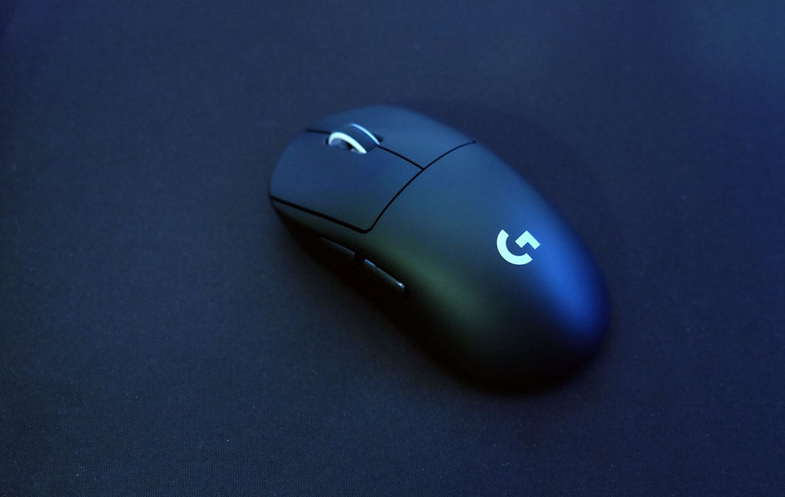
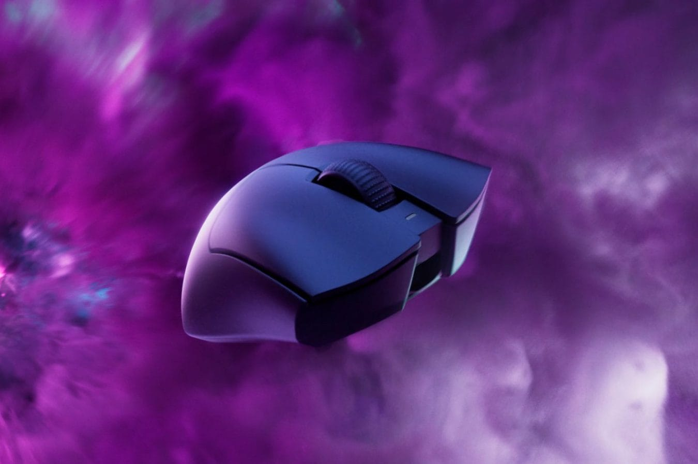
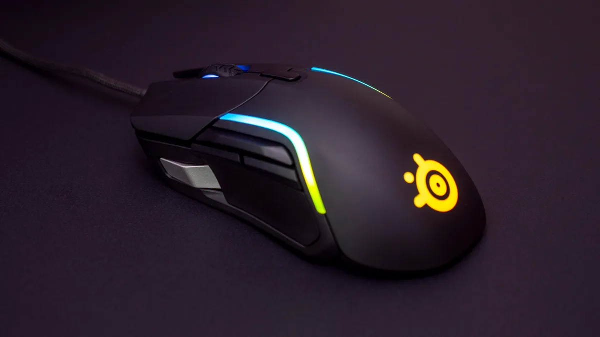
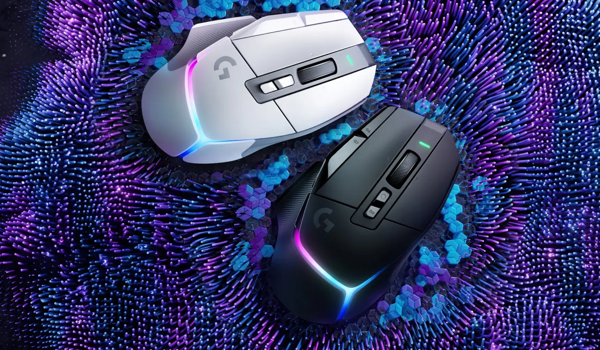
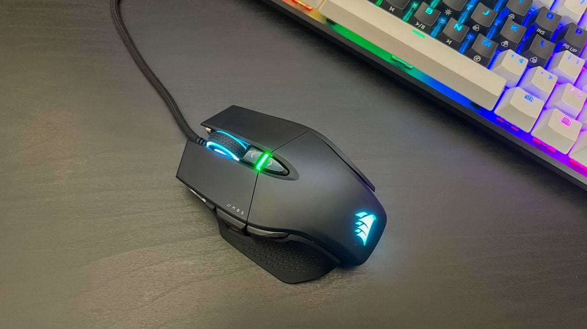

## **🖱️5 העכברים האלחוטיים הטובים ביותר לשנת 2025**

אם אתם גיימרים, אתם יודעים כמה עכבר טוב יכול לשנות את המשחק. פעם עכברים אלחוטיים נחשבו לאיטיים, אבל היום אין הבדל – החיבור מהיר, הדיוק פסיכי, ואין כבל שמפריע. הבעיה? בישראל המבחר מוגבל, ולא תמיד קל למצוא את הדגמים הכי טובים. אז חפרנו, בדקנו, וסיננו – הנה 5 העכברים האלחוטיים הכי טובים שאפשר להשיג כאן ועכשיו.

אז **איזה דגם מתאים לכם?** הנה **5 העכברים המובילים** לשנת 2025:

## **1️⃣ Logitech G Pro X Superlight 2 – עכבר ה-Esports האולטימטיבי**

ה-**Logitech G Pro X Superlight 2** הוא אחד מהעכברים **הקלים והמדויקים ביותר בשוק**, מה שהופך אותו לבחירה המושלמת לשחקני FPS תחרותיים. עם **משקל של 60 גרם בלבד**, העכבר כמעט ואינו מורגש ביד, מה שמאפשר **תנועה מהירה ודיוק מקסימלי**.

הדגם החדש מגיע עם **חיישן HERO 30K**, שהוא אחד החיישנים המדויקים ביותר בעולם, ומציע **רזולוציה מתכווננת עד 30,000 DPI**. בנוסף, קצב הדגימה (Polling Rate) מגיע ל-**2000Hz**, מה שמבטיח **זמן תגובה מיידי ללא דיליי**.

👨‍💻 **נוחות וארגונומיה**  
העיצוב שלו מתאים **לשחקני claw grip ו-fingertip grip**, אך יכול להיות מעט פחות נוח לשחקני **palm grip** בשל הגודל הקטן יחסית. הוא מיועד **לימניים בלבד**, וכולל 5 כפתורים בסיסיים אך יעילים.

🎮 **ביצועים בגיימינג**

- מצוין למשחקי FPS תחרותיים כמו CS2, Valorant, Apex Legends
- תגובה **מהירה במיוחד** בזכות טכנולוגיית **Lightspeed Wireless**
- משטחי PTFE לאחיזה חלקה ונטולת התנגדות
- סוללה שמספיקה **ל-95 שעות שימוש רצופות**

✅ **היתרונות**  
✔ **קל במיוחד – רק 60 גרם**  
✔ **חיישן HERO 30K מהטובים בשוק**  
✔ **זמן תגובה מהיר עם Polling Rate של 2000Hz**  
✔ **עד 95 שעות סוללה**  
✔ **תומך בטעינה אלחוטית עם Logitech PowerPlay**

❌ **החסרונות**  
❌ **ללא RGB או אפשרויות עיצוב מותאמות**  
❌ **רק 5 כפתורים – פחות מתאים ל-MMORPG או MOBA**  
❌ **לא מתאים לגיימרים שמעדיפים עכברים כבדים יותר**

💰 **מחיר:**  
🔹 **אילת:** ₪550  
🔹 **מחיר רגיל:** ₪649

[לרכישה ב-KSP: Logitech G Pro X Superlight 2](https://ksp.co.il/?appkey=18555&txt_search=Logitech%20G%20Pro%20X%20Superlight%202&param=mouselogitech)

## **2️⃣ Razer DeathAdder V3 Pro – העכבר של Faker**

ה-**Razer DeathAdder V3 Pro** הוא אחד העכברים **הפופולריים ביותר בקרב שחקני eSports**, ואפילו Faker, אגדת League of Legends, משתמש בו באופן קבוע. מדובר בעכבר **ארגונומי, קליל ומדויק**, עם **משקל של 64 גרם בלבד**.

🔍 **חיישן וביצועים**  
העכבר מצויד ב-**חיישן אופטי Focus Pro 30K**, שמספק **דיוק קיצוני** על כמעט כל משטח (כולל זכוכית). בשילוב עם **טכנולוגיית HyperSpeed Wireless**, העכבר מציע **חיבור מהיר ב-25% יותר מהמתחרים**, כך שלא תרגישו שום דיליי במשחק.

👨‍💻 **נוחות וארגונומיה**

- מתאים בעיקר **לשחקני Palm Grip ו-Claw Grip**
- ארגונומיה שמותאמת למשחקי FPS מהירים
- ללא RGB – מיקוד מלא **במהירות ודיוק**

🎮 **ביצועים בגיימינג**  
✔ מצוין ל-FPS כמו **Counter-Strike 2, Call of Duty, Rainbow Six Siege**  
✔ אחד העכברים **המהירים ביותר בשוק**  
✔ טכנולוגיית **HyperSpeed** מספקת חיבור מהיר ואמין  
✔ חיי סוללה של **90 שעות משחק רצוף**

✅ **היתרונות**  
✔ **קל במיוחד (64 גרם)**  
✔ **חיישן אופטי Focus Pro 30K עם דיוק קיצוני**  
✔ **חיבור HyperSpeed Wireless המהיר ביותר של Razer**  
✔ **מתאים לשחקני eSports מקצועיים**  
✔ **חיי סוללה של 90 שעות**

❌ **החסרונות**  
❌ **אין RGB או אפשרויות התאמה אישית**  
❌ **מעט יקר בהשוואה לדגמים אחרים**  
❌ **לא מתאים לשחקנים שזקוקים להרבה כפתורים צדדיים**

💰 **מחיר:**  
🔹 **אילת:** ₪405  
🔹 **מחיר רגיל:** ₪479

[לרכישה ב-KSP: Razer DeathAdder V3 Pro](https://ksp.co.il/?appkey=18555&txt_search=Razer%20DeathAdder%20V3%20Pro&param=razermouse)

## **3️⃣ SteelSeries Rival 5 – עכבר גיימינג משתלם עם כפתורים נוספים**

**SteelSeries Rival 5** הוא אחד העכברים הכי **ורסטיליים** בטווח המחירים שלו. הוא מציע שילוב נהדר של **דיוק, נוחות ותוספות חכמות**, מה שהופך אותו **לבחירה מעולה לשחקנים שמשחקים במגוון סגנונות** – FPS, MOBA, MMO ואפילו RPG.

🖱️ **חיישן וביצועים**  
ה-Rival 5 מצויד ב-**חיישן TrueMove Air** עם **רזולוציה של 18,000 DPI**, שמאפשר מעקב **מדויק ומהיר**. העכבר מגיע עם **זמן תגובה של 1ms** כך שלא תרגישו דיליי בכלל.

👨‍💻 **נוחות וארגונומיה**  
✔ מתאים ל-**Palm Grip ו-Claw Grip**  
✔ עיצוב **א-סימטרי לימניים בלבד**  
✔ משקל של **85 גרם** – מאוזן בין קלות ליציבות  
✔ **9 כפתורים ניתנים לתכנות**, אידיאלי למשחקים עם פקודות מהירות

🎮 **למי העכבר הזה מתאים?**  
✔ שחקני **FPS שרוצים כפתורים נוספים לנוחות** (Valorant, Apex Legends, Warzone)  
✔ שחקני **MMO/MOBA שזקוקים ליותר מקשי מאקרו**  
✔ גיימרים שמחפשים **איכות גבוהה במחיר משתלם**

✅ **היתרונות**  
✔ **חיישן TrueMove Air עם דיוק גבוה**  
✔ **9 כפתורים ניתנים לתכנות**  
✔ **עיצוב ארגונומי שמתאים למגוון אחיזות**  
✔ **אפשרות לתכנות RGB דרך SteelSeries GG**  
✔ **משקל מאוזן – לא קל מדי ולא כבד מדי**

❌ **החסרונות**  
❌ **לא מתאים לשמאליים**  
❌ **לא הבחירה הטובה ביותר ל-FPS תחרותיים (קצת יותר כבד מהאידיאל)**  
❌ **לא מגיע עם אפשרות טעינה אלחוטית**

💰 **מחיר:**  
🔹 **אילת:** ₪261  
🔹 **מחיר רגיל:** ₪309

[לרכישה ב-KSP: SteelSeries Rival 5](https://ksp.co.il/?appkey=18555&txt_search=SteelSeries%20Rival%205&param=steelseries)

## **4️⃣ Logitech G502 X Plus – העכבר הכי ורסטילי של Logitech**

ה-**Logitech G502 X Plus** הוא **אחד העכברים הכי ורסטיליים בשוק**, מתאים במיוחד **לשחקנים שאוהבים שליטה מקסימלית, התאמה אישית ואיכות בנייה גבוהה**. עם **13 כפתורים ניתנים לתכנות**, חיישן HERO 25K ו**תאורת RGB חכמה**, הוא מושלם **למשחקי FPS, MMO, RPG ואפילו עבודה מקצועית**.

🖱️ **חיישן וביצועים**  
✔ **חיישן HERO 25K** עם **דיוק מקסימלי**  
✔ טכנולוגיית **Lightspeed Wireless** לתגובה **מיידית** וללא דיליי  
✔ **מצב Smart Wheel** שמאפשר **החלפה בין גלילה חופשית לגלילה מדויקת**  
✔ תומך בטכנולוגיית **POWERPLAY לטעינה אלחוטית תוך כדי משחק**

👨‍💻 **נוחות וארגונומיה**  
✔ **עיצוב ארגונומי לימניים** עם **תמיכה מצוינת לכף היד**  
✔ מתאים במיוחד ל**Palm Grip**, אבל גם **Claw Grip אפשרי**  
✔ **משקל 106 גרם** – כבד יחסית, אך יציב ונוח  
✔ **13 כפתורים ניתנים לתכנות** – כולל כפתור **Sniper** להורדת DPI במהירות

🎮 **למי העכבר הזה מתאים?**  
✔ **שחקני MMO ו-RPG** שמחפשים **מקסימום שליטה עם כפתורים נוספים**  
✔ **שחקני FPS** שמעדיפים עכבר עם **משקל גבוה יותר לשליטה יציבה**  
✔ **יוצרי תוכן ועורכי וידאו** שצריכים **דיוק וגלגלת מתקדמת**

✅ **היתרונות**  
✔ **13 כפתורים ניתנים לתכנות – גמישות מקסימלית**  
✔ **חיישן HERO 25K עם דיוק קיצוני**  
✔ **תמיכה ב-POWERPLAY לטעינה אלחוטית רציפה**  
✔ **RGB חכם שמתאים את התאורה למצב המשחק**  
✔ **מבנה יציב ונוח לכף היד**

❌ **החסרונות**  
❌ **כבד יחסית – 106 גרם**  
❌ **לא הבחירה הטובה ביותר לשחקני FPS תחרותיים שמחפשים קלילות**  
❌ **מחיר גבוה יחסית**

💰 **מחיר:**  
🔹 **אילת:** ₪563  
🔹 **מחיר רגיל:** ₪665

[לרכישה ב-KSP: Logitech G502 X Plus](https://ksp.co.il/?appkey=18555&txt_search=Logitech%20G502%20X%20Plus&param=logitechg502)

## **5️⃣ Corsair M65 RGB Ultra Wireless – עם ג'ירוסקופ מובנה לשליטה מדויקת**

**Corsair M65 RGB Ultra Wireless** הוא **עכבר פרימיום לשחקנים שאוהבים שליטה מדויקת והתאמה אישית**. הדגם הזה **משלב טכנולוגיית אלחוט מהירה, חיישן עוצמתי 26K, ומערכת משקולות מתכווננת**, יחד עם **ג'ירוסקופ מובנה** המאפשר רמות שליטה חדשות במשחקים.

🖱️ **חיישן וביצועים**  
✔ **חיישן MARKSMAN 26K** DPI עם **דיוק מעולה**  
✔ **ג'ירוסקופ מובנה** לזיהוי תנועות עדינות והטיית העכבר לשליטה נוספת  
✔ טכנולוגיית **SLIPSTREAM WIRELESS** לחיבור מהיר במיוחד עם **זמן תגובה של פחות מ-1ms**  
✔ **מבנה אלומיניום מחוזק** שמעניק **עמידות גבוהה**

👨‍💻 **נוחות וארגונומיה**  
✔ **מערכת משקולות מתכווננת** להתאמה אישית של המשקל והאיזון  
✔ מתאים **בעיקר לשחקני Palm Grip ו-Claw Grip**  
✔ **כפתור Sniper ייעודי** להורדת ה-DPI במהירות  
✔ משקל **110 גרם** – **ניתן להתאים אותו עם המשקולות הכלולות**

🎮 **למי העכבר הזה מתאים?**  
✔ **שחקני FPS רציניים** שמחפשים שליטה **אבסולוטית**  
✔ **שחקנים שמעדיפים עכבר כבד ומדויק**  
✔ **מי שאוהב התאמה אישית – עם משקולות מתכווננות וג'ירוסקופ לשליטה מתקדמת**

✅ **היתרונות**  
✔ **חיישן 26K DPI עם רמת דיוק גבוהה במיוחד**  
✔ **ג'ירוסקופ ששדרג את השליטה בעכבר לרמה חדשה**  
✔ **כפתור Sniper ייחודי להורדת DPI בזמן אמת**  
✔ **מערכת משקולות מתכווננת – משקל דינמי**  
✔ **מבנה חזק עם מסגרת אלומיניום מחוזקת**

❌ **החסרונות**  
❌ **עכבר כבד יחסית – 110 גרם (אך ניתן להפחית עם המשקולות)**  
❌ **לא מתאים לשחקני FPS שמעדיפים עכברים קלים מאוד**  
❌ **מחיר יקר יחסית לשוק**

💰 **מחיר:**  
🔹 **אילת:** ₪466  
🔹 **מחיר רגיל:** ₪550

[לרכישה ב-KSP: Corsair M65 RGB Ultra Wireless](https://ksp.co.il/?appkey=18555&txt_search=M65%20RGB%20Ultra%20Wireles&param=corsairm65)

## **למה לבחור בעכבר גיימינג אלחוטי ב-2025?**

בעבר, עכברים אלחוטיים סבלו מבעיות של זמן תגובה גבוה (Latency) וסוללה חלשה, אך בשנת 2025 המצב שונה לחלוטין. הטכנולוגיות החדשות הפכו את העכברים האלחוטיים למהירים, יציבים ומדויקים כמו עכברים חוטיים, מה שהופך אותם לבחירה המועדפת על גיימרים, כולל מקצוענים ב-eSports.

- **אפס דיליי** – טכנולוגיות כמו Lightspeed (Logitech), HyperSpeed (Razer) ו-Slipstream (Corsair) מבטיחות תגובה מיידית, בדיוק כמו עכברים חוטיים.
- **חיי סוללה ארוכים** – הדגמים החדשים מחזיקים בין 80 ל-130 שעות משחק, ובחלקם ניתן להטעין תוך כדי משחק עם טעינה אלחוטית (PowerPlay, Qi Charging).
- **יותר חופש תנועה** – בלי כבלים שמגבילים אותך, במיוחד במשחקים מהירים כמו FPS ו-MOBA.
- **עיצוב קל משקל** – כיום יש עכברים אלחוטיים קלים יותר מ-60 גרם, מה שהיה בלתי אפשרי בעבר.

אין יותר סיבה להשתמש בעכבר חוטי כאשר אפשר לקבל את אותה רמה של דיוק, מהירות ונוחות – בלי הכבל שמפריע.

## **איך לבחור את עכבר הגיימינג המתאים ביותר עבורך?**

**משקל העכבר**

- עכברים קלי משקל (מתחת ל-70 גרם) מתאימים למשחקים מהירים ותחרותיים בהם נדרשת תגובה מהירה ודיוק מרבי.
- משקל בינוני (80-100 גרם) מספק איזון בין קלות לשליטה, ומתאים לשחקנים שמעדיפים ורסטיליות.
- עכברים כבדים (100 גרם ומעלה) מציעים יציבות גבוהה יותר ומתאימים לשחקנים שזקוקים לשליטה מדויקת לאורך זמן.

**סגנון אחיזה (Grip Style)**

- Palm Grip – מי שאוהב להניח את כל כף היד על העכבר יעדיף עכבר גדול עם תמיכה ארגונומית.
- Claw Grip – שילוב בין אחיזה יציבה לשליטה מהירה, מתאים לשחקנים שמבצעים תנועות חדות ומהירות.
- Fingertip Grip – מתאים למי שמעדיף עכבר קליל במיוחד ומסתמך בעיקר על תנועות האצבעות לשליטה.

**חיישן ודיוק (DPI & Polling Rate)**

- רמות DPI גבוהות (30K ומעלה) מספקות שליטה מדויקת בכל סיטואציה, עם אפשרות להתאים את הרגישות בהתאם לצורך.
- Polling Rate גבוה (1000-2000Hz) משפר את זמן התגובה ומאפשר תגובה מיידית ללחיצות ולתנועות עכבר קטנות.

**כמות כפתורים – כמה באמת צריך?**

- למשחקי FPS & MOBA, 5-7 כפתורים מספקים שליטה נוחה מבלי להעמיס על האחיזה.
- לשחקני MMORPG & RPG, עכברים עם 10 כפתורים ומעלה מאפשרים שליטה רחבה יותר על יכולות ופקודות מהירות.
- כפתור Sniper ייחודי מאפשר שינוי מיידי של רמות ה-DPI בלחיצת כפתור, והוא שימושי במיוחד לשחקנים שצריכים דיוק משתנה בזמן אמת.

**לא משנה אם אתם מחפשים עכבר קליל ל-FPS, מפלצת עם כפתורים ל-MMORPG, או משהו מאוזן לכל סוגי המשחקים – יש כאן דגם שיתאים לכם. בסוף, הכי חשוב שזה ירגיש נכון ביד ושייתן לכם את הביצועים שאתם צריכים. אז איזה עכבר אתם בוחרים?**
