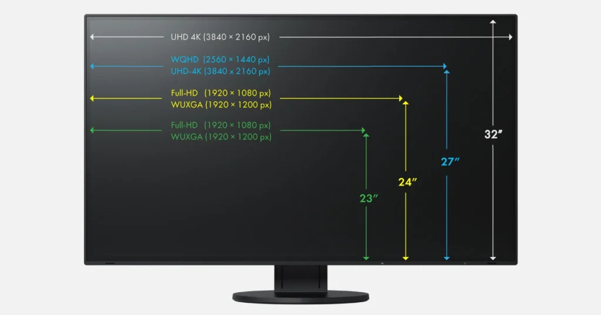

שלום לכם, חובבי הטכנולוגיה הישראלים! שנת 2025 כבר כאן, והמסכים סביבנו ממשיכים להתפתח בקצב מסחרר. בין אם אתם גיימרים שחולמים על קרבות חלקים ב-165 הרץ, אמנים שצריכים צבעים מדויקים כמו במציאות, מפתחי תוכנה שרוצים לראות 50 שורות קוד בו זמנית, או סתם משתמשים שמחפשים מסך נוח לעבודה וסרטים – יש מוניטור מושלם בשבילכם. אבל עם כל כך הרבה אפשרויות – OLED, LCD, 4K, גדלים מ-24 עד 49 אינץ' – איך בוחרים? במדריך הזה, נסקור את כל מה שצריך לדעת על טכנולוגיות, גדלים ושימושים, עם טיפים שיעזרו לכם להחליט. בואו נתחיל!

## **1\. סקירת טכנולוגיות: מה מתחת למכסה?**

הטכנולוגיה של המסך היא הלב של החוויה. הנה מה שכדאי להכיר:

  

- - **LCD – עדיין פה, ועדיין שווה**
        
        - - **IPS**: צבעים חיים וזוויות צפייה רחבות. מושלם לעבודה משרדית או עריכת תמונות (למשל, LG UltraFine 27 אינץ').
        
          
        
        - - **VA**: ניגודיות גבוהה ושחור עמוק יותר – טוב לסרטים ולמשחקים (כמו Samsung Odyssey G5).
        
          
        - - **TN**: זמן תגובה מהיר (1ms) וזול, אבל הצבעים פחות מרשימים – בחירה קלאסית לגיימרים בתקציב נמוך.

  

- - **OLED – המלך החדש**  
        צבעים עשירים, שחור אמיתי ותגובה מיידית. מושלם לגיימרים ואמנים, אבל המחיר גבוה ויש סיכון לשריפה במסך לאורך זמן. דוגמה? LG OLED evo G5 – פשוט חלום.

  

- - **Mini-LED – האמצע המוזהב**  
        משפר את ה-LCD עם תאורה מדויקת יותר. פחות יקר מ-OLED, ועדיין נותן איכות תמונה מעולה (ראו את ה-MSI MPG 321URX).

  

- **תוספות חשובות לגיימרים**  
    VRR (קצב רענון משתנה), Nvidia G-Sync ו-AMD FreeSync מבטיחים משחק חלק בלי קריעות מסך. שווה לבדוק תמיכה לפני הקנייה!

Hudhayfa Nazoordeen, סטודנט למתמטיקה באוניברסיטת ווטרלו, הצליח לבצע את הבלתי יאומן: לבנות כור היתוך קטן בחדרו בתוך ארבעה שבועות בלבד, עם תקציב של 2,000 דולר ובסיועו של Claude, העוזר הבינה המלאכותית של Anthropic. ההישג הזה, שבוצע ללא כל ניסיון קודם בציוד, דוחף את גבולות מה שחשבנו שאפשרי בפרויקט חובבני.

## **2\. גדלים ורזולוציות: כמה גדול זה גדול מדי?**

הגודל והרזולוציה משפיעים על הכל – מהנוחות ועד המחיר. הנה המדריך המהיר:

  

- - **24-27 אינץ', Full HD (1080p) או 2K (1440p)**  
        קומפקטי וזול, טוב לעבודה יומיומית, גלישה או גיימינג קליל. דוגמה: Dell P2419H – קלאסי ויעיל.

  

- - **32 אינץ', 4K (2160p)**  
        האיזון המושלם – מספיק גדול לפרטים חדים, לא גדול מדי לשולחן. מתאים לגיימינג, עיצוב ועבודה (כמו LG 32UN880).

  

- - **34-49 אינץ', Ultrawide (3440x1440 או 5120x1440)**  
        מסך רחב למי שצריך מרחב – מפתחים שרוצים שני חלונות פתוחים, או גיימרים שרוצים חוויה קולנועית (נסו את Samsung Odyssey G9).

  

- **טיפ ישראלי**: חדר קטן? תחשבו על 27 אינץ'. שולחן ענק? לכו על Ultrawide!

## **3\. מה חשוב לכם? שימושים ומפרטים**

כל אחד צריך משהו אחר מהמוניטור שלו. הנה מה שכדאי לבדוק לפי הצורך:

  

- - **לגיימינג**:  
        קצב רענון גבוה (120-165 הרץ), זמן תגובה נמוך (1-4ms), תמיכה ב-VRR. המלצה? LG OLED evo G5 עם 165 הרץ ב-4K.

  

- - **לעיצוב גרפי ואמנות**:  
        דיוק צבעים (Delta E < 2), כיסוי 100% sRGB או AdobeRGB. דוגמה: BenQ PD3220U – חביב המעצבים.

  

- - **לפיתוח תוכנה**:  
        מסך רחב (34 אינץ' ומעלה), רזולוציה גבוהה (4K או Ultrawide), תמיכה במספר חלונות. LG UltraWide 34WN780 עושה את העבודה.

  

- **לשימוש כללי**:  
    מחיר נוח, איכות תמונה סבירה (IPS 1080p או 1440p). AOC 24G2 מושלם למי שרוצה הכל מהכל בלי לשבור קופת חיסכון.

## **4\. טיפים לבחירה חכמה בישראל**

  

- - **תקציב**: מוניטורים טובים מתחילים ב-800 ש"ח (24 אינץ' בסיסי) ועד 5,000 ש"ח+ לדגמים מתקדמים. תכננו מראש!

  

- - **קנייה מקומית**: חנויות כמו KSP או Ivory מציעות מבחר, ויש אחריות מקומית – חשוב במיוחד ל-OLED.

  

- - **חיבורים**: HDMI 2.1 או DisplayPort 1.4 חיוניים ל-4K וקצב רענון גבוה. בדקו את המחשב שלכם לפני.

  

### **למי שרוצה עוד – המדריכים שלנו**

עדיין מתלבטים? הכנו לכם מדריכים מפורטים לכל סוג משתמש:

  

- - המוניטורים הטובים ביותר לגיימינג ב-2025

  

- - מוניטורים לאמנים ב-2025

  

- - מוניטורים למפתחים ב-2025

  

- - מוניטורים לשימוש יומי ב-2025

  

- גדלים ורזולוציות של מוניטורים ב-2025

## **סיכום**

  
בחירת מוניטור היא לא מדע טילים, אבל היא דורשת קצת מחשבה. תשאלו את עצמכם: מה אני עושה הכי הרבה? כמה מקום יש לי? ומה התקציב? עם המדריך הזה, אתם בדרך למסך שישדרג לכם את 2025.
