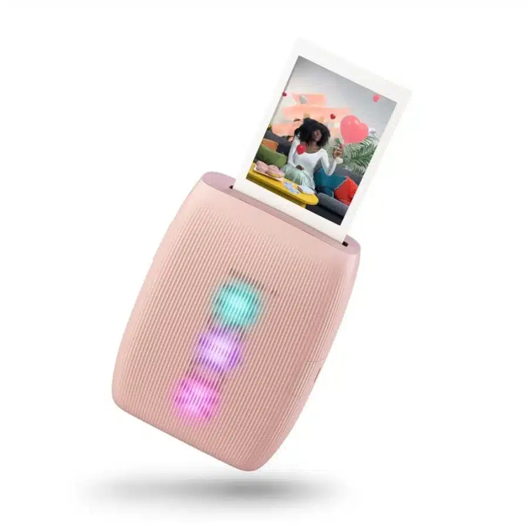
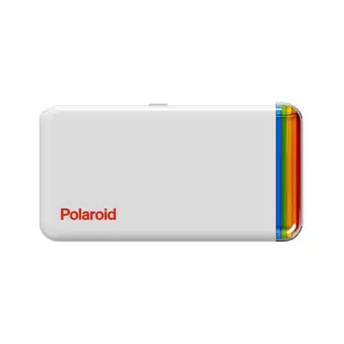
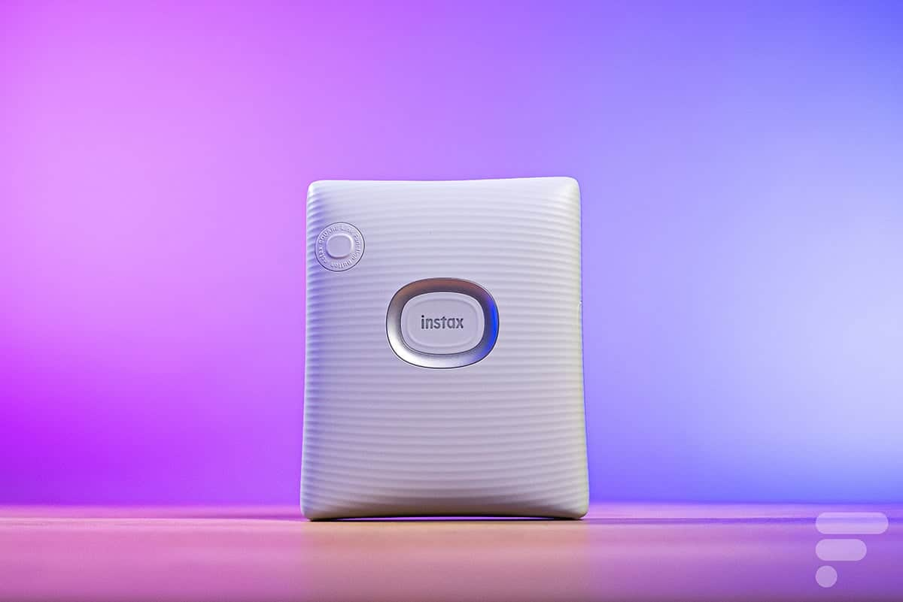
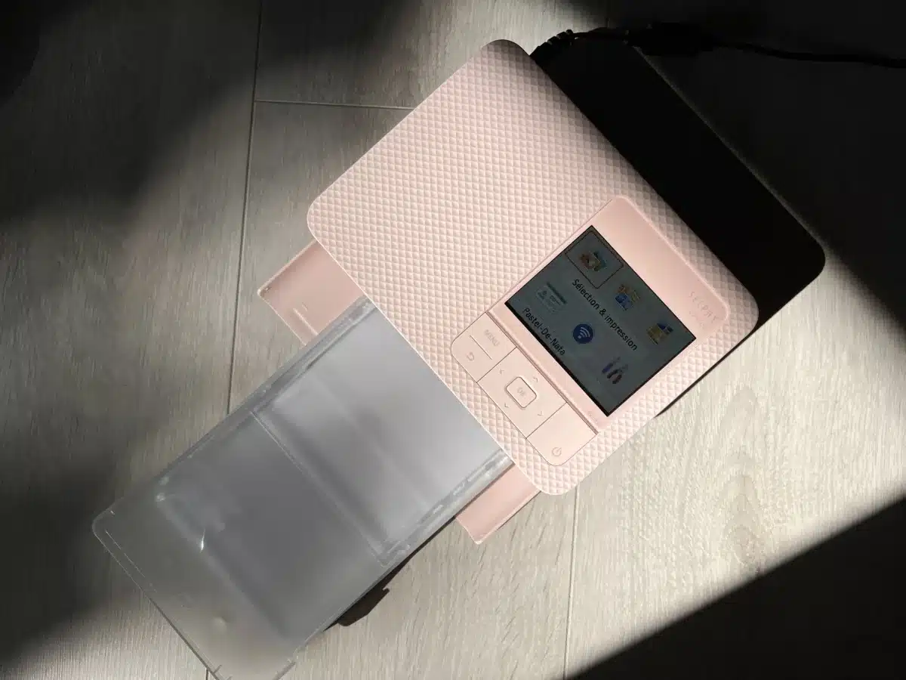
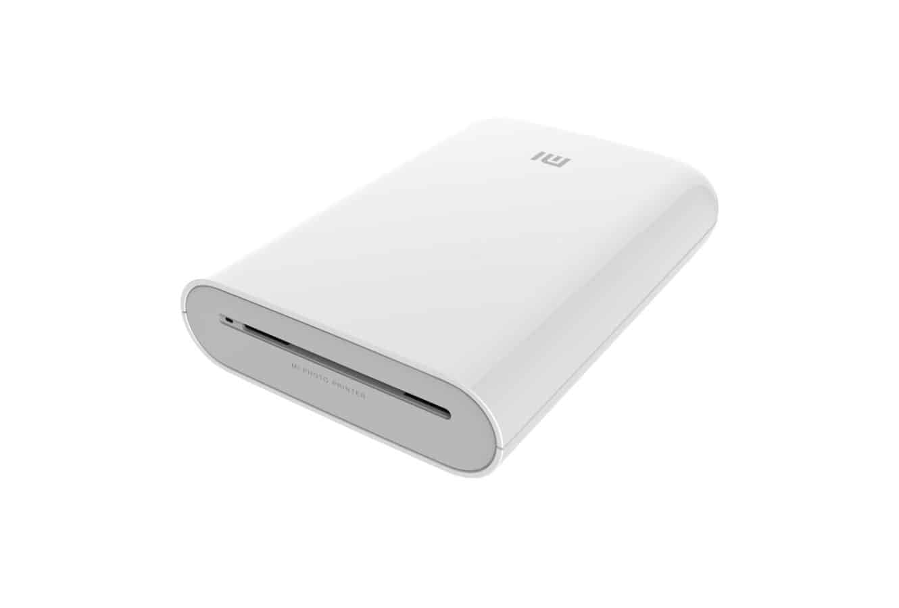
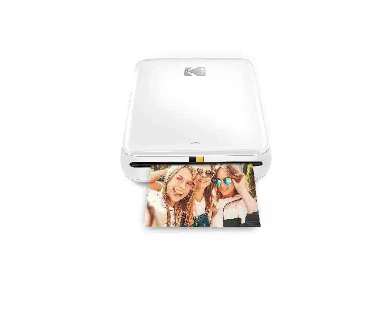

מדפסת תמונה ניידת משנה את חוקי המשחק – היא מאפשרת לכם להדפיס מיידית מהסמארטפון תמונות יפהפיות. זה אידיאלי:

- לאירועים כמו יומולדת או מסיבות
    
- לאלבומי זיכרון אישיים
    
- כמתנה ליודעי דבר
    
- ונשיאה בכיס או בתיק בלי להתאמץ
    

אבל לא כל מדפסת מתאימה לאותו שימוש – חשוב לוודא שהדגם שתבחר מתאים לצרכים שלך.

## **💡 איך לבחור את המדפסת שהכי מתאימה לך?**

1. **בחר לפי פורמט**:
    
    - 10×15 עבור אלבומים
        
    - פורמטים קטנים יותר לאירועים ותמונות עדכניות
        
2. **בדוק את איכות ההדפסה**:
    
    - סובלימציה = איכות גבוהה
        
    - ZINK = מהירה וזולה
        
    - פילם אינסטקס = רטרו ייחודי
        
3. **ניידות וסוללה**:
    
    - רוב הדגמים מספיקים להדפיס עשרות תמונות בלי טעינה
        
4. **עלות חומרה**:
    
    - חפש את המחיר הכולל – מדפסת יחד עם עלות להדפסה
        

## **📊 השוואה מורחבת של הדגמים המובילים**

| דגם | טכנולוגיה | מחיר ₪ | מימדי תמונה | יתרונות עיקריים | חסרונות |
| --- | --- | --- | --- | --- | --- |
| **Fujifilm Instax Mini Link 3** | פילם אינסטקס (כימי) | 499 | 62 x 46 מ"מ | עיצוב רטרו, עד 100 הדפסות לטעינה, אפליקציה עשירה | מחיר דיו גבוה |
| **Polaroid Hi Print** | סובלימציה תרמית | 499 | 54 x 86 מ"מ | צבעים חיים, אפליקציה איכותית, מהירות הפעלה | עלות להדפסה 0.75₪ |
| **Instax Square Link** | פילם אינסטקס מרובע (כימי) | 719 | כ־6 x 6 ס"מ | פורמט ייחודי, הכי קומפקטי, USB‑C | מבנה גדול יחסית |
| **Canon Selphy CP1500** | סובלימציה תרמית | 579 | 10 x 15 ס"מ | איכות סטודיו, ממשק נוח, פונקציות עריכה מובנות | פחות נייד, כבד |
| **Xiaomi Mi Portable Photo Printer** | ZINK (ללא דיו) | 289 | 50 x 76 מ"מ | קומפקטית במיוחד, מחיר זול, עבודה פשוטה | איכות צבעים בינונית |
| **Kodak Step Instant Printer** | ZINK | 333 | 5 x 8 ס"מ | תמיכה באינסטגרם/פייסבוק, הדפסה קלה | טעינה ב‑microUSB, בעיות בתוכנה |

## **📝 פרופיל מלא לכל מדפסת**

### 📸 **Fujifilm Instax Mini Link 3** (499 ₪)

- **עיצוב**: קומפקטית, משקל קל, ניידת במיוחד
    
- **אפליקציה**: מתקדמת, עם פילטרים, קולאז'ים, ויכולת לשלוט בזמן אמת בהדפסה
    
- **איכות**: גוונים רכים ותחושת נייר איכותית, כמעט כמו תמונה מכנית
    
- **שימוש**: מושלמת לאירועים ואותנטיות
    
- **חיסרון**: מחיר דיו גבוה (16.99 € לחבילה – תרגום ~68 ₪ ל־20 תמונות)
    

### **🎨 Polaroid Hi Print (499 ₪)**

- **טכנולוגיה**: סובלימציה – כך שהצבעים יוצאים חדים ובוהקים
    
- **מהירות**: תמונה מוכנה תוך דקה
    
- **מראה חיצוני**: אלגנטית ומשדרת איכות
    
- **אפליקציה**: תומכת גם בהדפסה ישירות מרשתות חברתיות
    
- **חיסרון**: עלות עתק לצבע – ~0.75 ₪ לתמונה
    

### **🔲 Instax Square Link (719 ₪)**

- **פורמט ייחודי**: תמונה ריבועית באיכות אינסטקס
    
- **טעינה**: USB‑C – נוח וסטנדרטי
    
- **קומפקטיות**: קלי משקל וניידת מאוד
    
- **אפליקציה**: אותה אפליקציה כמו ב־Mini Link, עם אפקטים חכמים
    
- **חיסרון**: עלות דיו גבוהה (~1 ₪ לתמונה)
    

### **🖨️ Canon Selphy CP1500 (579 ₪)**

- **גודל תמונה**: סטנדרט 10×15 – אידיאלי לאלבומים
    
- **איכות**: עמידה וחדות גבוהה, עם טכנולוגיה מקצועית
    
- **ממשק**: אפליקציה מלאה בעברית, עריכה מושלמת
    
- **סוללה**: מספיקה ל־72 הדפסות רצופות
    
- **חיסרון**: פחות ניידת – יכולה להיות קצת כבדה לתיק קבוע
    

### **🉑 Xiaomi Mi Portable Photo Printer (289 ₪)**

- **טכנולוגיה**: ZINK – הדפסה מהירה ללא דיו
    
- **קומפקטית**: עובדת עם בלוטות' ו‑Xiaomi Home מאפס
    
- **מחיר**: זולה מאוד בהשוואה
    
- **חיסרון**: צבעים כהים, פחות חדים – לא אידיאלית להדפסות מקצועיות
    

### **📥 Kodak Step Instant Printer (333 ₪)**

- **תמיכה חברתית**: הדפסה ישירות מהרשתות – פייסבוק ואינסטגרם
    
- **פשטות השימוש**: טעינה פשוטה, תפעול קל
    
- **חיסרון**: ממשק טעינה ישן (microUSB), תוכנה עדיין זקוקה לשיפורים
    

## **✔️ למי מתאימה כל מדפסת?**

- **איכות סופית ו־10×15** – Canon Selphy
    
- **צבעים חיים בתוך דקה** – Polaroid Hi Print
    
- **מראה רטרו קומפקטי** – Fujifilm Instax Mini/Square
    
- **הדפסה מהירה, מחיר זול** – Xiaomi או Kodak
