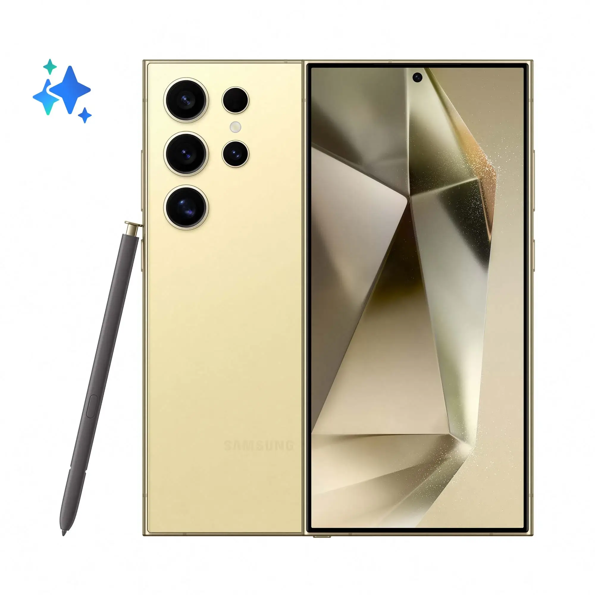
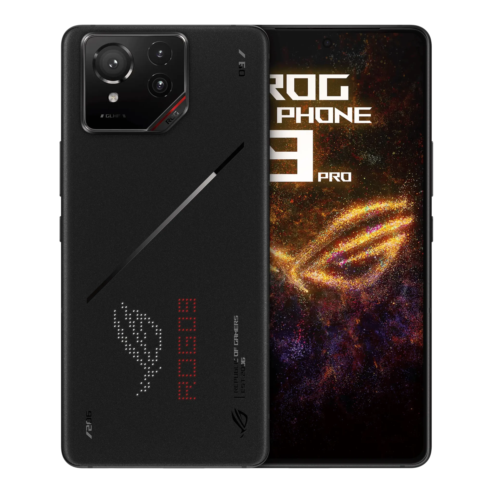
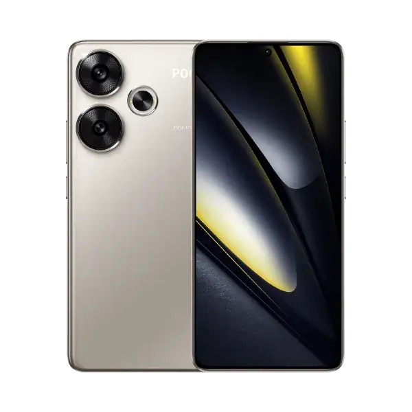
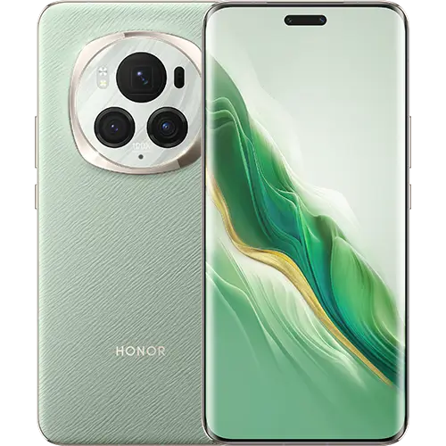
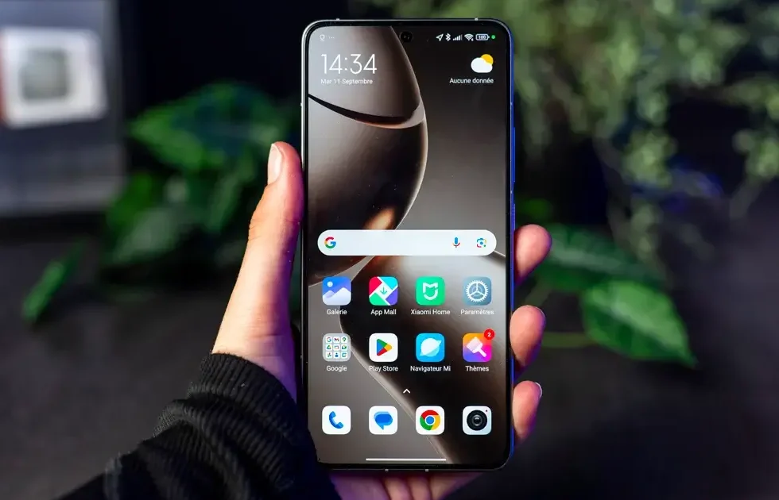
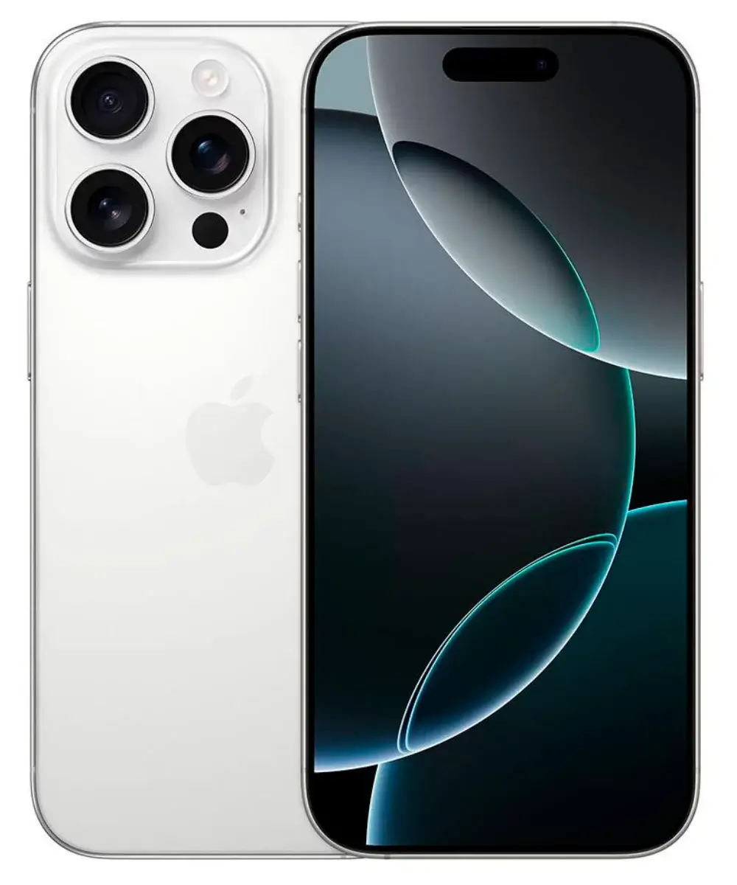

## שלושת המובילים:

#### **1\. Samsung Galaxy S24 Ultra: הבחירה הרב-תכליתית**

ה-**Galaxy S24 Ultra** של סמסונג הוא לא רק מכשיר פרימיום, אלא גם מכונה מרשימה למשחקים ניידים.

- **מעבד:** Snapdragon 8 Gen 3, שמציע ביצועים מצוינים וניהול חום יעיל.
- **מסך:** AMOLED בגודל 6.8 אינץ’ עם רזולוציית QHD וקצב רענון של 120Hz.
- **סוללה:** עד יומיים עבודה.
- **מחיר:** ~5,400 ₪.

#### **2\. Asus ROG Phone 9 Pro: החזק ביותר**

טלפון גיימינג מקצועי שמציע ביצועים מרשימים ותכונות מותאמות אישית.

- **מעבד:** [Snapdragon 8 Elite](https://techhorizons.co.il/snapdragon-8-elite/), החזק ביותר לשנת 2024.
- **מסך:** AMOLED בגודל 6.78 אינץ’ עם גימיקים כמו "AirTriggers".
- **קירור:** קירור מובנה ויכולת חיבור למערכת AeroActive Cooler.
- **סוללה:** קיבולת של 6000mAh לשימוש של עד יומיים.
- **מחיר:** ~4,800 ₪.

#### **3\. Xiaomi Poco F6: הבחירה התקציבית**

למי שמחפש מכשיר גיימינג במחיר משתלם, ה-**Poco F6** הוא הבחירה הנכונה.

- **מעבד:** Snapdragon 8s Gen 3, גרסה מוזלת של Snapdragon 8 Gen 3.
- **מסך:** AMOLED בגודל 6.67 אינץ’ עם קצב רענון של 120Hz.
- **טעינה מהירה:** מטען 90W, טעינה מלאה ב-51 דקות בלבד.
- **מחיר:** ~1,600 ₪.

## דגמים נוספים שכדאי לשקול:

#### **Honor Magic 6 Pro: אלטרנטיבה מרשימה**

עם מעבד **Snapdragon 8 Gen 3**, המכשיר מבטיח ביצועים עקביים וקירור מצוין לאורך זמן.

- **מסך:** AMOLED בגודל 6.8 אינץ’ עם קצב רענון אדפטיבי של עד 120Hz.
- **סוללה:** 5600mAh שמחזיקה עד יומיים.
- **מחיר:** ~4,500 ₪.

#### **[Xiaomi 14T Pro](https://techhorizons.co.il/xiaomi-14t-pro/): מסך מרשים ב-144Hz**

טלפון שמציע ביצועים מעולים לגיימינג עם מעבד Dimensity 9300+ ותמיכה בגרפיקה גבוהה.

- **מסך:** OLED בגודל 6.67 אינץ’ עם קצב רענון משתנה עד 144Hz.
- **טעינה מהירה:** 120W שמאפשרת טעינה מלאה ב-40 דקות.
- **מחיר:** ~3,200 ₪.

#### **Apple iPhone 16 Pro: גיימינג בסגנון אפל**

עם **מעבד A18 Pro**, האייפון הופך למיני-קונסולה שמספקת חוויית גיימינג יוצאת דופן.

- **מסך:** AMOLED בגודל 6.3 אינץ’, עם בהירות גבוהה במיוחד.
- **מגבלות:** Fortnite עדיין לא זמין בחנות האפליקציות.
- **מחיר:** ~5,600 ₪.

## קריטריונים לבחירת סמארטפון לגיימינג:

- **מעבד:** מעבד עוצמתי הוא חובה למשחקים תובעניים.
- **מסך:** העדיפו מסך AMOLED עם קצב רענון של לפחות 120Hz.
- **סוללה:** סוללה חזקה ומערכת קירור יעילה יבטיחו זמן משחק ממושך.

## איזה סמארטפון מתאים ל-Fortnite?

בשל מגבלות אפל, **Fortnite** אינו זמין ב-App Store. משתמשי אנדרואיד יכולים ליהנות ממנו בצורה מלאה. דגמים כמו **Samsung Galaxy S24 Ultra** ו-**Asus ROG Phone 9 Pro** הם הבחירה האידיאלית.

## האם כדאי לשחק עם בקר?

שימוש בבקר משפר את הדיוק, אך יכניס אתכם למערכות משחק עם משתמשי קונסולות ו-PC, שיכולים להקשות על הניצחון.

## לסיכום:

בין אם אתם גיימרים מזדמנים או מקצועיים, יש סמארטפון גיימינג שמתאים לצרכים שלכם ב-2024. בחרו את המתאים ביותר עבורכם ותיהנו מחוויית משחק ברמה הגבוהה ביותר.

- Samsung Galaxy S24 Ultra: סמארטפון גיימינג חזק עם Snapdragon 8 Gen 3, מסך AMOLED 120Hz ואוטונומיה של יומיים.
- Asus ROG Phone 9 Pro: החזק ביותר ב-2024 עם מסך 6.78 אינץ', אביזרי גיימינג וביצועים מעולים.
- Xiaomi Poco F6: בחירה משתלמת עם מעבד Snapdragon 8s Gen 3, עיצוב קל וטעינה מהירה 90W.
