## **למה חשוב לבחור את ה-SSD הנכון ב-2025?**

עם הדרישות ההולכות וגוברות של המחשוב המודרני, בחירת ה-SSD המתאים היא קריטית. בין אם אתם **גיימרים, מפתחים או משתמשי כוח**, SSD איכותי יכול **לשפר משמעותית זמני טעינה, לשפר ביצועים ולהבטיח אמינות לטווח ארוך**.

אבל עם **PCIe 4.0, PCIe 5.0 ו-SATA SSDs** בשוק – איזה מהם הכי כדאי? במדריך הזה ריכזנו **את ה-SSD הטובים ביותר של 2025** בהתבסס על **ביצועים, מחיר ושימושים שונים**.

## ה-SSD הטוב ביותר בכללי:

### Samsung 990 Pro

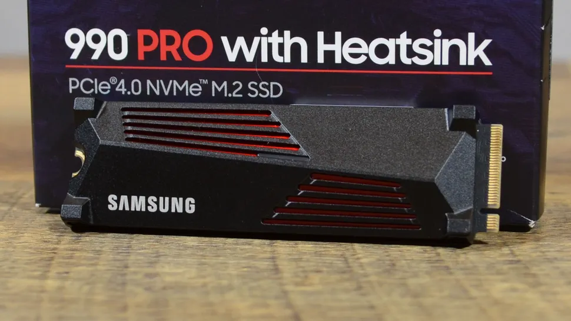
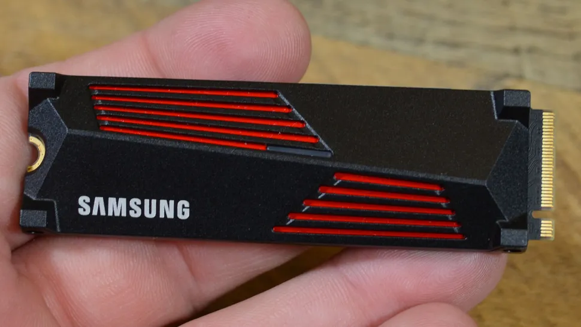
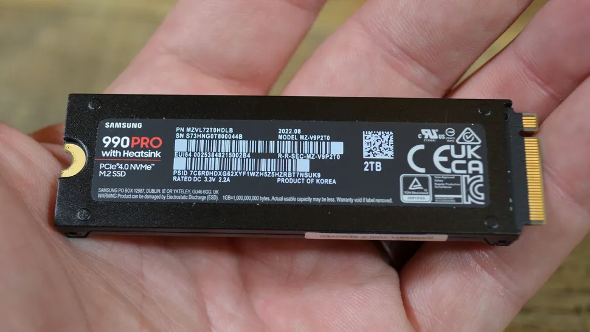
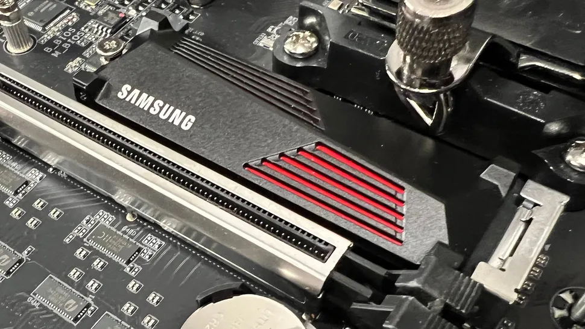

🔹 **נפח אחסון:** 1TB, 2TB, 4TB  
🔹 **ממשק:** PCIe 4.0 x4  
🔹 **מהירות קריאה:** עד 7,450MB/s  
🔹 **מהירות כתיבה:** עד 6,900MB/s

💡 **למה הוא הכי טוב?**  
ה-**Samsung 990 Pro** הוא ה-SSD המאוזן ביותר. הוא מספק **מהירויות מדהימות, עמידות גבוהה ותאימות רחבה**, מה שהופך אותו לבחירה מעולה עבור **גיימרים, מפתחים ואנשי מקצוע**.

✅ **יתרונות:**

- **מנצל עד תום את תקן PCIe 4.0**
- **תואם ל-PS5**
- **אמין למשימות גיימינג ועבודה מקצועית**

❌ **חסרונות:**

- **לא PCIe 5.0** (אבל עדיין מהיר ביותר)
- **יקר יותר מ-SSD תקציבי**

## ה-SSD המשתלם ביותר:

### PNY XLR8 CS3140

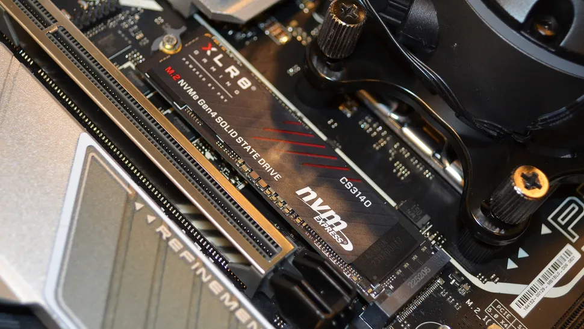
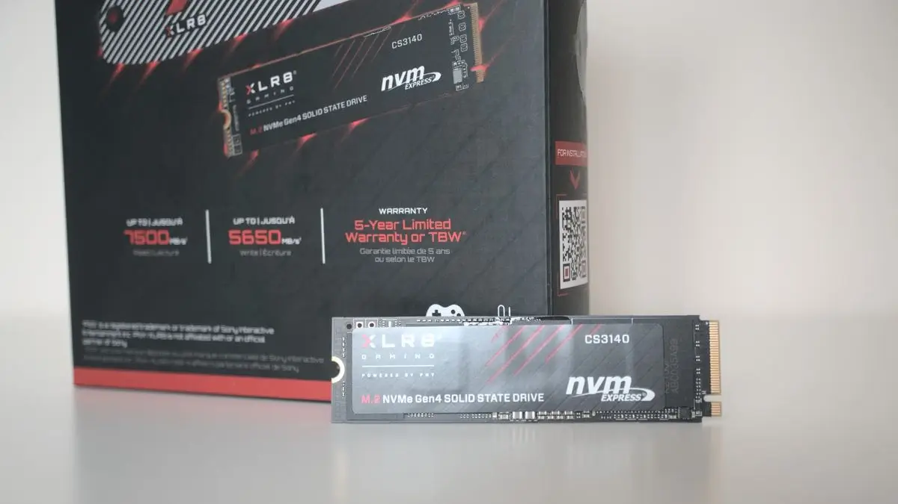

🔹 **נפח אחסון:** 1TB - 4TB  
🔹 **מהירות קריאה:** עד 7,500MB/s  
🔹 **מהירות כתיבה:** עד 6,850MB/s

💡 **למה הוא מעולה?**  
ה-**PNY XLR8 CS3140** מספק **ביצועים גבוהים במחיר נגיש**, מה שהופך אותו לבחירה מושלמת עבור **גיימרים ובוני מחשבים בתקציב נמוך**.

✅ **יתרונות:**

- **תמורה מצוינת למחיר**
- **מהירות מעולה למשחקים ולמשימות מרובות**
- **אפשרות להוספת גוף קירור**

❌ **חסרונות:**

- **לא ה-SSD הכי מהיר בשוק**
- **הגוף קירור נמכר בנפרד**

## ה-SSD הטוב ביותר בכללי

### Samsung 990 EVO

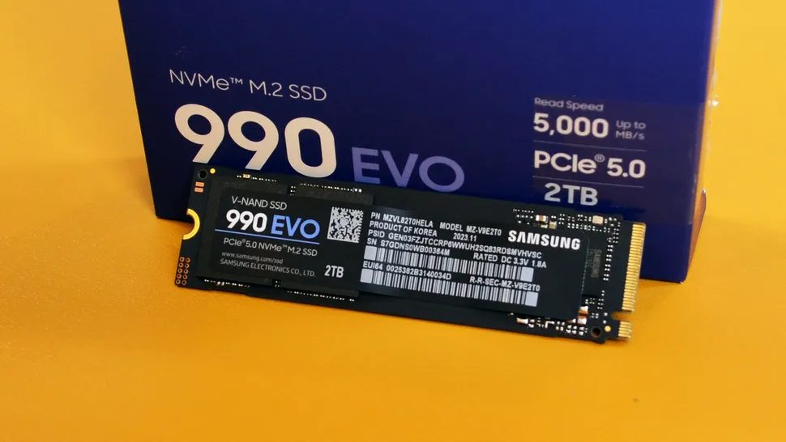
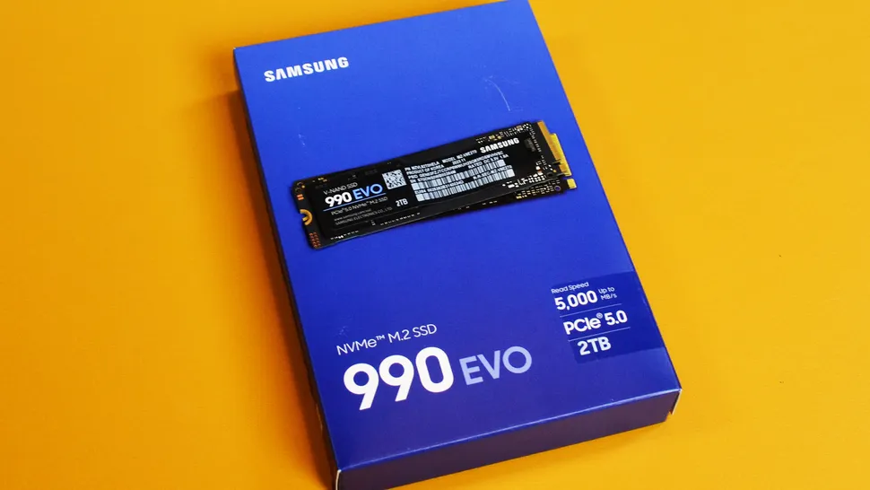
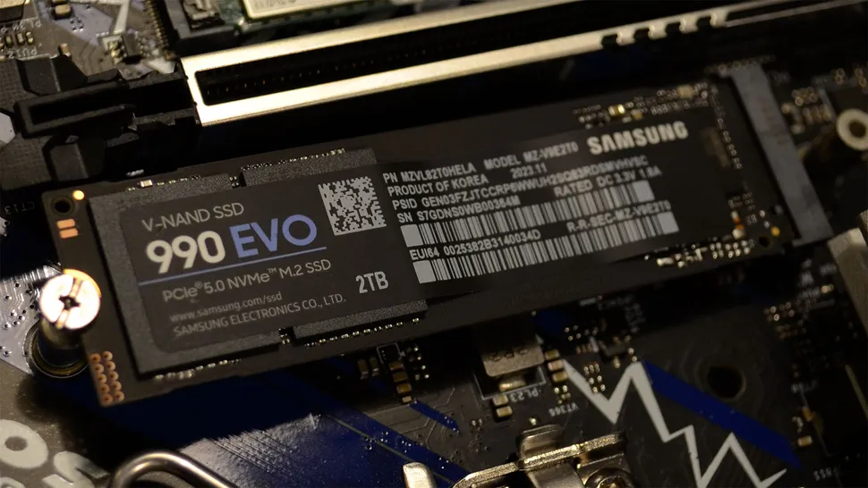

**נפח אחסון:** 1TB - 2TB  
🔹 **ממשק:** PCIe 4.0 x4 / PCIe 5.0 x2  
🔹 **מהירות קריאה:** עד 5,000MB/s  
🔹 **מהירות כתיבה:** עד 4,200MB/s

💡 **למה לבחור בו?**  
ה-**Samsung 990 EVO** מספק **ביצועים יציבים עם צריכת חשמל מופחתת**, מה שהופך אותו **לבחירה מצוינת ללפטופים**.

✅ **יתרונות:**

- **משפר חיי סוללה בלפטופים**
- **איזון טוב בין ביצועים למחיר**
- **אמינות גבוהה לעבודה יומיומית**

❌ **חסרונות:**

- **לא המהיר ביותר בקטגוריה**
- **מתאים בעיקר לשימוש יום-יומי ולא לגיימינג כבד**

## ה-SSD הטוב ביותר לגיימינג :

### Corsair MP600 Pro LPX

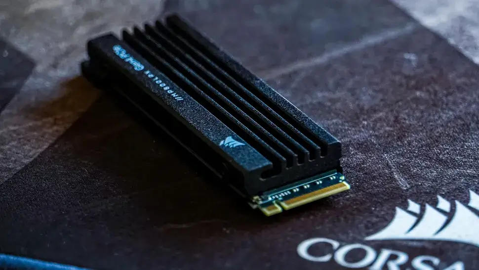
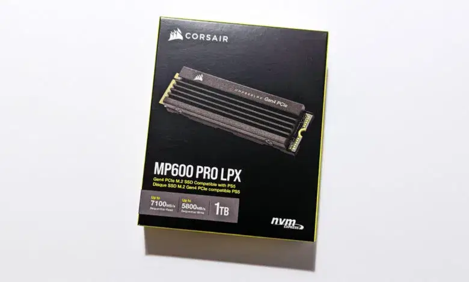
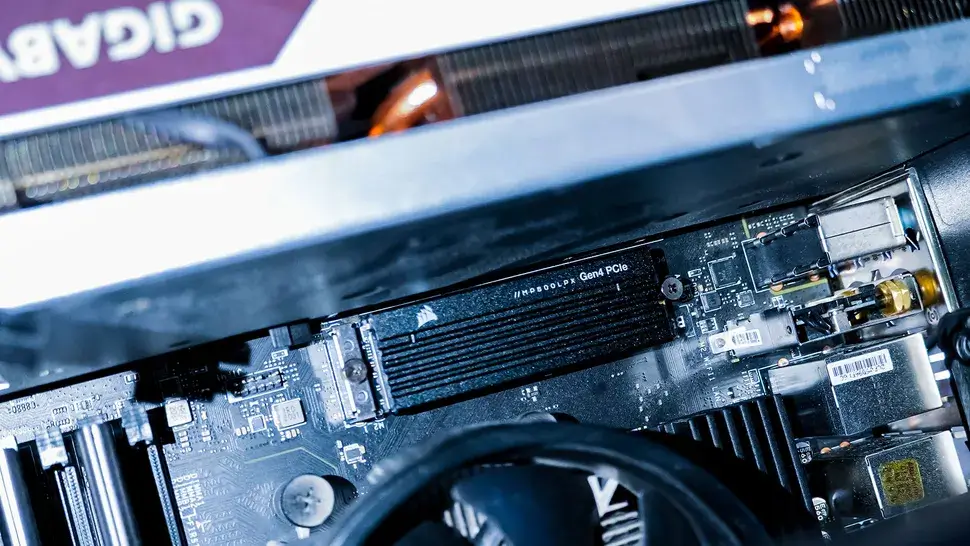

**נפח אחסון:** 500GB - 4TB  
🔹 **מהירות קריאה:** עד 7,100MB/s  
🔹 **מהירות כתיבה:** עד 6,800MB/s  
🔹 **גוף קירור מובנה**

💡 **למה לבחור בו?**  
ה-**Corsair MP600 Pro LPX** תוכנן **למקסם ביצועים במשחקים**, עם **תאימות מלאה ל-DirectStorage** וזמני טעינה מהירים במיוחד.

✅ **יתרונות:**

- **מותאם לגיימינג עם זמני תגובה נמוכים**
- **תומך ב-PS5 וב-PC**
- **כולל גוף קירור מובנה לשמירה על טמפרטורה אופטימלית**

❌ **חסרונות:**

- **מהירויות כתיבה רנדומליות לא מהטובות ביותר**
- **יקר יותר מהדגמים התקציביים**

## ה-SSD החיצוני הטוב ביותר:

### Samsung T7

**נפח אחסון:** 500GB - 2TB  
🔹 **מהירות קריאה:** עד 1,050MB/s  
🔹 **מהירות כתיבה:** עד 1,000MB/s  
🔹 **USB 3.2 Gen 2**

💡 **למה לבחור בו?**  
אם אתם מחפשים **SSD חיצוני מהיר ואמין**, ה-**Samsung T7** הוא **קומפקטי, בטוח וקל לנשיאה**.

✅ **יתרונות:**

- **אבטחה מובנית עם הצפנת AES 256-bit**
- **מהיר מאוד להעברת קבצים וגיבויים**
- **גודל קומפקטי ונוח לנשיאה**

❌ **חסרונות:**

- **לא כולל הגנה קשיחה לנפילות**
- **מעט יקר יחסית לקטגוריה**

## סיכום: איזה SSD הכי מתאים לכם ב-2025?

✔ **לשימוש כללי:** **Samsung 990 Pro**  
✔ **לגיימינג:** **Corsair MP600 Pro LPX**  
✔ **לפטופים:** **Samsung 990 EVO**  
✔ **לתקציב נמוך:** **PNY XLR8 CS3140**  
✔ **לאחסון חיצוני:** **Samsung T7**

💡 **עם PCIe 5.0 שמתחיל להיכנס לשוק, האם כדאי לשדרג עכשיו?** כרגע, **PCIe 4.0 מציע את התמורה הטובה ביותר לכסף**, ויישאר רלוונטי לפחות לשנים הקרובות.
