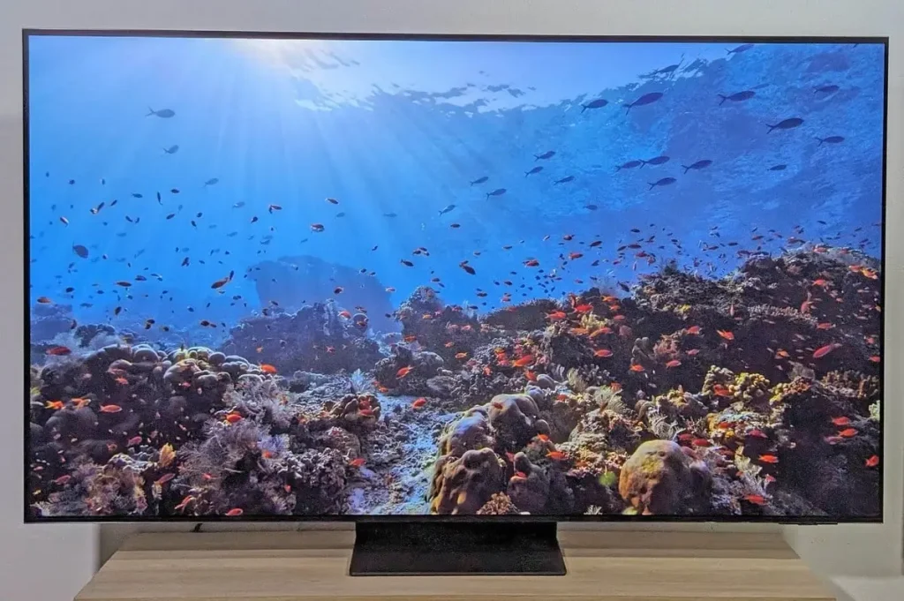
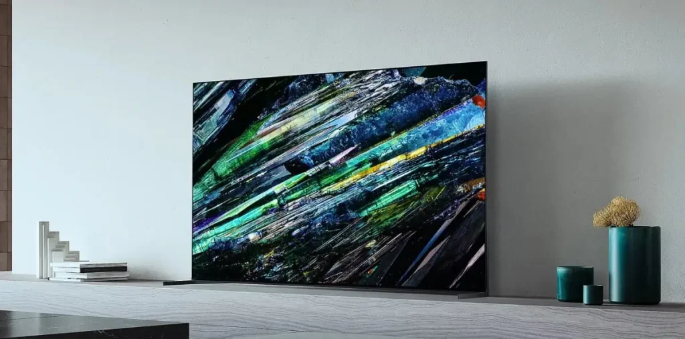
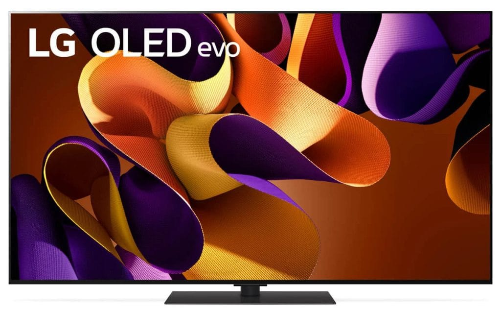
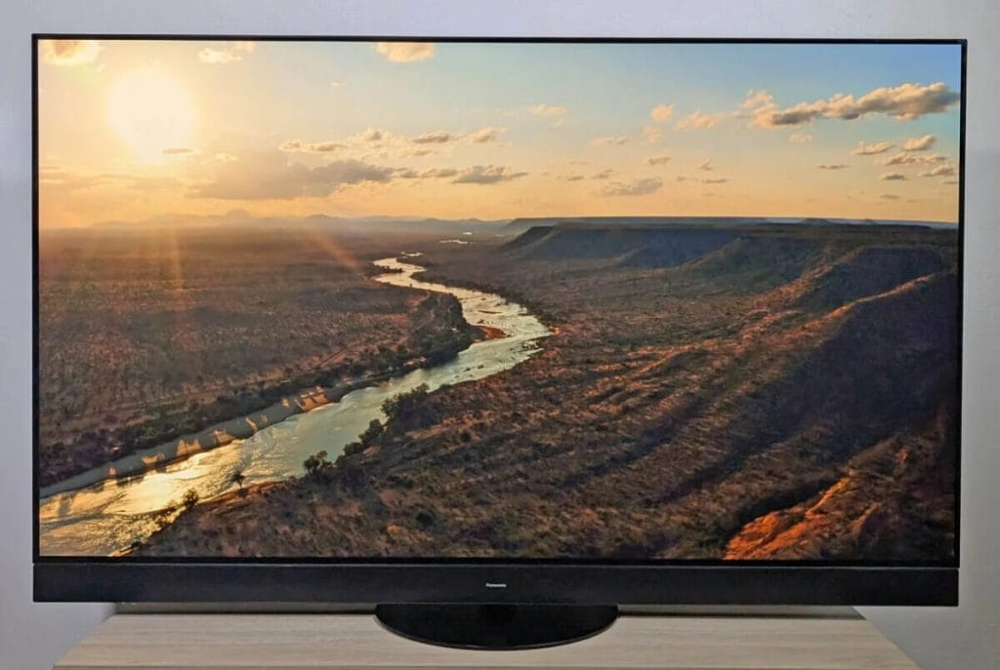
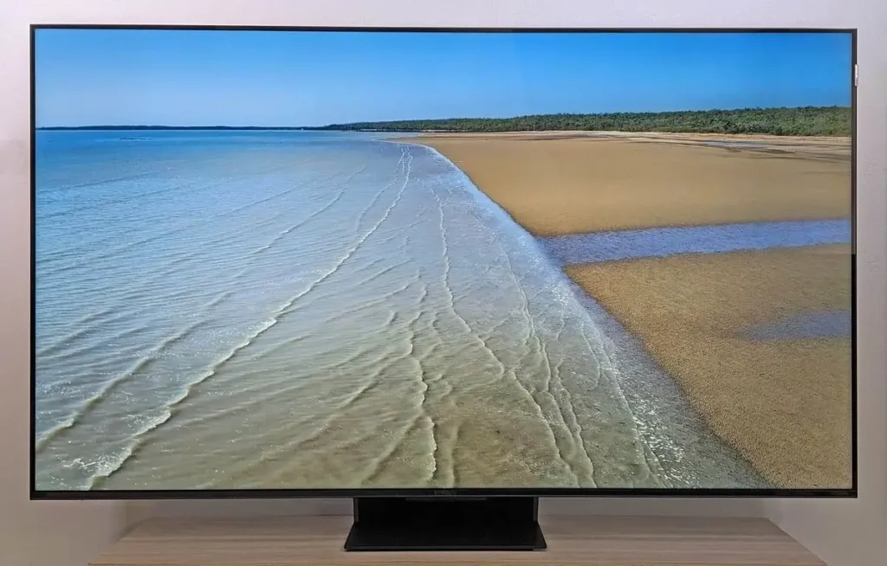
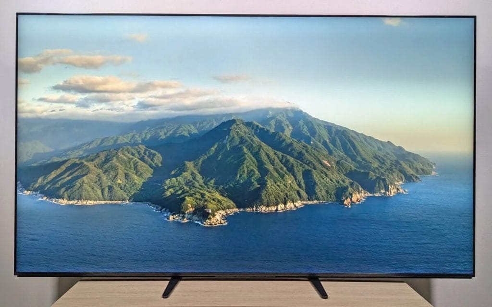

## **איזו טלוויזיה לבחור ב-2024? הטופ 3 שלנו**

**הטלוויזיה היוקרתית ביותר (OLED)**  
9/10  
**LG OLED65G4**

- הבהירות הגבוהה ביותר שנמדדה
- איכות תמונה יוצאת דופן
- מצוינת לגיימינג
- מחיר גבוה
- מחיר: כ-10,500 ש"ח

**הטלוויזיה הטובה ביותר לשנת 2024**  
9/10  
**Samsung TQ65S95D**

- שימושים מגוונים
- בהירות יוצאת דופן
- מסנן אנטי-רפלקט מצוין
- מחיר: כ-11,200 ש"ח

**הטלוויזיה הטובה ביותר ביחס מחיר-איכות**  
9/10  
**TCL 65C89B**

- מוכנה ל-PS5 ול-Xbox Series X
- ניגודיות מעולה של Mini LED
- מסך גדול במחיר סביר
- מחיר: כ-5,200 ש"ח

## Samsung TQ65S95D - הטלוויזיה הטובה ביותר לשנת 2024

טלוויזיה זו מגיעה מסדרת S95 המובילה של סמסונג. היא מבוססת על הדור השלישי של פאנלים מסוג QD-OLED שפותחו על ידי Samsung Display. עם בהירות חזקה, ניגודיות מצוינת ומעבד AI חכם, היא מספקת תמונה חדה ומדויקת, גם במצבי תאורה חזקים. תכונת האנטי-רפלקט ייחודית משדרגת את חוויית הצפייה גם בשעות היום.  
מחיר: כ-11,200 ש"ח

## Sony XR-65A95L - הטלוויזיה הטובה ביותר של Sony

הסדרה החדשה A95L מציגה טלוויזיה באיכות תמונה מעולה עם פאנל QD-OLED המיוצר על ידי Samsung Display. דגם זה תומך ב-HDR10, HLG ו-Dolby Vision ומספק צבעים מדויקים ושחורים עמוקים ללא עיוותים.  
הטלוויזיה הזו מתאימה גם לגיימינג עם input lag נמוך ויכולות מתקדמות נוספות כמו Dolby Vision Gaming ב-120Hz.  
מחיר: כ-12,000 ש"ח

## LG OLED65G4 - טלוויזיה OLED יוקרתית

ה-LG OLED65G4 היא הדגם המתקדם ביותר מסדרת ה-G של LG. היא מציעה בהירות גבוהה במיוחד עם מסך White OLED Evo וטכנולוגיית Brightness Booster Max שמגבירה את הבהירות הכוללת.  
כמו כן, היא מציעה איכות תמונה מעולה, עם מגוון מצבי צפייה כגון Filmmaker Mode המתאימים לתנאי תאורה שונים.  
מחיר: כ-10,500 ש"ח

## Panasonic TV-65Z95AEG - ביצועי OLED ברמה גבוהה

דגם זה מציע פאנל Master OLED Ultimate עם קירור אחורי שמאפשר בהירות שיא של 1633 cd/m². דיוק הצבעים הגבוה והניגודיות המצוינת הופכים את הטלוויזיה הזו לבחירה מעולה עבור אוהבי קולנוע.  
היא מתאימה גם לגיימינג עם input lag של 8.9ms.  
מחיר: כ-15,000 ש"ח

## TCL 65C89B - הטלוויזיה הטובה ביותר ביחס מחיר-איכות

הטלוויזיה TCL 65C89B מציעה ביצועים מעולים במחיר נוח יחסית. עם פאנל QLED ותמיכה ב-HDR10+ ו-Dolby Vision IQ, היא מתאימה לשימושים מגוונים, כולל גיימינג עם input lag של 14.7ms.  
מחיר: כ-5,200 ש"ח

## Sony Bravia 9 75XR90 - הטלוויזיה הבהירה ביותר

טלוויזיה זו מציעה בהירות שיא של 2696 cd/m² ומספקת תמונה מדויקת עם צבעים טבעיים. היא גם מתאימה לגיימינג ומציעה input lag של 17.1ms.  
מחיר: כ-13,900 ש"ח

## סיכום

ב2024 יש מגוון עצום של טלוויזיות, אבל מה שבאמת חשוב זה למצוא את מה שמתאים לכם. בין אם אתם מחפשים איכות תמונה מעולה לצפייה בסרטים או תגובה מהירה למשחקי וידאו, יש טלוויזיה לכל צורך. כדאי לקחת בחשבון את הטכנולוגיה (OLED, QLED או LCD), גודל המסך והתקציב שלכם. אחרי הכל, הטלוויזיה המושלמת היא זו שתתאים לכם בדיוק ותשדרג לכם את חוויית הצפייה בבית.

- סטודנט למתמטיקה בנה כור היתוך בחדרו בתוך 4 שבועות בלבד, עם תקציב של 2,000 דולר.סטודנט למתמטיקה בנה כור היתוך בחדרו בתוך 4 שבועות בלבד, עם תקציב של 2,000 דולר.
- הפרויקט הושלם בעזרת Claude, הבינה המלאכותית של Anthropic, ללא ניסיון קודם בציוד.
- למרות שהכור אינו יוצר היתוך אמיתי, ההישג הזה עשוי לעורר גישות חדשות במחקר על אנרגיה נקייה.
