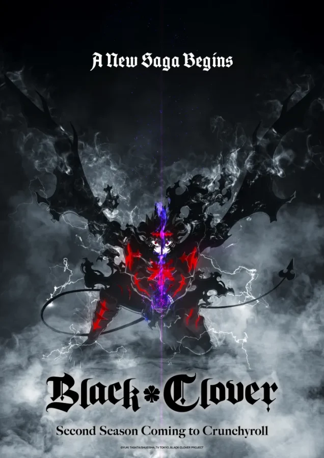

## **עונה חדשה לאחת מהאנימות האהובות חוזרת**

במהלך פאנל התעשייה של Crunchyroll באירוע Anime Expo 2025, הוכרז רשמית כי עונה חמישית ל"בלאק קלובר" נמצאת בהפקה – בליווי טיזר ראשון שמחזיר את אסטה למסך. עבור המעריצים, זו בשורה מרגשת במיוחד, לאחר ארבע שנות הפסקה מהסדרה המרכזית (מאז 2021).

לאחר סיום העונה הרביעית, קיבלנו סרט קולנוע בשם "חרבו של מלך הקוסמים" ב-2023, אך הוא התרחש לפני אירועי סיום הסדרה. כעת, העונה החמישית תמשיך בדיוק מהמקום שבו הפסקנו – בעיצומה של העלילה מול ממלכת הספייד.

## **🗓️ מתי יוצאת עונה 5 של Black Clover?**

נכון לעכשיו אין תאריך יציאה רשמי לעונה 5 של Black Clover, אך לפי ההכרזה של Crunchyroll באירוע Anime Expo 2025, הסדרה החדשה נמצאת כבר בשלבי הפקה מתקדמים וצפויה לעלות במהלך 2025 או תחילת 2026.

הסטרימינג יתבצע באופן בלעדי ב־Crunchyroll, בדיוק כמו בעונות הקודמות.

## **📺 איפה אפשר לראות?**

עונות 1–4 זמינות לצפייה בפלטפורמות כמו Netflix, Prime Video ו-Hulu (תלוי אזור). עונה 5, כאמור, תעלה בבלעדיות ב־Crunchyroll.

## **🎥 טריילר ראשון לעונה 5 של Black Clover**

לצד ההכרזה המרגשת, שוחרר גם טיזר קצר לעונה החמישית של Black Clover, ובמרכזו אסטה במראה בוגר ואפל מתמיד. הטריילר מציג רמזים לסיפור שימשיך ישירות מהעונה הקודמת – עם אקשן מאגי סוחף, אנימציה משודרגת והבטחה לעימותים גדולים במיוחד. מדובר בטעימה שמעלה את רף הציפיות לקראת החזרה של הסדרה האהובה.

https://www.youtube.com/watch?v=Ln\_imebEmAQ

## **🧙‍♂️ תזכורת: מה זה בכלל בלאק קלובר?**

"בלאק קלובר" היא סדרת פנטזיה המבוססת על מנגה מצליחה מאת יוקי טאבטה. הסיפור מתרחש בעולם שבו לכל אדם יש כוחות קסם – חוץ מאסטה, יתום ללא קסם כלל. ביום קבלת הספרים המאגיים, הוא מקבל דווקא גרים שחור שמעניק לו כוחות נוגדי קסם. כך מתחיל מסעו להפוך למלך הקוסמים.

## **🆕 מה חדש בעונה 5?**

הטיזר שפורסם חושף מראה חדש לאסטה, אשר מרמז על עלילה שתתמקד בקשת "פשיטת ממלכת הספייד" – אחד הרגעים המורכבים והאהובים במנגה. הצוות המפיק – כולל סטודיו Pierrot – חוזר להפקה, והאנימציה צפויה להיות באיכות גבוהה במיוחד.

בנוסף, הסדרה חוגגת השנה 10 שנים ליציאת המנגה המקורית, כך שמדובר בקאמבק עם משקל רגשי גדול לקהל הוותיק.

## **לסיכום**

בלאק קלובר חוזרת – וזה הולך להיות גדול. אם עקבתם אחרי אסטה, יונו, ושאר חברי יחידת "השוורים השחורים", הגיע הזמן להתכונן לפרק חדש ומרגש ביקום הקסום של Clover Kingdom.
