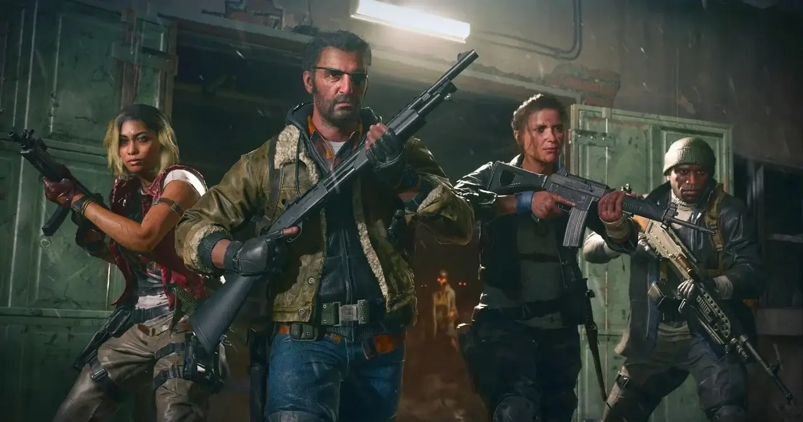

מעוניינים לסיים 100% מהאתגרים בקמפיין של [Call of Duty Black Ops 6](https://techhorizons.co.il/call-of-duty-black-ops-6/) אבל מתקשים במשימות הסודיות? הגעתם למקום הנכון! כאן נפרט כל אחד מההישגים שתוכלו להשיג כדי לקבל את כרטיסי הביקור הייחודיים, השמורים רק לסוכנים המיומנים ביותר.

## אילו הן המשימות הסודיות (Dark Ops) בקמפיין של BO6?

בין אם זה במצב זומבים, במולטיפלייר או בקמפיין, האתגרים של המשימות הסודיות אינם גלויים לשחקנים ב-Call of Duty: Black Ops 6. כדי לגלות את דרכי ההשגה, השחקנים צריכים פשוט לנסות את מזלם. זהו אתגר לא פשוט להשלים את כל האתגרים הקשורים לקמפיין כשאין שום רמזים. עם זאת, ריכזנו עבורכם את המידע הנחוץ כדי לעזור לכם להשלים את הקמפיין בהצלחה.

- **נוכחות רפאים** - התגנבו למרכז המודיעין של האתר השחור מבלי להתגלות במהלך הפרק "מטרה בעדיפות".
- **אפשרויות אינסופיות** - השמידו את כל הטילים מסוג SCUD מבלי להשתמש ב-C4 במהלך הפרק "עונת הציד".
- **אנשים נעדרים** - החביאו 5 גופות בתוך ארונות במהלך הפרק "מתחת לרדאר".
- **קינטיקה** - השלימו את המרוץ נגד הזמן במעבר אחד בלבד במהלך הפרק "חרדת פרידה".

## הטיפים הטובים ביותר להשלמת המשימות הסודיות (Dark Ops) בקמפיין של BO6

כדי להצליח באתגרים הללו, אנו ממליצים קודם כל לסיים את מצב הקמפיין ורק לאחר מכן לחזור למשימות בהן מסתתר אתגר סודי. עם הבנה טובה יותר של המשימה, תוכלו להשלים את האתגר ביתר קלות.

או פשוט התמידו כדי להשיג אותם. עם זאת, היו רגועים – המשימות הסודיות בקמפיין פשוטות בהרבה מאתגרי מצב הזומבים או המולטיפלייר. יתרה מזאת, הן דורשות הרבה פחות זמן, כך שתוכלו לעבור במהירות לאתגרים הבאים.

- השלימו את הקמפיין תחילה: כך תוכלו להכיר את המשימות לעומק, מה שיקל עליכם בהשלמת האתגרים הסודיים.
- פשוט וקל יותר מזומבים ומולטיפלייר: אתגרי Dark Ops בקמפיין דורשים פחות זמן ומורכבות, מה שמאפשר התקדמות מהירה.
