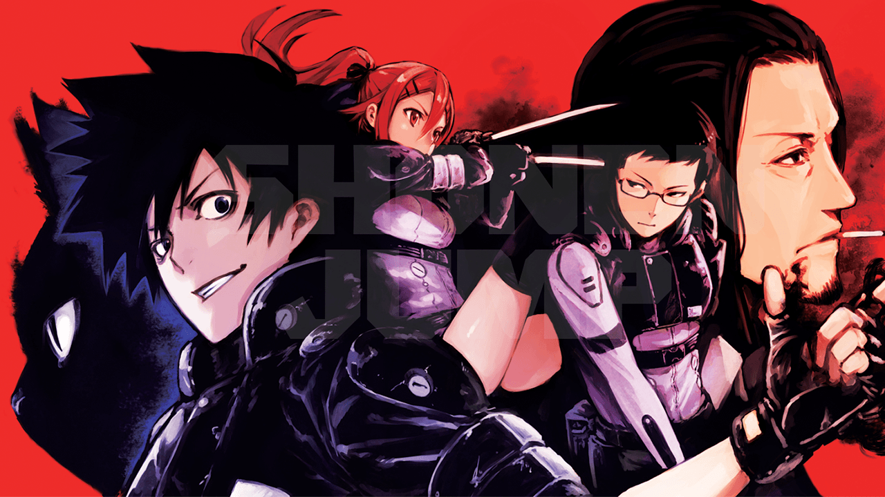

https://www.youtube.com/watch?v=Q\_qEpIW4HKQ

זה רשמי: **Black Torch** מקבלת עיבוד לאנימה! VIZ Media הכריזה על החדשות בכנס **Emerald City Comic Con**, תוך חשיפת **טיזר ראשון** שמבטיח אווירה **אינטנסיבית ומלאת אקשן**. בטריילר אפשר לראות את **ג'ירו אזומה** בחליפת הקרב שלו, לצד בן הברית המסתורי שלו **ראגו**, מונונוקה עוצמתי. אך לא מדובר רק בהצגה של הדמויות – ברקע ניתן לראות **דמות מאיימת משתקפת בעיר**, רמז ברור לכך שהקרב המתקרב יהיה רחוק מלהיות קל.

ההכרזה הזו מגיעה בהפתעה, שכן **Black Torch** מעולם לא היה אחד המותגים הגדולים של VIZ Media. המנגה פורסמה בין **2017 ל-2018** ב-**Jump SQ. ו-Shonen Jump+**, והסתיימה תוך **חמישה כרכים בלבד**. אבל למרות שהיא לא זכתה להצלחה מסחרית עצומה, הסיפור שמערב **נינג'ות, ארגוני ביון וישויות על-טבעיות** משך אליו לא מעט מעריצים. כעת, עם עיבוד אנימה רשמי, הסדרה מקבלת **הזדמנות שנייה להפוך ללהיט**.

## **שונן מלא באקשן בין נינג'ות ומונונוקה**

העלילה של **Black Torch** משלבת את עולם הנינג'ות עם האלמנטים של העל-טבעי. ג'ירו אזומה, צאצא למשפחת נינג'ות, גדל תחת משמעת קפדנית של סבו ולמד את **אמנויות הלחימה המסורתיות**. אך בנוסף לכישוריו כלוחם, יש לו **יכולת ייחודית** – הוא מסוגל **לדבר עם בעלי חיים**.

הכול משתנה כשהוא מציל **חתול שחור פצוע** בשם **ראגו**, שמתגלה כ**ישות מיתולוגית בעלת כוח הרסני**. המפגש הזה מכניס את ג'ירו ישירות למרכזו של קונפליקט נרחב, ומכריח אותו **להתמזג עם ראגו** כדי לשרוד מול אויבים חזקים שמנסים לנצל את כוחו של המונונוקה העתיק.

האנימה שומרת על **מבנה קלאסי של שונן**, אך מקבלת גישה יותר אינטנסיבית וישירה. אין כאן סיפור של **התקדמות הדרגתית או טורנירים ארוכים**, אלא **מאבק הישרדות מתמיד**, שבו הגיבור **נאלץ להשתפר תוך כדי הקרב**. מי שאהב את **Jujutsu Kaisen**, **Bleach** או **Noragami**, ימצא כאן הרבה אלמנטים מוכרים אבל עם טוויסט משלו.

## **הטיזר הראשון מספק הצצה מבטיחה**

הטריילר הראשון של **Black Torch** לא חושף יותר מדי מהעלילה, אך הוא בהחלט מבסס **את הסגנון והאווירה**. האנימציה נראית **חלקה ואנרגטית**, העיצוב של הדמויות **מדויק וחד**, והכימיה בין **ג'ירו וראגו** ניכרת כבר מהרגע הראשון.

עם זאת, נשארת השאלה הגדולה – **איך תתבצע ההתאמה למנגה?** עם **רק חמישה כרכים**, ייתכן שהאנימה תהיה נאמנה מאוד למקור ותסתיים תוך עונה אחת בלבד, או לחלופין **תפתח את העולם עם תוכן מקורי**. אנימות קצרות רבות הצליחו לשמור על קצב גבוה ולספק חוויית צפייה ממוקדת, אך יש גם מקרים שבהם הארכות מיותרות פגעו בקצב העלילה. אם ההפקה תדע **לאזן בין נאמנות לסיפור המקורי לבין הרחבה חכמה**, **Black Torch** עשויה להפוך **לשונן איכותי, קומפקטי ומדויק**.

## **מתי ואיפה אפשר יהיה לצפות ב-Black Torch?**

VIZ Media אישרו שהאנימה **רשמית בשלבי הפקה**, אך נכון לעכשיו **אין תאריך יציאה מדויק**. רוב הסיכויים שהסדרה תנחת במהלך **2025**, עם שידור צפוי ב-**Crunchyroll או Netflix**, שהן פלטפורמות האנימה המרכזיות כיום.

## **Black Torch – להיט בפוטנציה?**

אמנם **Black Torch** לא הספיקה להפוך למותג ענק במהלך הפרסום שלה, אך **המעבר לפורמט אנימה עשוי לשנות הכול**. סדרות שונן **אינטנסיביות וקצרות**, שלא מתעכבות יותר מדי על פיתוחים מיותרים, מצליחות לא פעם לתפוס מקום של כבוד בז'אנר.

היוצר **טסויושי טאקאקי** הצהיר שהוא **מעורב בתהליך ההפקה**, והוא מבטיח שהאנימה **תשמור על רוח המנגה** תוך שיפור האלמנטים הוויזואליים והתנועתיים. אם הקרבות יהיו **סוחפים**, הדמויות **כובשות**, והקצב **יישאר חד ומהיר**, אין ספק ש**Black Torch** יכולה להיות **אחת מההפתעות המעניינות של 2025**.

נמשיך לעקוב אחרי ההתפתחויות, וברגע שיתפרסמו **תאריך שידור רשמי ופלטפורמות צפייה**, נדאג לעדכן אתכם ראשונים!
