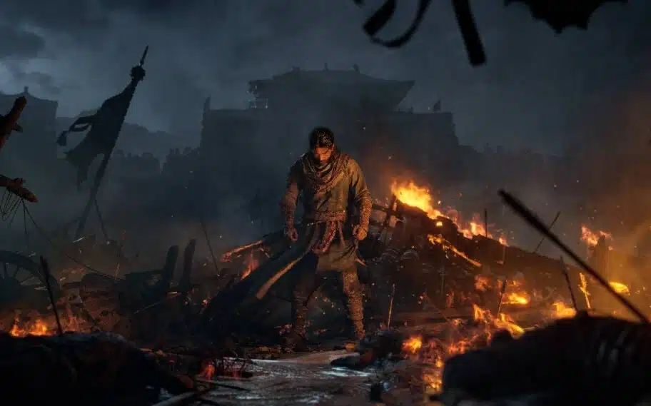
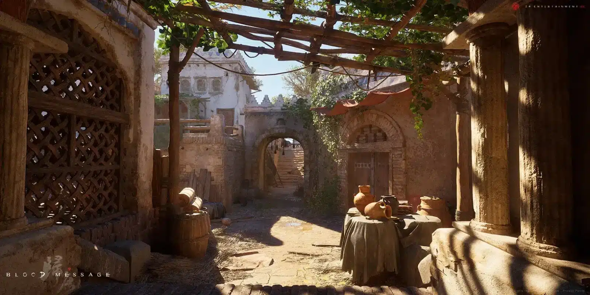
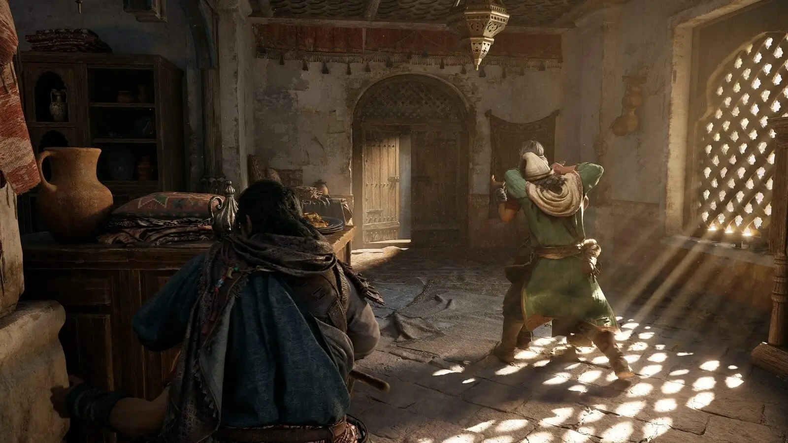

## **פרטי המשחק**

- **🎮 שם המשחק**: Blood Message
    
- **🧠 מפתח**: 24 Entertainment (יוצרי Naraka Bladepoint)
    
- **📦 מפיץ**: NetEase
    
- **📅 יציאה צפויה**: טרם הוכרזה
    
- **🖥️ פלטפורמות**: PC, PlayStation 5, Xbox Series X|S
    
- **🛠️ מנוע גרפי**: Unreal Engine 5
    
- **🎯 ז’אנר**: הרפתקה־פעולה קולנועית, סינגל־פלייר, הישרדות
    
- **🎭 מצב**: לשחקן יחיד
    
- **🌍 רקע**: סין העתיקה, סוף שושלת טאנג (המאה ה־9 לספירה)
    
- **[Blood-message.com](https://www.blood-message.com/en/) ( שווה להציץ גם באתר הרשמי של המשחק)**

https://www.youtube.com/watch?v=bW1m\_qzi4EM

## **הצהרת כוונות חדשה מבית NetEase**

Blood Message הוא המשחק הראשון של NetEase שמתמקד **אך ורק בחוויית שחקן יחיד קולנועית** — שינוי כיוון מהותי לחברה שנודעה במשחקים מרובי־משתתפים, בעיקר לשוק הסיני.  
המטרה: **לכבד גיבורים אנונימיים מההיסטוריה**, להעניק חוויה נרטיבית־רגשית על רקע משברים פוליטיים ותרבותיים.  
כך לפי Zhipeng Hu, המפיק הבכיר בחברה:

> "זהו פרויקט של דור חדש... ניסיון של עשרים שנה שמתמקד בלב האנושי."

## **עלילה: שליחות, מלחמה, ואבהות**

העלילה מתרחשת בסוף שושלת טאנג, תקופה של מרידות והתמוטטות של מוסדות השלטון.  
**שחקן מגלם שליח אלמוני ובנו הצעיר**, במסע של כ־1,600 קילומטרים מדונחואנג ועד צ’אנגאן, על רקע מרד אלים המאיים על עצם קיומה של האימפריה.  
המסר שהם נושאים עשוי לשנות את גורל האומה.

לאורך הדרך יפגשו שחקנים עם **החלטות מוסריות**, סכנות טבע, התנגשות בין נאמנות אישית לגורל לאומי — והמשחק מנסה **לרגש מבלי לוותר על עומק היסטורי**.

## **משחקיות: פעולה, הישרדות, סתימות**

- **קרבות בגוף שלישי** – סצנות לחימה עוצמתיות, דינמיות ומבוימות לעילא
    
- **מערכת סתימות** – יריבים שמגיבים ב־AI מתקדמת, עם מגוון דרכים להתגנבות
    
- **הישרדות** – ניהול משאבים, חציית מדבריות, טיפוס, הסתתרות
    
- **קו־עלילה ליניארי** – כל פרק מבוים בקפידה, במעין "פרקים קולנועיים"
    

NetEase מבטיחה חוויה אמנותית עם **אזכורים לאונצ’רטד, Ghost of Tsushima וגם The Last of Us**.

## **קונפליקט רגשי ופוליטי**

לצד האקשן, המשחק מציב במרכזו **הקשר אנושי־מוסרי**: מהי חובה? מהו הקרבה?  
הבן הקטן לא רק דמות נלווית, אלא מראה מוסרית לגיבור עצמו, שמתחבט בשאלות של נאמנות, משפחה וזהות אישית.  
כל פרק נבנה סביב **מטאפורה אחת ברורה**, והמסע כולו הופך **לטרגדיה אטית ומרגשת**.

## **עיצוב אמנותי וטכנולוגי**

המשחק מפותח במנוע Unreal Engine 5 עם:

- **צילום תנועה מלא (Mocap)**
    
- **סביבות היסטוריות אותנטיות**: מערות מוגאו, מקדשים, ערים מוקפות חומה
    
- **הבעות פנים ומודל דמויות ריאליסטיים**
    
- **עיצוב שמע סינמטי ותזמור מקורי**
    

## **סיכון עסקי? או התחלה חדשה?**

NetEase הודיעה שלא תהסס **לבטל משחקים שלא יעמדו בציפיות הכלכליות**. לכן Blood Message נבחן בזכוכית מגדלת:

- אם יצליח – זה עשוי לפתוח דרך לעוד פרויקטים איכותיים
    
- אם ייכשל – ייתכן וייוותר כחריג בודד במיקוד העסקי של החברה
    

במקביל, החברה הפסיקה השקעות במספר אולפנים בינלאומיים – כולל Quantic Dream – כדי למקד מאמצים בשוק המקומי בסין.

## **סיכום: למה זה מעניין?**

Blood Message הוא לא עוד משחק פעולה:  
זהו ניסיון **קולנועי, רגשי והיסטורי** להכניס את שחקני המיינסטרים אל תוך עולם אחר – עם קונפליקט מוסרי ופוליטי שנשען על דמויות אמינות ועולם עשיר.

ב־TechHorizons נעקוב מקרוב אחר כל פרט. אם המשחק יעמוד בציפיות, הוא עשוי להפוך לאחד ההפתעות של 2026.
