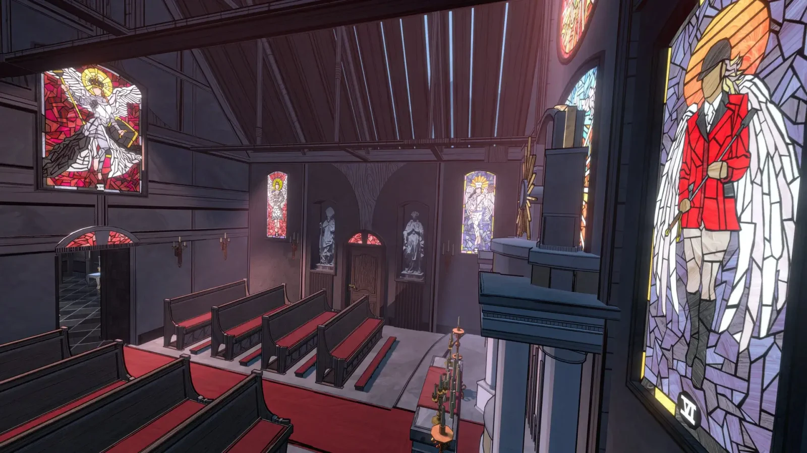
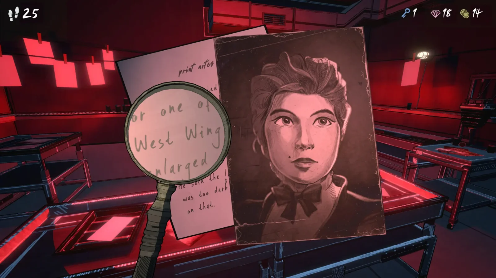

הוא עוד לא יצא – וכבר מככב בביקורות עם **[ציון 92/100 ב־Metacritic](https://www.metacritic.com/game/blue-prince/)**.  
הכירו את **Blue Prince**, משחק פאזלים ייחודי שמגיע ב־**10 באפריל** ל־PlayStation 5, Xbox Series X|S ו־PC. מבקרי גיימינג שכבר שיחקו בו מתארים אותו כ"משחק שהפך לי את המוח", ואפילו **Shuhei Yoshida** (מי שהיה ממקימי PlayStation) הגדיר אותו כ־**מועמד לגיטימי ל־GOTY 2025**.

## **חדר 46 שלא אמור להתקיים**

הסיפור מתחיל כשסיימון, הדמות הראשית, יורש אחוזה מסתורית על הר הוללי לאחר מות דוד־רבא שלו. הבעיה?  
כדי לקבל את הירושה – עליו **למצוא את חדר 46**.  
אבל באחוזה יש **רק 45 חדרים**.

מכאן נפתחת חוויה מבלבלת, מוזרה וממכרת. חדרי האחוזה **משנים את מיקומם כל הזמן**, ואנחנו צריכים לפענח איך בכלל אפשר להגיע למשהו שלא קיים – או שכן?

## **בנוי על מנגנון Rogue-lite ממכר**

הקסם של Blue Prince לא מסתכם רק בתעלומה. הוא מציע גם מנגנון משחק ייחודי:

- כל חדר במשחק **נבחר אקראית מתוך שלוש אפשרויות**
    
- צריך לחבר בין החדרים בצורה חכמה כדי **לפתוח נתיבים נסתרים**
    
- יש לכם **50 מהלכים בלבד** בכל ניסיון – ואז מתחילים מההתחלה
    

אבל כמו בכל משחק Rogue-lite טוב, **הידע שצברתם נשמר** – ומאפשר לכם להתקדם בפעם הבאה.

## **חוויה שלא מיועדת לכולם**

אם אתם חובבי פעולה שמעדיפים לשבור דלתות במקום לפתור חידות – זה כנראה לא בשבילכם.  
Blue Prince דורש **חשיבה מעמיקה**, **סבלנות** ויכולת להיכשל שוב ושוב עד שמוצאים את הדרך.  
בנוסף, חשוב לדעת: **המשחק זמין רק באנגלית** (לפחות כרגע), אז רמת הבנה טובה של השפה נדרשת.

## **מחיר וזמינות**

- 🎮 זמין החל מ־**10 באפריל 2025**
    
- 💻 לפלטפורמות: **Steam, PS5, Xbox Series X|S**
    
- 🕹 כלול ב־**Game Pass** וב־**PlayStation Plus Extra**
    
- 💸 מחיר: **29.99 אירו** (כ־₪120)
