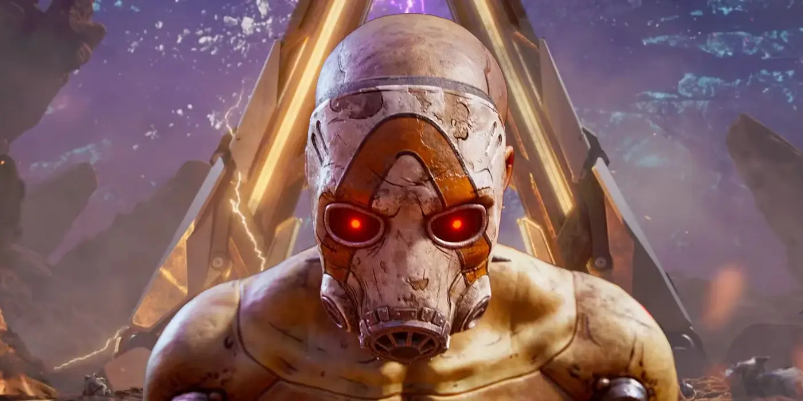
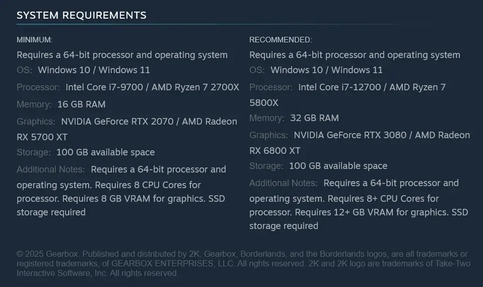

## **חוזרים לפנדורה עם דרישות מוגזמות**

הפרק הרביעי של Borderlands נוחת ב־**12 בספטמבר 2025**, עם אותו הומור פסיכי, קצב מטורף — ודרישות חומרה מפתיעות.  
המשחק החדש נבנה ב־**Unreal Engine 5**, ומיועד לקונסולות הדור החדש ולמחשב. גרסת ה־Switch 2 תגיע רק מאוחר יותר השנה.

אבל מה שהכי תופס את העין (או את הארנק), זו **הרמה הטכנית החדשה** שהמפתחים דורשים מהמחשב שלכם.

## **דרישות מערכת מינימליות: לא לכולם**

| דרישות מינימום |   |
| --- | --- |
| **מערכת הפעלה** | Windows 10 / 11 בגרסת 64 ביט |
| **מעבד** | Intel Core i7-9700 או AMD Ryzen 7 2700X |
| **זיכרון RAM** | 16 ג״ב |
| **כרטיס גרפי** | NVIDIA RTX 2070 או AMD RX 5700 XT עם לפחות 8 ג״ב VRAM |
| **אחסון** | 100 ג״ב על SSD (חובה) |

🧠 _כרטיסי מסך עם פחות מ־8 ג״ב זיכרון או מעבדים מתחת ל־8 ליבות לא יעברו את הסף._

## **דרישות מומלצות: מחשב עילית**

| דרישות מומלצות |   |
| --- | --- |
| **מערכת הפעלה** | Windows 10 / 11 (64 ביט) |
| **מעבד** | Intel Core i7-12700 או AMD Ryzen 7 5800X |
| **RAM** | 32 ג״ב |
| **כרטיס גרפי** | NVIDIA RTX 3080 או AMD RX 6800 XT (לפחות 12 ג״ב VRAM) |
| **אחסון** | 100 ג״ב על SSD |

⚠️ _אם חשבתם ש־16 ג״ב RAM זה מספיק, תחשבו שוב — Borderlands 4 מכוון גבוה מאוד_

## **למה זה ככה?**

שתי סיבות עיקריות:

1. **Unreal Engine 5** מביא איתו רמות חדשות של פירוט גרפי, תאורה דינמית וטקסטורות בגודל עצום.
    
2. **עולם פתוח הרבה יותר חי**, עם AI משופר וחוויית אונליין משודרגת.
    

Gearbox שואפת לספק את Borderlands הכי גדול ומרשים אי פעם — וזו הסיבה שאתם תצטרכו מחשב שמתאים לרמה הזו.

## **כך תכינו את המחשב שלכם**

אם אתם לא בטוחים שהמערכת שלכם מוכנה, הנה כמה המלצות לשדרוג:

- 💾 **RAM**: לשדרג ל־32GB, במיוחד אם אתם מריצים גם רקע
    
- 🔥 **GPU**: RTX 3080 יד שנייה או AMD RX 7900 GRE יתנו פייט
    
- 🧠 **CPU**: מינימום 8 ליבות, רצוי דור 12 ומעלה
    
- ⚙️ **SSD מהיר**: לא רק בשביל שטח, אלא גם למהירות טעינה
    

## **מתי זה קורה — ועל אילו פלטפורמות?**

Borderlands 4 יושק רשמית ב־**12.9.2025** ל־:

- 🖥️ PC
    
- 🎮 PlayStation 5
    
- 🎮 Xbox Series X|S
    

גרסת ה־Switch 2 תצא בהמשך, כנראה עם גרפיקה מונמכת.

🎮 _שורה תחתונה_: Borderlands 4 נראה מבטיח, אבל הוא **דורש מחשב עוצמתי במיוחד**.  
זה הזמן לבדוק אם אתם מוכנים לקרב.
