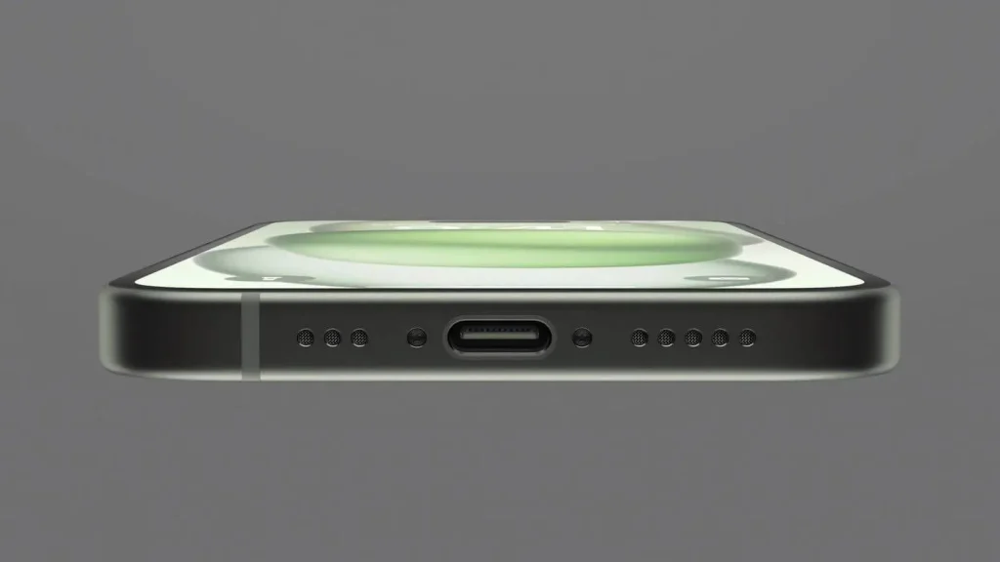
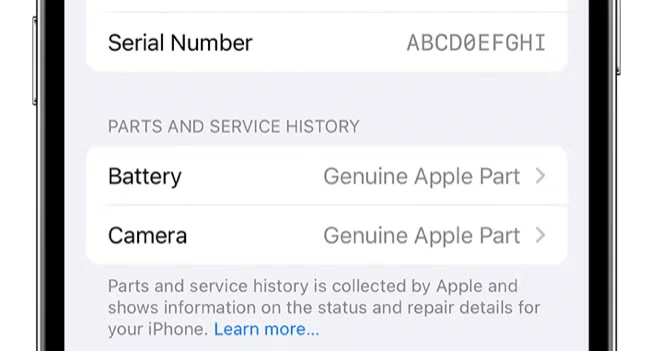

רכישת אייפון יד שנייה יכולה להיות דרך מצוינת לחסוך כסף, אבל היא גם עלולה להיות מסוכנת. מכשיר עלול להיות חסום, גנוב, עם סוללה שחוקה או חלקים שהוחלפו. במדריך הזה נפרט **איך לבדוק אייפון לפני שקונים אותו**, כדי להימנע מבעיות והונאות.

## **איפה אפשר לקנות אייפון יד שנייה בישראל?**

### **חנויות שמתמחות בטלפונים משומשים (האופציה הבטוחה ביותר)**

- חנויות כמו **iStore, iDigital או משווקים פרטיים** מציעות אייפונים מחודשים עם אחריות.
- המחיר גבוה יותר מאצל מוכר פרטי, אבל זו אופציה בטוחה יותר.

### **אתרי יד שנייה ופלטפורמות מקוונות**

- **Yad2, Facebook Marketplace, Homeless** מאפשרים רכישה ישירה ממוכרים פרטיים במחירים נמוכים יותר.
- **חובה לבדוק את המכשיר פיזית** לפני שמשלמים.
- אם המחיר נמוך מדי או שהמוכר לא מוכן להיפגש - זה דגל אדום.

### **רכישה מאדם פרטי**

- אם קונים ממישהו מוכר (משפחה, חברים), הסיכון נמוך יותר.
- אין אחריות במקרה של בעיה, לכן **צריך לבדוק את המכשיר היטב לפני התשלום**.

## **בדיקות חיוניות לפני קניית אייפון יד שנייה**

### **1\. האם האייפון נדלק ועובד?**

- **בקשו מהמוכר להדליק את המכשיר** מולכם.
- מכשיר שלא נדלק עלול להיות תקול או חסום.
- מוכר אמין לא יתנגד לבדיקה כזו.

### **2\. בדיקת נעילת רשת – האם המכשיר עובד עם כרטיס SIM ישראלי?**

- הכניסו **כרטיס SIM של חברת סלולר ישראלית** (Partner, Pelephone, Hot Mobile וכו').
- ודאו שהמכשיר **מזהה את הרשת ומאפשר לבצע שיחות**.
- אם מופיעה הודעה **"SIM לא נתמך"** או **"אין שירות"**, המכשיר עלול להיות **חסום על ידי מפעיל או גנוב**.
- אם המוכר מסרב לתת לכם לבדוק עם SIM – **עדיף לא לקנות את המכשיר**.

### **3\. בדיקת נעילת iCloud (מאוד חשוב!)**

- היכנסו ל-**הגדרות > \[שם המשתמש\] > iCloud**.
- ודאו ש-**"מצא את האייפון שלי" (Find My iPhone) כבוי**.
- אם המכשיר לא נותן לכבות את האפשרות הזו – **הוא עדיין משויך למשתמש אחר ולא תוכלו להשתמש בו**.

💡 **טיפ:** בקשו מהמוכר **לאפס את המכשיר מולכם** (**הגדרות > כללי > העברה או איפוס > מחק את כל התוכן וההגדרות**).

- אם לאחר האיפוס המכשיר **מבקש מזהה Apple וסיסמה**, סימן שהוא עדיין נעול – **אל תקנו אותו**!

### **4\. בדיקת מצב הסוללה**

- גשו ל-**הגדרות > סוללה > מצב סוללה**.
- סוללה עם **קיבולת נמוכה מ-85%** תחזיק פחות זמן בין טעינות.
- הודעת **"שירות"** אומרת שהסוללה שחוקה וכנראה תצטרך החלפה.

### **5\. בדיקת מסך ומגע**

- **גררו אייקון על פני כל המסך** כדי לבדוק שאין אזורים מתים.
- הקישו במספר מקומות על המסך כדי לוודא שהמגע מגיב היטב.
- בדקו את המסך **באור חזק** כדי לראות אם יש שריטות עמוקות או פיקסלים מתים.

### **6\. בדיקת מצלמות ופלאש**

- פתחו את האפליקציה **מצלמה** ובדקו את המצלמות הקדמית והאחורית.
- צלמו תמונה ווידאו כדי לבדוק **את הפוקוס והחדות**.
- הפעילו את **הפלאש** ובדקו שהוא נדלק.

### **7\. בדיקת רמקולים ומיקרופון**

- השמיעו מוזיקה או סרטון YouTube כדי לבדוק **אם הצליל חזק וברור**.
- בצעו שיחת ניסיון כדי לבדוק **אם השמע בשיחה עובד היטב**.
- הפעילו **Siri** ודברו כדי לבדוק שהמיקרופון עובד.

### **8\. בדיקת טעינה ושקע הטעינה**

- חברו **מטען USB-C או Lightning** ובדקו שהטעינה מתחילה מיד.
- אם הכבל "זז" יותר מדי בתוך השקע, ייתכן שהחיבור רופף – תיקון כזה יכול להיות יקר.
- אם הדגם תומך בכך, בדקו **טעינה אלחוטית (MagSafe)**.

### **9\. בדיקת Face ID או Touch ID**

- גשו ל-**הגדרות > Face ID וקוד גישה** ובדקו אם ניתן **להוסיף זיהוי פנים חדש**.
- אם המכשיר עם **Touch ID**, נסו **להוסיף טביעת אצבע**.
- אם זה לא עובד, ייתכן שהמכשיר **עבר תיקון לא רשמי**.

### **10\. בדיקת חלקים שהוחלפו**

- היכנסו ל-**הגדרות > כללי > מידע**.
- אם מופיעה הודעה על **"חלק לא מקורי"**, זה אומר שהסוללה, המסך או רכיבים אחרים הוחלפו **ללא חלקים רשמיים של אפל**.

### **11\. בדיקת נזקים חיצוניים**

- **הורידו את הכיסוי** (אם המוכר משתמש באחד) כדי לבדוק אם יש שברים או פגיעות בגוף המכשיר.
- שימו את האייפון על משטח שטוח ובדקו אם הוא **מונח בצורה ישרה** – אם לא, ייתכן שהשלדה עקומה.
- בדקו את **עדשות המצלמה** אם יש שריטות או סדקים.

## **מה לא לעשות בקניית אייפון יד שנייה?**

❌ לקנות בלי לבדוק את המכשיר.  
❌ לשלם מראש בלי לבדוק שהמכשיר עובד.  
❌ לקנות מכשיר עם **נעילת iCloud** פעילה.  
❌ לקנות מאדם שמסרב לאפשר בדיקה של **SIM, מצלמה, סוללה וטעינה**.  
❌ לפגוש מוכר במקום חשוך או מבודד.

## **סיכום: איך לקנות אייפון יד שנייה בבטחה?**

✔ הכניסו **כרטיס SIM ישראלי** ובדקו שהמכשיר מזהה אותו.  
✔ ודאו שהמכשיר **לא נעול ל-iCloud**.  
✔ בדקו **את הסוללה, המסך, המצלמה והשמע**.  
✔ בדקו **Face ID / Touch ID** לוודא שהמכשיר תקין.  
✔ בדקו **אם בוצעו תיקונים עם חלקים לא מקוריים**.  
✔ פגשו את המוכר **במקום ציבורי** ושאלו שאלות לפני הקנייה.

אם תבצעו את כל הבדיקות האלו, תקבלו **אייפון יד שנייה במצב טוב וללא סיכונים**.
