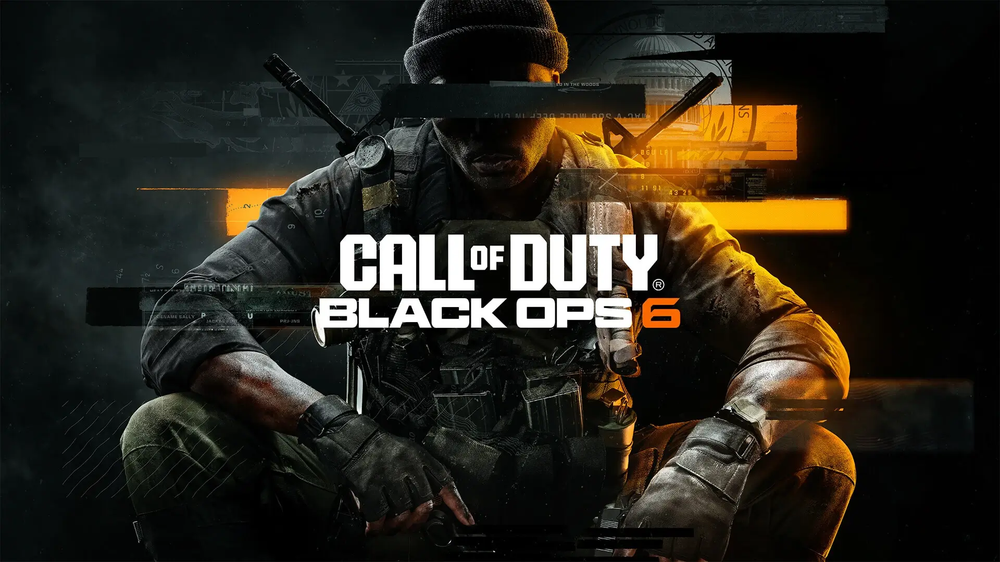
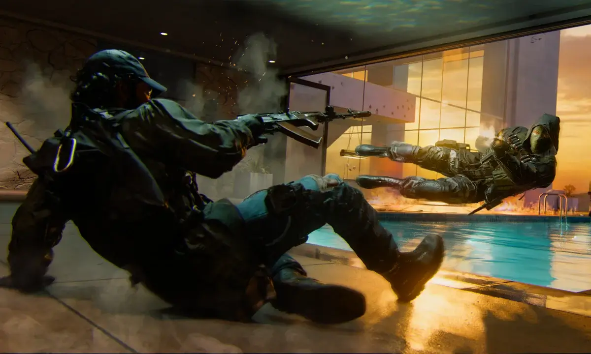
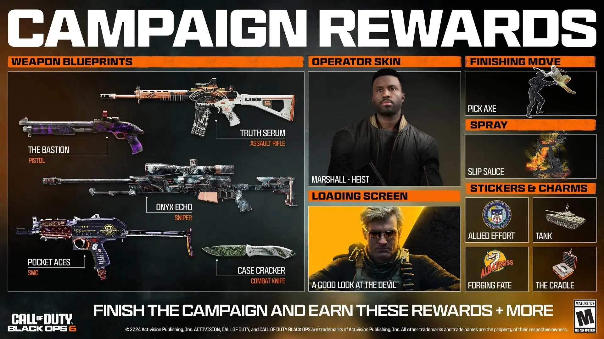

ההמתנה הסתיימה – Black Ops 6 הגיע, ומאז השקתו כבר הספיק להגדיר מחדש את הסטנדרט למשחקי יריות בזכות חידושי המשחקיות, הגרפיקה המדהימה ומצב מרובה משתתפים שמבטיח אקשן בלתי נגמר. המשחק, אשר פותח על ידי Treyarch תחת Microsoft, מביא איתו אפשרויות משחק חדשות, עלילה מותחת ומנגנוני תנועה שהופכים כל קרב לחוויה דינמית וחדשנית.

## תנועת Omni-Movement: משחקיות חופשית וזורמת

החידוש הבולט ביותר ב-Black Ops 6 הוא מערכת תנועת ה-Omni-Movement. כאן, השחקנים יכולים לנוע בחופשיות מלאה בכל כיוון – ריצה, גלישה, צלילה ואפילו מעבר מהיר בין תנועות שונות. בין אם אתם בורחים מזומבים או מתמודדים מול שחקנים במולטיפלייר, היכולת לנוע ב-360 מעלות מוסיפה אלמנט מפתיע למשחקיות, עם רגעים קולנועיים במיוחד.

## מצב זומבים: מפות חדשות וסיפור מתמשך

מצב הזומבים האייקוני חוזר, והוא טוב מאי פעם. שתי המפות החדשות – Terminus ו-Liberty Falls – מציעות עולמות עשירים ומורכבים. עם חידות ואיסטר-אגים שמחכים להתגלות, כל קרב זומבים ב-Black Ops 6 מצריך תכנון אסטרטגי ויכולת הסתגלות מהירה. במפה Liberty Falls, לדוגמה, השחקנים יוכלו לנוע בין בניינים על ידי אומגות ולהתמודד עם המוני זומבים שמגיחים מכל פינה. זהו מצב משחק שדורש לא רק תגובה מהירה אלא גם הבנה עמוקה של סביבת המשחק.

## מולטיפלייר אינטנסיבי ומפות קרב דינמיות

https://www.youtube.com/watch?v=GYG\_h-L-K2E&ab\_channel=CallofDuty

מצב מרובה המשתתפים מביא איתו עיצוב מפות חדש ומותאם לאקשן קרוב ומהיר. ישנן מפות מסורתיות שמתאימות לקרבות פתוחים וגדולים, לצד מפות Strike קטנות יותר ל-6v6 או 2v2 שמספקות חוויות קרב קומפקטיות ואינטנסיביות. כל מפה מציעה תמהיל ייחודי של מקומות גבוהים, שטחים פתוחים ואזורים מוגנים, מה שמאפשר גיוון טקטי ועידוד לאסטרטגיות מגוונות במהלך הקרבות.

## התאמות אישיות ופרסים במצב מרובה משתתפים

Black Ops 6 מאפשר התאמה אישית מעמיקה של כלי נשק וציוד דרך מערכת Wildcard, עם יכולת להוסיף כלים ייחודיים כמו ציוד טקטי נוסף או שילוב של שני כלי נשק עיקריים. חלוקת ה-perks לשלוש קטגוריות – Enforcer, Strategist ו-Recon – מעודדת שחקנים לאמץ סגנון משחק מותאם אישית עם בונוסים על פי בחירתם.

## גרפיקה מהמעלה הראשונה וחוויית משחק שואבת

בכל הנוגע לגרפיקה, Black Ops 6 מראה על קפיצת מדרגה משמעותית. עם טקסטורות עשירות, אפקטים ריאליסטיים ומנוע גרפי שמנצל את מלוא הפוטנציאל של הדור החדש, כל מפה מרגישה חיה ונושמת. גם כלי הנשק עוצבו בקפידה, מה שמספק חוויית ירי מדויקת ותחושת עוצמה בכל קרב. השילוב של כל האלמנטים האלו יוצר עולם משחק עמוק ומרתק שהשחקנים מתקשים לעזוב.

## האם Black Ops 6 עומד בציפיות?

מאז השקתו, Black Ops 6 מצליח לענות על הציפיות ואף להתעלות עליהן. בין אם אתם שחקני מולטיפלייר תחרותיים או חובבי עלילה, המשחק מציע חוויות מספקות ומאתגרות בכל מצב. מערכת התנועה החדשה, מצבי המשחק המגוונים, והעיצוב הקפדני של המפות מבטיחים שעות של הנאה בלתי פוסקת.

Black Ops 6 לא רק ממשיך את המסורת של Call of Duty – הוא מרענן אותה עם אלמנטים חדשניים וסוחפים שהופכים אותו לאחד המשחקים הטובים ביותר לשנת 2024.

- תנועת Omni-Movement חדשנית: מאפשרת לשחקנים לנוע בכל כיוון, עם ריצה, גלישה וצלילה שמוסיפים למשחקיות דינמיות וחופש פעולה מלא.
- מצב זומבים משופר: כולל מפות חדשות, Liberty Falls ו-Terminus, עם חידות ואיסטר-אגים שמוסיפים עניין ואתגר במאבק נגד גלי הזומבים.
- עיצוב מפות מותאם לאקשן אינטנסיבי: מפות מולטיפלייר מגוונות עם אפשרויות תמרון רבות, המותאמות לקרבות קרובים ומהירים ולסגנונות משחק שונים.
