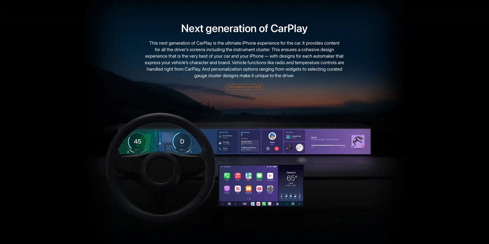

Apple אישרה באופן רשמי שגרסת **CarPlay 2** לא תושק ב-2024 כפי שתוכנן. למרות זאת, החברה מבטיחה שהעבודה על המערכת המתקדמת נמשכת בשיתוף פעולה עם מספר יצרניות רכב.

## העיכוב ומה Apple אומרת על זה

עד סוף 2024, האתר הרשמי של CarPlay טען שדגמים ראשונים התומכים ב-CarPlay 2 יגיעו במהלך השנה. אך עם תחילת 2025, [Apple עדכנה את האתר](https://www.apple.com/ios/carplay/) והסירה כל אזכור לתאריך ההשקה.

בהצהרה ל-**[9to5Mac](https://9to5mac.com/)**, Apple הבהירה:

> _"הדור הבא של CarPlay נבנה על שנים של תובנות והצלחות, ומספק חוויה מותאמת אישית עם אינטגרציה עמוקה בין Apple ליצרניות הרכב. אנחנו ממשיכים לעבוד בשיתוף פעולה הדוק עם מספר יצרניות רכב, שיחשפו פרטים נוספים כשיתקרבו להשקת הדגמים התומכים."_

## מה צפוי ב-CarPlay 2?

CarPlay 2 נועד להציע אינטגרציה עמוקה יותר בין המכשירים של Apple למערכות הרכב. המערכת החדשה צפויה לכלול:

- **התאמה אישית רחבה יותר** שתאפשר ליצרניות רכב לשלב את עיצובי המותג שלהן.
- **שדרוגים ויזואליים ופונקציונליים**, כמו שליטה מורחבת על פונקציות הרכב (מיזוג, מד מהירות ועוד).

## מה הלאה?

למרות העיכוב, Apple ממשיכה לעבוד על פיתוח CarPlay 2 יחד עם שותפיה בתעשיית הרכב. ייתכן שעדכון המערכת יכלול גם שיפורים ל-CarPlay הקיים, אך החברה לא סיפקה פרטים נוספים.

השאלה הגדולה נותרה: האם כדאי לחכות ל-CarPlay 2, או שעדיף ש-Apple תתמקד בשדרוג המערכת הנוכחית?

- CarPlay 2 נדחה ל-2025, אך Apple ממשיכה בפיתוח עם יצרניות הרכב.
- המערכת החדשה תשלב פונקציות רכב מתקדמות ועיצובים מותאמים אישית.
- טרם פורסם תאריך השקה חדש, אבל שדרוגים משמעותיים צפויים.
