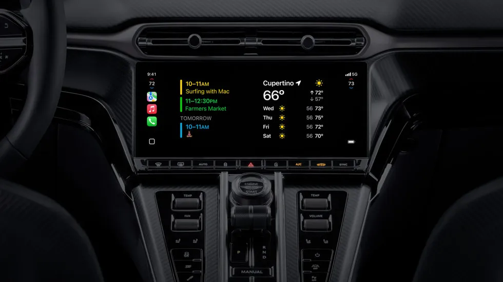
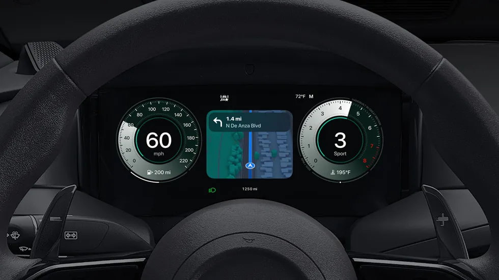

## **מה זה CarPlay Ultra?**

CarPlay Ultra הוא הדור הבא של CarPlay, המערכת שמחברת בין האייפון לרכב ומספקת שליטה חכמה יותר על פונקציות הרכב. המערכת החדשה כוללת אינטגרציה רחבה יותר של לוחות המחוונים, בקרת מזגן, שליטה על מערכות עזר לנהג ועוד.

### **מה חדש ב-CarPlay Ultra לעומת הגרסאות הקודמות?**

CarPlay Ultra מביאה כמה שדרוגים משמעותיים בהשוואה לגרסאות הקודמות של CarPlay. הנה כמה מהשיפורים המרכזיים:

- **שילוב מערכות רכב נוספות:** כעת ניתן לשלוט גם במזגן, בתאורה, במצבי נהיגה ובמערכות בטיחות ישירות מהאייפון.
    
- **מסכים דיגיטליים מרובים:** CarPlay Ultra מכסה את כל המסכים ברכב – כולל לוח המחוונים, מסך המולטימדיה ואפילו תצוגות על השמשה (HUD).
    
- **ממשקים מותאמים אישית:** אפל יצרה ממשקים מותאמים אישית עבור מותגים כמו Aston Martin ו-Hyundai, כך שהמראה הכללי ישתלב עם עיצוב הפנים של הרכב.
    
- **עיצוב מתקדם ויותר וידג'טים:** המשתמשים יוכלו להציג וידג'טים על גבי המסכים, כולל מזג אוויר, לוח שנה, תחזיות זמן הגעה ועוד.
    
- **לוחות מחוונים דיגיטליים:** CarPlay Ultra מציגה מהירות, מד דלק, מד סיבובי מנוע ועוד – ישירות על מסך לוח המחוונים.
    
- **שליטה קולית דרך Siri:** שליטה ברדיו, בקרת אקלים ואפילו במצבי נהיגה באמצעות פקודות קוליות.
    
- **ווידג'טים מותאמים אישית:** הצגת נתונים מהאייפון כמו לוח שנה, מזג אוויר והתראות על גבי המסכים ברכב.
    
- **ממשקים ייעודיים למותגי רכב:** Apple עובדת עם יצרניות הרכב כדי להתאים את הממשק למותג – למשל, Aston Martin קיבלה עיצוב ייחודי עם נגיעות פרימיום.
    

<figure>

<figcaption>

Apple-CarPlay-Ultra-cluster-widgets\_big.jpg.large\_

</figcaption>

</figure>

<figure>

<figcaption>

Apple-CarPlay-Ultra-cluster-Maps\_big.jpg.large\_

</figcaption>

</figure>

## **זמינות ותאימות – אילו רכבים יתמכו?**

CarPlay Ultra משיקה את הבכורה שלה עם Aston Martin בארה"ב וקנדה. הדגמים הראשונים שתומכים במערכת כוללים:

- Aston Martin DBX
    
- Aston Martin Vantage
    
- Aston Martin DB12
    
- Aston Martin Vanquish
    

אפל הודיעה כי התמיכה ב-CarPlay Ultra תתרחב לכל דגמי Aston Martin בעולם במהלך 12 החודשים הקרובים.

### **מי עוד תומך ב-CarPlay Ultra?**

מלבד Aston Martin, אפל הודיעה כי מספר יצרניות רכב נוספות כבר נמצאות בשלבי אינטגרציה מתקדמים של CarPlay Ultra:

- **Hyundai:** אפל מתכננת להתחיל בהשקה עם דגמים יוקרתיים כמו Genesis.
    
- **Kia:** Kia עובדת על גרסאות מותאמות של CarPlay Ultra עבור רכביה החכמים, כולל אפשרות לשליטה במצבי נהיגה ספורטיביים.
    
- **Porsche:** אפל כבר הציגה הדמיות של CarPlay Ultra בשיתוף פעולה עם Porsche, אך אין עדיין צפי לתאריך השקה.
    
- **Genesis:** דגם הפרימיום של Hyundai יציע חווית נהיגה מתקדמת עם CarPlay Ultra, כולל שילוב תצוגת HUD מותאמת.
    

### **מה עם מותגים נוספים?**

Apple ממשיכה לנהל מגעים עם יצרניות רכב נוספות, כולל BMW, Mercedes ו-Ford. למרות שאין עדיין מידע רשמי על זמינות CarPlay Ultra בדגמים נוספים, ישנם דיווחים על כך שאפל מתכננת להרחיב את התמיכה במהלך 2026.

Apple ממשיכה לנהל מגעים עם יצרניות רכב נוספות, כולל BMW, Mercedes ו-Ford, אך כרגע אין מידע רשמי על זמינות CarPlay Ultra בדגמים נוספים.

- **Hyundai** – אפל עובדת על שילוב CarPlay Ultra במודלים חדשים, אך טרם נמסרה מסגרת זמן.
    
- **Kia** – עבודה בתהליך, צפי לעדכון בחודשים הקרובים.
    
- **Genesis** – יישום עתידי שיציע חווית פרימיום עם ממשק ייחודי.
    

## **עדכון תוכנה לרכבים קיימים – מה זה כולל?**

אם אתם בעלי Aston Martin תואם, תוכלו לקבל את CarPlay Ultra כעדכון תוכנה ישירות מהסוכנויות המקומיות. העדכון יאפשר:

- **שדרוג מערכת ההפעלה לרכב:** תאימות מלאה ל-CarPlay Ultra, כולל שליטה במסכים מרובים.
    
- **שדרוגי בטיחות:** גישה לפונקציות נהיגה חכמות כמו זיהוי סטייה מנתיב ובלימת חירום.
    
- **שילוב Siri רחב יותר:** היכולת לשלוט במזגן, ברדיו ובמערכות נוספות באמצעות פקודות קוליות.
    

העדכון יהיה זמין בארה"ב וקנדה תחילה, ובהמשך יתרחב לשווקים נוספים בהתאם לזמינות הדגמים.

אם אתם בעלי Aston Martin תואם, תוכלו לקבל את CarPlay Ultra כעדכון תוכנה ישירות מהסוכנויות המקומיות בקרוב.

האם CarPlay Ultra תצליח לשנות את חוויית הנהיגה? נמשיך לעקוב ולעדכן בהתאם להתפתחויות.
