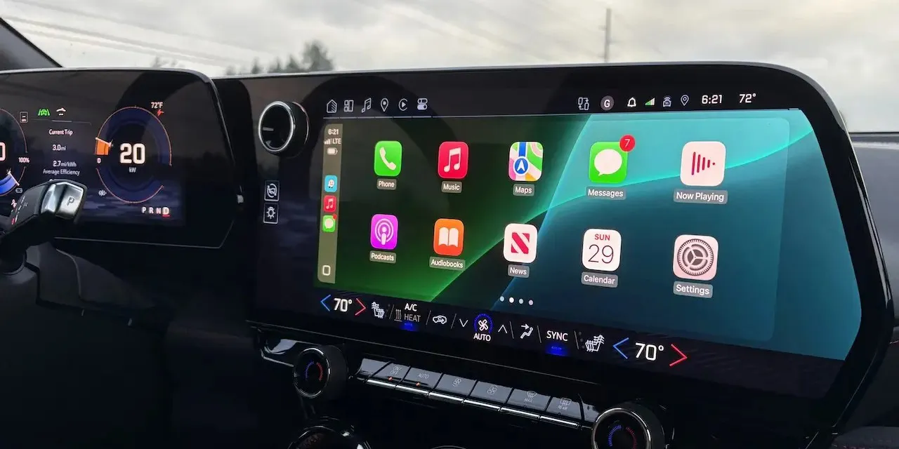
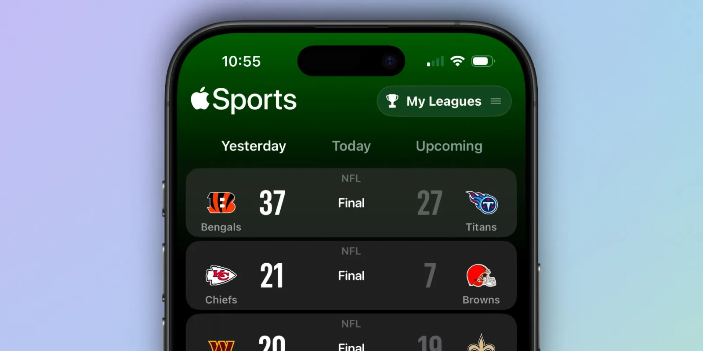
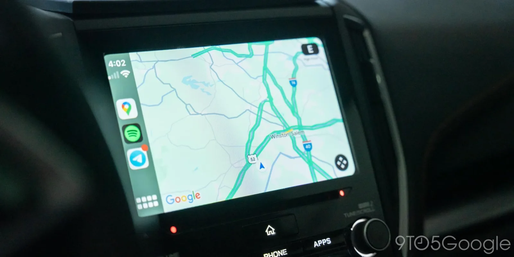

במהלך חודש מרץ סיפרנו לכם על אחד החידושים המעניינים של CarPlay עם iOS 18.4: הוספת תמיכה רשמית באפליקציות ספורט בעזרת API ייעודי. כעת, לאחר ש-iOS 18.4 שוחרר רשמית לכל המשתמשים, מתברר שזו רק אחת מכמה תוספות חדשות.

אז מה עוד מתחדש ב־CarPlay עם iOS 18.4?

## **שורת אייקונים שלישית למסכים גדולים**

עד היום, מסכי רכב רחבים הציגו שתי שורות בלבד של אפליקציות ב-CarPlay. עם iOS 18.4, רכבים בעלי מסכים גדולים מקבלים שורת אייקונים שלישית, מה שמאפשר גישה מהירה ונוחה ליותר אפליקציות ישירות ממסך הבית.

## **אפליקציות ספורט ב-CarPlay**

כפי שסיקרנו לראשונה, אפליקציות ספורט יוכלו מעכשיו להציע תצוגה ייעודית למשחקים חיים ב-CarPlay. דרך ה־API החדש, מפתחים יכולים להציג תוצאות של משחקים בצורה ברורה ומותאמת לנהיגה, עם תצוגת קבוצות צבעונית ומרהיבה.

## **אפשרות לקבוע אפליקציית ניווט ברירת מחדל באירופה**

משתמשים באיחוד האירופי יכולים מעכשיו לבחור אפליקציית ניווט ברירת מחדל ב-CarPlay, ולא להיות מחויבים ל-Apple Maps. אפשר לבחור בקלות ב־Google Maps או ב־Waze, ולהשתמש בהם ישירות עם פקודות קוליות ל-Siri ("קח אותי לתל אביב" למשל).  
**(בישראל האפשרות הזו עדיין לא זמינה, אך ייתכן ותגיע בהמשך.)**

אמנם CarPlay 2.0 הגדול עדיין בדרך, אך Apple ממשיכה לשדרג גם את הגרסה הנוכחית. עם יותר גמישות, יותר התאמות אישיות, ותמיכה בחוויית ספורט חכמה יותר – iOS 18.4 מביא כמה חידושים קטנים אך משמעותיים.
